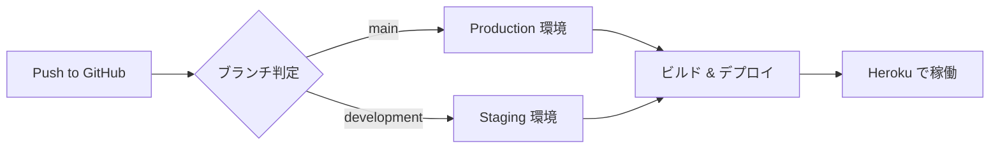
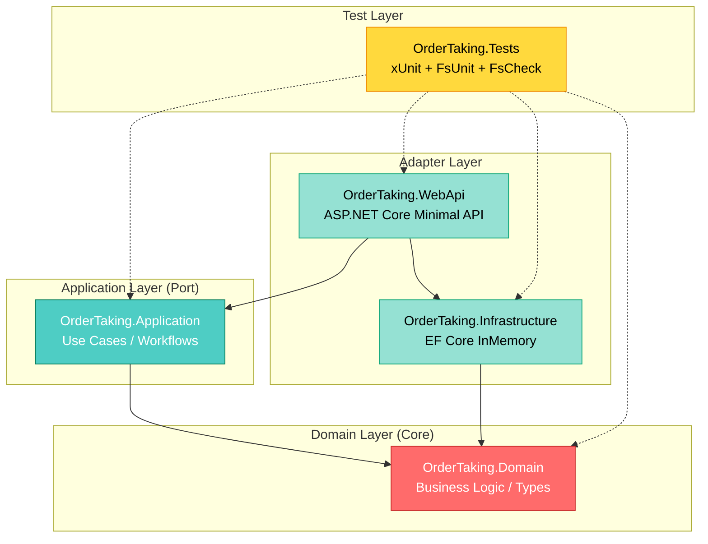

# OrderTaking - 注文受付システム

[](https://github.com/k2works/case-study-functional-ddd/actions/workflows/ci.yml)
[](https://github.com/k2works/case-study-functional-ddd/actions/workflows/ci.yml)
[](https://dotnet.microsoft.com/download/dotnet/9.0)
[](https://fsharp.org/)
[](LICENSE)

F# の関数型プログラミングとドメイン駆動設計による注文受付システム。

## 📋 概要

本プロジェクトは「Domain Modeling Made Functional」の原則に基づいた、F# による関数型ドメイン駆動設計のケーススタディです。ヘキサゴナルアーキテクチャを採用し、テスト駆動開発（TDD）による高品質なソフトウェア開発を実践します。

## 🛠️ 技術スタック

### 言語・フレームワーク
- **F# 9.0** / **.NET 9.0**
- **ASP.NET Core 9.0** - Minimal API
- **Dapper 2.1.35** - Micro ORM（軽量・高速データアクセス）
- **FluentMigrator 6.2.0** - データベースマイグレーション
- **SQLite** - 開発・テスト環境
- **PostgreSQL 16+** - 本番環境

### ビルド・品質管理
- **Cake 5.0.0** - ビルド自動化
- **Fantomas 6.3.13** - コードフォーマッター
- **FSharpLint 0.26.4** - 静的解析

### テスト
- **xUnit 2.6.2** - テストフレームワーク
- **FsUnit.xUnit 6.0.0** - BDD スタイルテスト
- **FsCheck 2.16.6** - プロパティベーステスト
- **coverlet.collector 6.0.2** - カバレッジ収集

### インフラ
- **Heroku** - ホスティング（Standard-1X Dyno）
- **GitHub Actions** - CI/CD

## 📦 前提条件

### 必須
- [.NET 9.0 SDK](https://dotnet.microsoft.com/download/dotnet/9.0) または互換バージョン
- Git

### 推奨
- [Visual Studio Code](https://code.visualstudio.com/) + [Ionide](https://ionide.io/)
- または [JetBrains Rider](https://www.jetbrains.com/rider/)

## 🚀 開発環境セットアップ

### 1. リポジトリのクローン

```bash
git clone https://github.com/k2works/case-study-functional-ddd.git
cd case-study-functional-ddd/app
```

### 2. .NET SDK の確認

```bash
dotnet --version
# 9.0.x または互換バージョン
```

### 3. ローカルツールの復元

```bash
dotnet tool restore
```

インストールされるツール：
- Cake.Tool 5.0.0
- Fantomas 6.3.13
- dotnet-fsharplint 0.26.4

### 4. 依存関係の復元

```bash
dotnet restore
```

### 5. ビルド

```bash
dotnet build
```

## 🏗️ ビルド・テスト手順

### Cake タスクを使用（推奨）

```bash
# すべて実行（Clean → Restore → Build → Test）
dotnet cake

# 個別タスク
dotnet cake --target=Clean         # クリーンアップ
dotnet cake --target=Restore       # 依存関係復元
dotnet cake --target=Build         # ビルド
dotnet cake --target=Test          # テスト実行
```

### dotnet CLI を直接使用

```bash
# ビルド
dotnet build --configuration Release

# テスト実行
dotnet test --configuration Release
```

## ✨ コード品質管理

### コードフォーマット

```bash
# フォーマット実行
dotnet cake --target=Format

# フォーマットチェック（CI 用）
dotnet cake --target=FormatCheck
```

または直接実行：

```bash
# フォーマット
dotnet fantomas . --recurse

# チェックのみ
dotnet fantomas --check . --recurse
```

### 静的解析

```bash
# リント実行
dotnet cake --target=Lint

# すべての品質チェック（FormatCheck + Lint）
dotnet cake --target=Quality
```

または直接実行：

```bash
dotnet dotnet-fsharplint lint OrderTaking.sln
```

## 📊 テスト

### テスト実行

```bash
# すべてのテスト
dotnet test

# 詳細出力
dotnet test --verbosity normal

# カバレッジ付き
dotnet test --collect:"XPlat Code Coverage"
```

### テストの種類

プロジェクトには以下のテストが含まれています：

1. **xUnit テスト** - 基本的な単体テスト
2. **FsUnit テスト** - BDD スタイルの読みやすいテスト
3. **FsCheck テスト** - プロパティベーステスト

例：
```fsharp
// xUnit
[<Fact>]
let ``Basic xUnit test`` () = Assert.True(true)

// FsUnit (BDD スタイル)
[<Fact>]
let ``FsUnit: List should contain elements`` () =
    [ 1; 2; 3 ] |> should contain 2

// FsCheck (プロパティベース)
[<Property>]
let ``List reverse twice is original`` (xs: int list) =
    List.rev (List.rev xs) = xs
```

## 🚢 デプロイ

### Heroku へのデプロイ

#### 前提条件
- Heroku アカウント
- Heroku CLI インストール
- Git リポジトリ

#### ローカルからの手動デプロイ

```bash
# Heroku にログイン
heroku login

# アプリケーション作成（初回のみ）
heroku create <your-app-name>

# .NET Core Buildpack 設定（初回のみ）
heroku buildpacks:set https://github.com/jincod/dotnetcore-buildpack

# Heroku リモートを追加（既存アプリの場合）
heroku git:remote -a <your-app-name>

# サブディレクトリをデプロイ
git subtree push --prefix app/backend heroku main
```

#### GitHub Actions による自動デプロイ

ブランチに応じて自動的に異なる環境へデプロイされます。

**デプロイ環境:**
- `main` ブランチ → **Production** 環境（本番）
- `development` ブランチ → **Staging** 環境（検証）

**必要な GitHub Secrets:**

リポジトリに以下の Secrets を設定してください：

| Secret 名 | 説明 | 取得方法 |
|-----------|------|----------|
| `HEROKU_API_KEY` | Heroku API キー（共通） | `heroku auth:token` |
| `HEROKU_EMAIL` | Heroku アカウントメール（共通） | Heroku 登録メール |
| `HEROKU_APP_NAME_PRODUCTION` | Production 用 Heroku アプリ名 | 例: `case-study-function-ddd` |
| `HEROKU_APP_NAME_STAGING` | Staging 用 Heroku アプリ名 | 例: `case-study-function-ddd-dev` |

**設定手順:**

1. **Heroku API キーの取得**
   ```bash
   heroku auth:token
   ```

2. **GitHub Secrets の登録**
   - GitHub リポジトリ → Settings → Secrets and variables → Actions
   - 「New repository secret」で上記 4 つを追加

3. **Heroku アプリの Buildpack 設定**
   ```bash
   # Production 環境
   heroku buildpacks:set https://github.com/jincod/dotnetcore-buildpack -a <production-app-name>

   # Staging 環境
   heroku buildpacks:set https://github.com/jincod/dotnetcore-buildpack -a <staging-app-name>
   ```

**デプロイフロー:**



**ワークフロー構成:**
- ランナー: `ubuntu-22.04`（Heroku CLI 互換性のため）
- アクション: `akhileshns/heroku-deploy@v3.13.15`
- Buildpack: `https://github.com/jincod/dotnetcore-buildpack`
- デプロイディレクトリ: `app/backend`

## 📁 プロジェクト構造

```
app/
└── backend/
    ├── OrderTaking.sln                 # ソリューションファイル
    ├── build.cake                      # Cake ビルドスクリプト
    ├── .editorconfig                   # エディタ設定
    ├── fsharplint.json                 # FSharpLint 設定
    ├── .config/
    │   └── dotnet-tools.json           # ローカルツール定義
    ├── OrderTaking.Domain/             # ドメイン層
    ├── OrderTaking.Application/        # アプリケーション層
    ├── OrderTaking.Infrastructure/     # インフラ層
    ├── OrderTaking.WebApi/             # WebAPI 層
    └── OrderTaking.Tests/              # テストプロジェクト
```

### アーキテクチャ

ヘキサゴナルアーキテクチャ（ポートとアダプター）を採用：



**依存関係:**
- WebApi → Application, Infrastructure
- Application → Domain
- Infrastructure → Domain
- Tests → すべて（破線: テスト依存）

## 🔄 CI/CD

### GitHub Actions

#### CI ワークフロー
- トリガー: push/PR to main, development
- ステップ:
  1. .NET 9.0 セットアップ
  2. ツール復元
  3. ビルド
  4. テスト
  5. フォーマットチェック
  6. リント

#### Deploy ワークフロー
- トリガー: push to main, development
- ステップ:
  1. ブランチ判定（main → production, development → staging）
  2. 環境変数設定
  3. Heroku へ自動デプロイ
- 環境:
  - **Production**: main ブランチ → 本番環境
  - **Staging**: development ブランチ → 検証環境

## 📚 参照ドキュメント

### プロジェクトドキュメント
- [要件定義](../docs/requirements/requirements_definition.md)
- [アーキテクチャ設計](../docs/design/architecture.md)
- [ドメインモデル設計](../docs/design/domain_model.md)
- [インフラ設計](../docs/design/architecture_infrastructure.md)
- [技術スタック](../docs/design/tech_stack.md)
- [テスト戦略](../docs/design/test_strategy.md)

### リリース計画
- [リリース計画](../docs/development/release_plan.md)
- [イテレーション 0 計画](../docs/development/iteration_plan-0.md)

### F# 学習教材
- [F# TDD 入門 第1部](../docs/reference/テスト駆動開発から始めるFSharp入門1.md)
- [F# TDD 入門 第2部](../docs/reference/テスト駆動開発から始めるFSharp入門2.md)
- [F# TDD 入門 第3部](../docs/reference/テスト駆動開発から始めるFSharp入門3.md)
- [F# TDD 入門 第4部](../docs/reference/テスト駆動開発から始めるFSharp入門4.md)

## 🤝 コントリビューション

プロジェクトへの貢献を歓迎します。

### 開発ワークフロー

1. フィーチャーブランチを作成
2. 変更を実装
3. テストを追加・実行
4. フォーマットチェック: `dotnet cake --target=FormatCheck`
5. プルリクエストを作成

### コミット規約

Conventional Commits に準拠：

```
feat: 新機能追加
fix: バグ修正
docs: ドキュメント更新
style: フォーマット変更
refactor: リファクタリング
test: テスト追加・修正
chore: ビルド・ツール関連
```

## 📄 ライセンス

このプロジェクトは学習・研究目的のケーススタディです。

## 🙏 謝辞

- [Domain Modeling Made Functional](https://pragprog.com/titles/swdddf/domain-modeling-made-functional/) by Scott Wlaschin
- F# コミュニティ
