# OrderTaking モジュール 詳細内アーキテクチャ設計

## 概要

本ドキュメントは、`src\OrderTaking\` ディレクトリ内の F# コードの詳細内アーキテクチャを分析・設計したものです。本プロジェクトは「Domain Modeling Made Functional」の書籍に基づく実装例であり、関数型プログラミングとドメイン駆動設計の原則を適用した注文受付システムです。

### プロジェクト特徴

- **言語**: F#（関数型プログラミング）
- **設計アプローチ**: ドメイン駆動設計 (DDD)
- **アーキテクチャパターン**: ポートとアダプター（ヘキサゴナルアーキテクチャ）
- **対象ドメイン**: 注文受付プロセス
- **ターゲット**: .NET Standard 2.0

## アーキテクチャ概要図

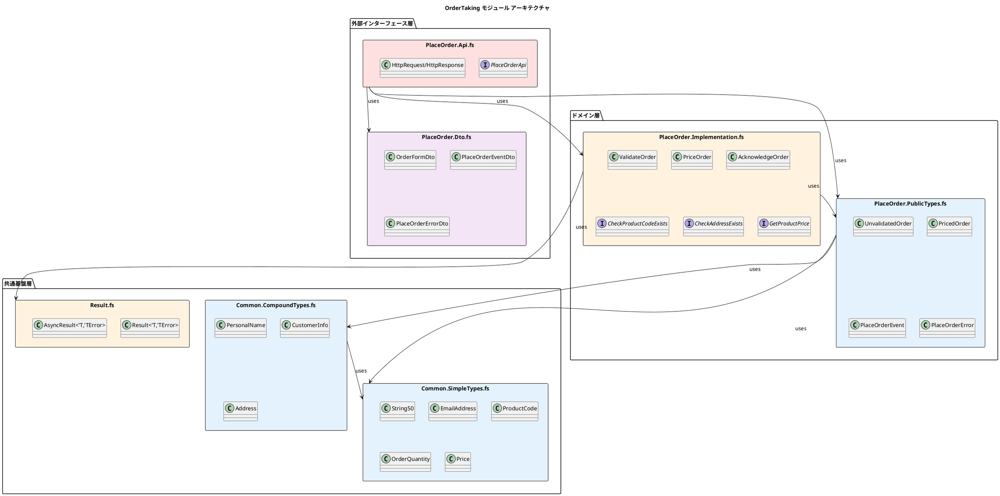

## モジュール詳細設計

### 1. 外部インターフェース層

#### PlaceOrder.Api.fs
**責務**: HTTP API エンドポイントの提供とワークフローの制御

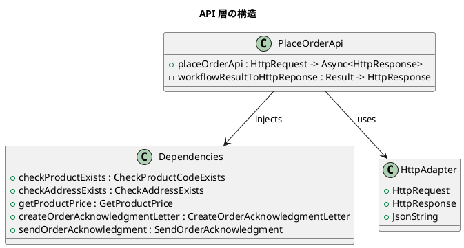

**重要な設計決定**:
- 依存関係注入によるテスタビリティの確保
- ダミー実装による外部システムからの独立性
- JSON シリアライゼーションによる HTTP 通信の抽象化

#### PlaceOrder.Dto.fs
**責務**: データ転送オブジェクト（DTO）の定義とドメインオブジェクトとの変換

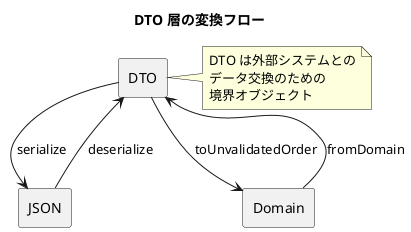

### 2. ドメイン層

#### PlaceOrder.PublicTypes.fs
**責務**: 境界付けられたコンテキストの公開インターフェース定義

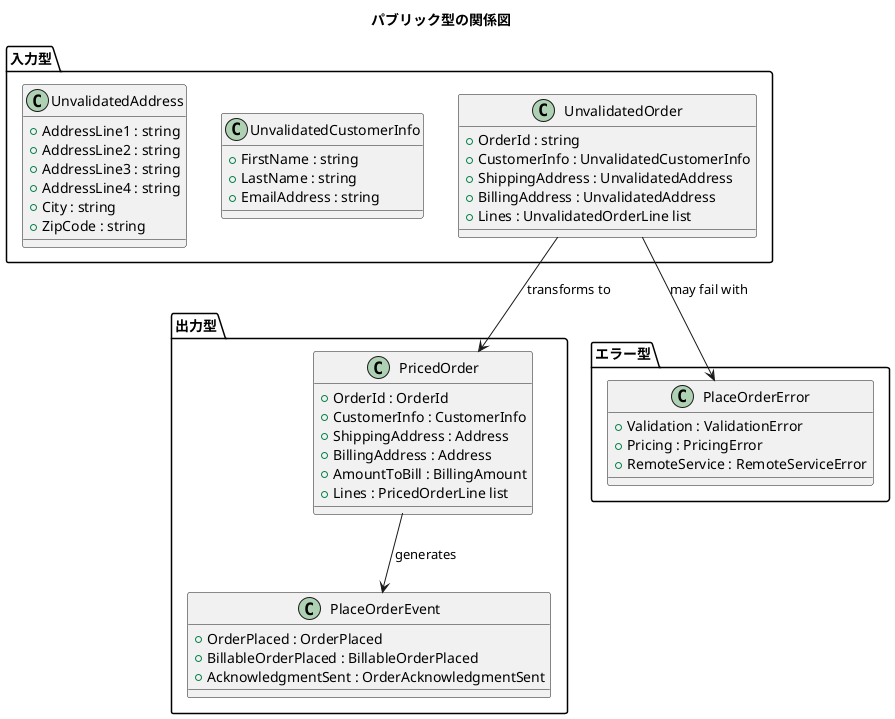

#### PlaceOrder.Implementation.fs
**責務**: ビジネスワークフローの実装とドメインロジックの集約

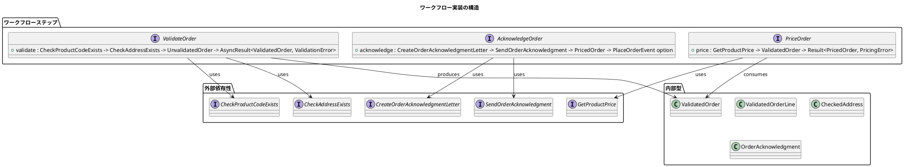

### 3. 共通基盤層

#### Common.SimpleTypes.fs
**責務**: ドメイン固有の値オブジェクトとプリミティブな制約型の定義

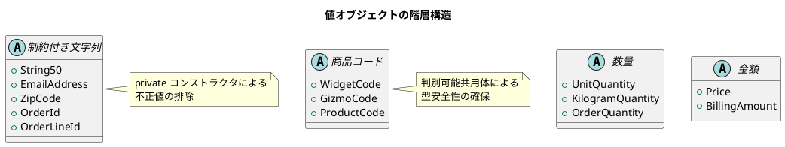

#### Common.CompoundTypes.fs
**責務**: 複合的なドメインオブジェクトの定義

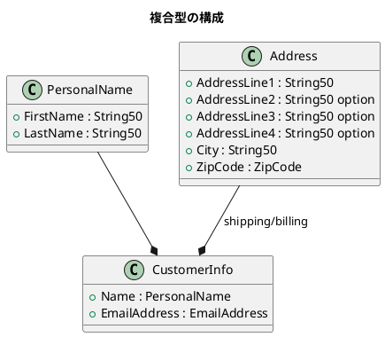

#### Result.fs
**責務**: 関数型エラーハンドリングとモナド演算の提供

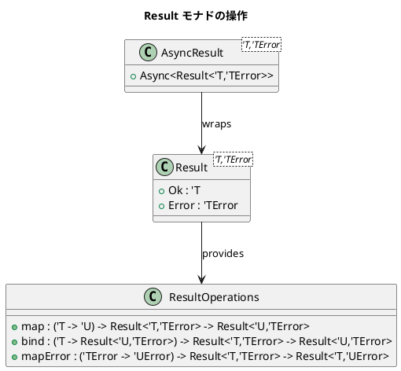

## 設計パターンとアーキテクチャ原則

### 1. ドメイン駆動設計 (DDD) パターン

#### 値オブジェクト (Value Objects)
```fsharp
// 不変性と制約の実装例
type String50 = private String50 of string

module String50 =
    let create str =
        if String.IsNullOrEmpty(str) then
            Error "String50 must not be null or empty"
        elif str.Length > 50 then
            Error "String50 must not be more than 50 chars"
        else
            Ok (String50 str)
```

#### エンティティ (Entities)
```fsharp
// 識別子による等価性
type ValidatedOrder = {
    OrderId : OrderId           // 識別子
    CustomerInfo : CustomerInfo
    ShippingAddress : Address
    BillingAddress : Address
    Lines : ValidatedOrderLine list
}
```

#### 集約 (Aggregates)
```fsharp
// 注文が集約ルートとして整合性を保証
type PricedOrder = {
    OrderId : OrderId
    // ... 他のプロパティ
    Lines : PricedOrderLine list  // 集約内のエンティティ
}
```

### 2. 関数型プログラミング原則

#### 純粋関数
```fsharp
// 副作用のない純粋関数
let priceOrder : PriceOrder =
    fun getProductPrice validatedOrder ->
        // 純粋な計算のみ
        result {
            let! pricedLines =
                validatedOrder.Lines
                |> List.map (priceOrderLine getProductPrice)
                |> Result.sequence

            let amountToBill =
                pricedLines
                |> List.sumBy (fun line -> line.LinePrice)
                |> BillingAmount.create

            return {
                OrderId = validatedOrder.OrderId
                CustomerInfo = validatedOrder.CustomerInfo
                ShippingAddress = validatedOrder.ShippingAddress
                BillingAddress = validatedOrder.BillingAddress
                AmountToBill = amountToBill
                Lines = pricedLines
            }
        }
```

#### 関数の合成
```fsharp
// ワークフローの合成
let placeOrder : PlaceOrder =
    fun checkProductCodeExists checkAddressExists getProductPrice createAcknowledgmentLetter sendAcknowledgment ->
        fun unvalidatedOrder ->
            asyncResult {
                let! validatedOrder =
                    validateOrder checkProductCodeExists checkAddressExists unvalidatedOrder

                let! pricedOrder =
                    priceOrder getProductPrice validatedOrder
                    |> AsyncResult.ofResult

                let acknowledgmentOption =
                    acknowledgeOrder createAcknowledgmentLetter sendAcknowledgment pricedOrder

                return createEvents pricedOrder acknowledgmentOption
            }
```

### 3. ポートとアダプターアーキテクチャ

#### ポート（インターフェース）
```fsharp
// 外部依存性の抽象化
type CheckProductCodeExists = ProductCode -> bool
type CheckAddressExists = UnvalidatedAddress -> AsyncResult<CheckedAddress,AddressValidationError>
type GetProductPrice = ProductCode -> Price
```

#### アダプター（実装）
```fsharp
// API 層でのダミー実装
let internal checkProductExists : CheckProductCodeExists =
    fun productCode -> true  // ダミー実装

let internal getProductPrice : GetProductPrice =
    fun productCode -> Price.unsafeCreate 1M  // ダミー実装
```

## エラーハンドリング戦略

### 1. 型安全なエラー処理

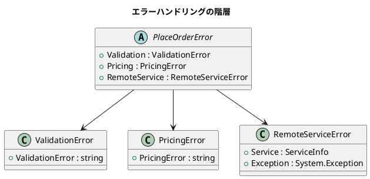

### 2. Result モナドによる例外のない実装

```fsharp
// エラーの合成と変換
let validateOrder : ValidateOrder =
    fun checkProductCodeExists checkAddressExists unvalidatedOrder ->
        asyncResult {
            let! checkedShippingAddress =
                checkAddressExists unvalidatedOrder.ShippingAddress
                |> AsyncResult.mapError (fun err -> ValidationError "Invalid shipping address")

            let! checkedBillingAddress =
                checkAddressExists unvalidatedOrder.BillingAddress
                |> AsyncResult.mapError (fun err -> ValidationError "Invalid billing address")

            // ... 他の検証

            return validatedOrder
        }
```

## データフロー設計

### 1. 型の変換パイプライン

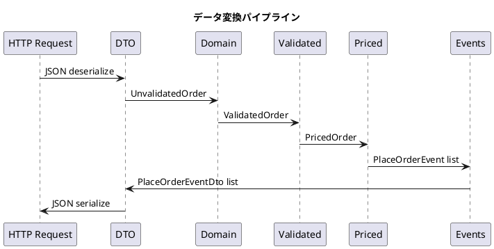

### 2. ワークフローの実行フロー

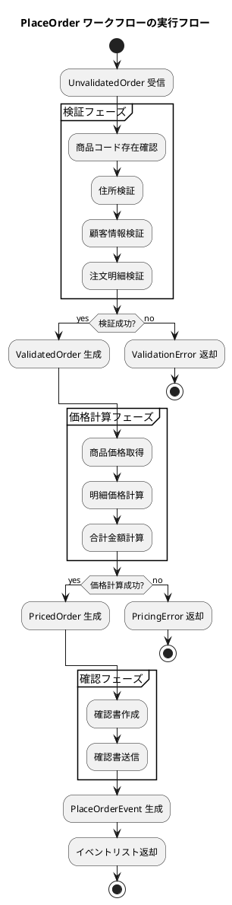

## パフォーマンス考慮事項

### 1. 非同期処理の活用

```fsharp
// AsyncResult による非同期処理
type AsyncResult<'T,'TError> = Async<Result<'T,'TError>>

// 並列処理可能な操作の識別
let validateAddresses unvalidatedOrder =
    [
        checkAddressExists unvalidatedOrder.ShippingAddress
        checkAddressExists unvalidatedOrder.BillingAddress
    ]
    |> AsyncResult.sequence  // 並列実行
```

### 2. メモリ効率の最適化

```fsharp
// 不変データ構造による効率的なデータ共有
type PricedOrder = {
    OrderId : OrderId
    CustomerInfo : CustomerInfo  // 検証済みデータの再利用
    ShippingAddress : Address    // 検証済みデータの再利用
    BillingAddress : Address     // 検証済みデータの再利用
    AmountToBill : BillingAmount
    Lines : PricedOrderLine list
}
```

## テスト戦略

### 1. 単体テストのアプローチ

```fsharp
// 純粋関数のテスト例
[<Test>]
let ``valid order should be priced correctly`` () =
    // Given
    let getProductPrice = fun _ -> Price.unsafeCreate 10M
    let validatedOrder = createValidatedOrder()

    // When
    let result = priceOrder getProductPrice validatedOrder

    // Then
    match result with
    | Ok pricedOrder ->
        pricedOrder.AmountToBill |> should equal expectedAmount
    | Error _ ->
        failwith "Expected successful pricing"
```

### 2. 統合テストのアプローチ

```fsharp
// ワークフロー全体のテスト
[<Test>]
let ``complete workflow should handle valid order`` () =
    // Given
    let dependencies = createTestDependencies()
    let unvalidatedOrder = createUnvalidatedOrder()

    // When
    let result =
        placeOrder
            dependencies.checkProductCodeExists
            dependencies.checkAddressExists
            dependencies.getProductPrice
            dependencies.createAcknowledgmentLetter
            dependencies.sendAcknowledgment
            unvalidatedOrder
        |> Async.RunSynchronously

    // Then
    match result with
    | Ok events ->
        events |> should contain (OrderPlaced pricedOrder)
    | Error _ ->
        failwith "Expected successful order processing"
```

## 運用考慮事項

### 1. ログ戦略

```fsharp
// 構造化ログの実装
let logValidationFailure (error: ValidationError) orderId =
    Log.Warning("Order validation failed: {OrderId} {Error}", orderId, error)

let logPricingFailure (error: PricingError) orderId =
    Log.Error("Order pricing failed: {OrderId} {Error}", orderId, error)
```

### 2. 監視メトリクス

```fsharp
// メトリクス収集ポイント
let incrementOrderProcessed() =
    Metrics.Counter.Increment("orders_processed_total")

let recordProcessingTime duration =
    Metrics.Histogram.Record("order_processing_duration_ms", duration)
```

## 将来の拡張性

### 1. 新しいドメインイベントの追加

```fsharp
// イベント型の拡張
type PlaceOrderEvent =
    | OrderPlaced of OrderPlaced
    | BillableOrderPlaced of BillableOrderPlaced
    | AcknowledgmentSent of OrderAcknowledgmentSent
    | OrderValidationFailed of OrderValidationFailed  // 新規追加
    | OrderCancelled of OrderCancelled                // 新規追加
```

### 2. 新しい検証ルールの追加

```fsharp
// 検証ステップの拡張
type ValidateOrder =
    CheckProductCodeExists
     -> CheckAddressExists
     -> CheckCustomerCredit     // 新規追加
     -> CheckInventoryLevel     // 新規追加
     -> UnvalidatedOrder
     -> AsyncResult<ValidatedOrder, ValidationError>
```

## まとめ

本 OrderTaking モジュールは、関数型プログラミングとドメイン駆動設計の原則を適用した優れたアーキテクチャ例です。以下の特徴により、保守性と拡張性の高いシステムを実現しています：

### 主要な設計上の利点

1. **型安全性**: F# の型システムによる compile-time での制約チェック
2. **不変性**: データの予期しない変更を防ぐ設計
3. **関数合成**: 小さな関数の組み合わせによる複雑なワークフローの実現
4. **エラーハンドリング**: Result モナドによる例外のない安全な実装
5. **テスタビリティ**: 純粋関数と依存関係注入による高いテスト容易性
6. **関心事の分離**: レイヤー間の明確な責務分離

### 推奨される活用方法

- ドメイン駆動設計の学習材料として
- 関数型プログラミングパターンの実践例として
- 型安全な Web API の実装参考として
- エラーハンドリング戦略の設計指針として

本アーキテクチャは、変更を楽に安全にできて役に立つソフトウェアの実現を目指す開発者にとって、貴重な参考実装となるでしょう。