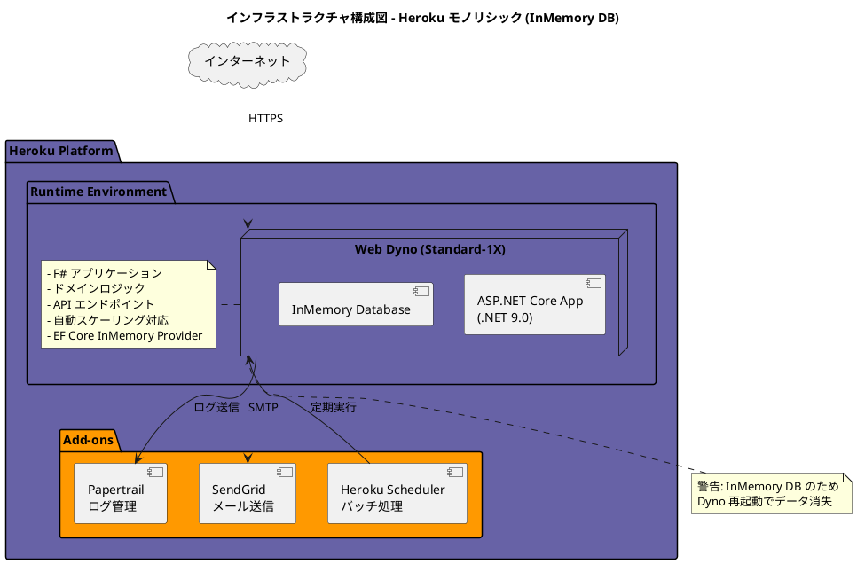
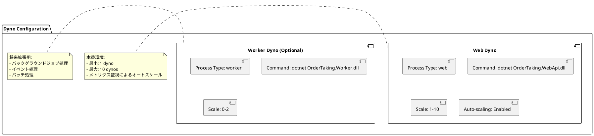
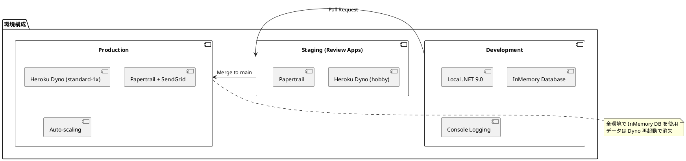
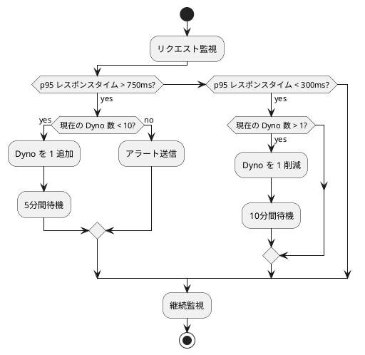
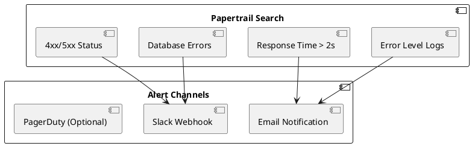
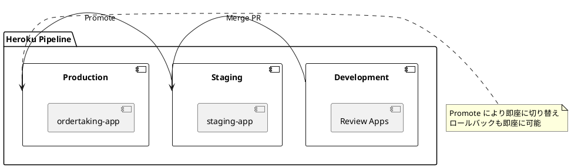

# インフラストラクチャアーキテクチャ設計書 - 注文受付システム

## 概要

本ドキュメントは、F# による関数型ドメインモデリングと ASP.NET Core を用いた注文受付システムのインフラストラクチャアーキテクチャを定義します。モノリシック構成で Heroku をクラウドプラットフォームとして採用し、インメモリデータベースを使用したシンプルなインフラを構築します。

**注意**: 本構成はインメモリデータベースを使用するため、Dyno 再起動時にデータが失われます。永続化が必要な場合は別途バックアップ戦略が必要です。

## インフラストラクチャ設計方針

### 基本原則

1. **シンプリシティ**: モノリシック構成による管理の簡素化
2. **スケーラビリティ**: Heroku のスケーリング機能を活用
3. **Infrastructure as Code**: 設定のコード化とバージョン管理
4. **自動化**: デプロイと運用の自動化
5. **コスト最適化**: 開発初期は小規模構成、必要に応じてスケール

### アーキテクチャスタイル

**モノリシックデプロイメント**を採用します。



## デプロイメントアーキテクチャ

### Heroku アプリケーション構成

#### アプリケーション設定

| 項目 | 設定値 | 説明 |
|------|--------|------|
| **App Name** | ordertaking-app | アプリケーション識別子 |
| **Region** | US または Europe | 地理的配置 |
| **Stack** | heroku-22 | Ubuntu 22.04 ベース |
| **Runtime** | .NET 9.0 | F# 実行環境 |
| **Dyno Type** | Standard-1X | 512MB RAM、1X CPU |

#### Dyno 構成



### データベース設計

#### InMemory Database 構成

| 項目 | 設定値 | 説明 |
|------|--------|------|
| **Provider** | EF Core InMemory | Entity Framework Core InMemory プロバイダー |
| **永続性** | なし | Dyno 再起動で全データ消失 |
| **パフォーマンス** | 高速 | ディスク I/O なし |
| **用途** | 開発・テスト・デモ | 本番環境での使用には注意が必要 |

#### データモデル定義

既存のデータモデル設計書に基づき、以下のエンティティを Entity Framework Core で定義します：

```fsharp
// Domain/Entities.fs
module OrderTaking.Domain.Entities

open System
open System.ComponentModel.DataAnnotations
open System.ComponentModel.DataAnnotations.Schema

[<Table("orders")>]
type OrderEntity() =
    [<Key>]
    member val OrderId: string = "" with get, set
    [<Required>]
    member val CustomerFirstName: string = "" with get, set
    [<Required>]
    member val CustomerLastName: string = "" with get, set
    [<Required>]
    member val CustomerEmail: string = "" with get, set
    [<Required>]
    member val ShippingAddressLine1: string = "" with get, set
    member val ShippingAddressLine2: string = null with get, set
    [<Required>]
    member val ShippingAddressCity: string = "" with get, set
    [<Required>]
    member val ShippingAddressZipCode: string = "" with get, set
    [<Required>]
    member val BillingAddressLine1: string = "" with get, set
    member val BillingAddressLine2: string = null with get, set
    [<Required>]
    member val BillingAddressCity: string = "" with get, set
    [<Required>]
    member val BillingAddressZipCode: string = "" with get, set
    [<Required>]
    member val OrderStatus: string = "" with get, set
    member val TotalAmount: decimal = 0m with get, set
    member val CreatedAt: DateTime = DateTime.UtcNow with get, set
    member val UpdatedAt: DateTime = DateTime.UtcNow with get, set

[<Table("order_lines")>]
type OrderLineEntity() =
    [<Key>]
    member val OrderLineId: string = "" with get, set
    [<Required>]
    member val OrderId: string = "" with get, set
    [<Required>]
    member val ProductCode: string = "" with get, set
    [<Required>]
    member val ProductType: string = "" with get, set
    [<Required>]
    member val Quantity: decimal = 0m with get, set
    member val UnitPrice: decimal = 0m with get, set
    member val LineTotal: decimal = 0m with get, set
    member val LineOrder: int = 0 with get, set

[<Table("products")>]
type ProductEntity() =
    [<Key>]
    member val ProductCode: string = "" with get, set
    [<Required>]
    member val ProductName: string = "" with get, set
    [<Required>]
    member val ProductType: string = "" with get, set
    [<Required>]
    member val UnitPrice: decimal = 0m with get, set
    member val IsActive: bool = true with get, set
    member val CreatedAt: DateTime = DateTime.UtcNow with get, set
    member val UpdatedAt: DateTime = DateTime.UtcNow with get, set

[<Table("domain_events")>]
type DomainEventEntity() =
    [<Key>]
    member val EventId: string = "" with get, set
    [<Required>]
    member val EventType: string = "" with get, set
    [<Required>]
    member val EventData: string = "" with get, set
    [<Required>]
    member val AggregateId: string = "" with get, set
    [<Required>]
    member val AggregateType: string = "" with get, set
    member val EventVersion: int = 1 with get, set
    member val OccurredAt: DateTime = DateTime.UtcNow with get, set
    member val ProcessedAt: Nullable<DateTime> = Nullable() with get, set
```

#### DbContext 設定

```fsharp
// Infrastructure/OrderContext.fs
module OrderTaking.Infrastructure.OrderContext

open Microsoft.EntityFrameworkCore
open OrderTaking.Domain.Entities

type OrderContext(options: DbContextOptions<OrderContext>) =
    inherit DbContext(options)

    [<DefaultValue>]
    val mutable private _orders: DbSet<OrderEntity>
    member this.Orders with get() = this._orders and set v = this._orders <- v

    [<DefaultValue>]
    val mutable private _orderLines: DbSet<OrderLineEntity>
    member this.OrderLines with get() = this._orderLines and set v = this._orderLines <- v

    [<DefaultValue>]
    val mutable private _products: DbSet<ProductEntity>
    member this.Products with get() = this._products and set v = this._products <- v

    [<DefaultValue>]
    val mutable private _domainEvents: DbSet<DomainEventEntity>
    member this.DomainEvents with get() = this._domainEvents and set v = this._domainEvents <- v

    override this.OnModelCreating(modelBuilder: ModelBuilder) =
        base.OnModelCreating(modelBuilder)

        // Index 定義
        modelBuilder.Entity<OrderEntity>()
            .HasIndex(fun o -> o.CustomerEmail :> obj)
            .HasDatabaseName("idx_orders_customer_email")
        |> ignore

        modelBuilder.Entity<OrderLineEntity>()
            .HasIndex(fun ol -> ol.OrderId :> obj)
            .HasDatabaseName("idx_order_lines_order_id")
        |> ignore

        modelBuilder.Entity<DomainEventEntity>()
            .HasIndex(fun de -> de.AggregateId :> obj)
            .HasDatabaseName("idx_domain_events_aggregate")
        |> ignore
```

#### InMemory Database 設定

```fsharp
// WebApi/Program.fs
let configureServices (services: IServiceCollection) =
    // InMemory Database 設定
    services.AddDbContext<OrderContext>(fun options ->
        options.UseInMemoryDatabase("OrderTakingDb") |> ignore
    ) |> ignore

    services
```

## Heroku Add-ons 構成

### 1. Papertrail（ログ管理）

#### 設定

| 項目 | 設定値 |
|------|--------|
| **Plan** | Choklad (無料) |
| **保持期間** | 7日間 |
| **検索** | フルテキスト検索対応 |

#### ログ構造化

```fsharp
// Serilog による構造化ログ
module Logging =
    open Serilog

    let configureLogger() =
        LoggerConfiguration()
            .MinimumLevel.Information()
            .Enrich.FromLogContext()
            .Enrich.WithProperty("Application", "OrderTaking")
            .Enrich.WithProperty("Environment", getEnvironment())
            .WriteTo.Console(
                outputTemplate = "[{Timestamp:yyyy-MM-dd HH:mm:ss} {Level:u3}] {Message:lj}{NewLine}{Exception}"
            )
            .CreateLogger()
```

### 2. SendGrid（メール送信）

#### 設定

| 項目 | 設定値 |
|------|--------|
| **Plan** | Starter (無料 - 月12,000通) |
| **認証** | API Key |
| **送信元** | noreply@ordertaking-app.com |

#### メール送信実装

```fsharp
module EmailService =
    open SendGrid
    open SendGrid.Helpers.Mail

    let sendOrderConfirmation (order: PricedOrder) = async {
        let apiKey = Environment.GetEnvironmentVariable("SENDGRID_API_KEY")
        let client = SendGridClient(apiKey)

        let from = EmailAddress("noreply@ordertaking-app.com", "Order Taking System")
        let subject = $"注文確認 - {order.OrderId |> OrderId.value}"
        let toEmail = order.CustomerInfo.EmailAddress |> EmailAddress.value
        let toName = $"{order.CustomerInfo.LastName |> String50.value} {order.CustomerInfo.FirstName |> String50.value}"
        let ``to`` = EmailAddress(toEmail, toName)

        let htmlContent = generateOrderConfirmationHtml order
        let msg = MailHelper.CreateSingleEmail(from, ``to``, subject, "", htmlContent)

        let! response = client.SendEmailAsync(msg) |> Async.AwaitTask
        return response.IsSuccessStatusCode
    }
```

### 3. Heroku Scheduler（バッチ処理）

#### 設定

| 項目 | 設定値 |
|------|--------|
| **Plan** | Standard (無料) |
| **実行頻度** | 日次・時間・10分間隔 |

#### スケジュールタスク例

```bash
# 毎日午前2時に未処理イベントをクリーンアップ
0 2 * * * dotnet OrderTaking.Worker.dll cleanup-events

# 1時間ごとに期限切れ注文をチェック
0 * * * * dotnet OrderTaking.Worker.dll check-expired-orders
```

## CI/CD パイプライン

### GitHub Actions → Heroku デプロイ

```yaml
# .github/workflows/deploy.yml
name: Deploy to Heroku

on:
  push:
    branches:
      - main

jobs:
  deploy:
    runs-on: ubuntu-latest
    steps:
      - name: Checkout code
        uses: actions/checkout@v3

      - name: Setup .NET
        uses: actions/setup-dotnet@v3
        with:
          dotnet-version: '9.0.x'

      - name: Restore dependencies
        run: dotnet restore

      - name: Build
        run: dotnet build --configuration Release --no-restore

      - name: Run tests
        run: dotnet test --no-build --verbosity normal

      - name: Deploy to Heroku
        uses: akhileshns/heroku-deploy@v3.12.14
        with:
          heroku_api_key: ${{secrets.HEROKU_API_KEY}}
          heroku_app_name: "ordertaking-app"
          heroku_email: ${{secrets.HEROKU_EMAIL}}
```

### Heroku Buildpack 構成

#### Procfile

```
web: cd src/OrderTaking.WebApi && dotnet OrderTaking.WebApi.dll --urls http://0.0.0.0:$PORT
```

#### .buildpacks（マルチビルドパック）

```
https://github.com/jincod/dotnetcore-buildpack
```

#### app.json（Review Apps 用）

```json
{
  "name": "OrderTaking App",
  "description": "F# 関数型ドメインモデリング - 注文受付システム (InMemory DB)",
  "repository": "https://github.com/yourusername/ordertaking-app",
  "keywords": ["fsharp", "dotnet", "ddd", "functional", "inmemory"],
  "stack": "heroku-22",
  "buildpacks": [
    {
      "url": "https://github.com/jincod/dotnetcore-buildpack"
    }
  ],
  "env": {
    "ASPNETCORE_ENVIRONMENT": {
      "description": "ASP.NET Core environment",
      "value": "Production"
    },
    "SENDGRID_API_KEY": {
      "description": "SendGrid API Key",
      "required": false
    },
    "DATABASE_PROVIDER": {
      "description": "Database provider (InMemory)",
      "value": "InMemory"
    }
  },
  "formation": {
    "web": {
      "quantity": 1,
      "size": "standard-1x"
    }
  },
  "addons": [
    "papertrail:choklad",
    "sendgrid:starter"
  ]
}
```

## 環境構成

### 環境別設定



### 環境変数管理

#### Heroku Config Vars

```bash
# 本番環境設定
heroku config:set ASPNETCORE_ENVIRONMENT=Production
heroku config:set SENDGRID_API_KEY="SG.xxx..."
heroku config:set ALLOWED_HOSTS="ordertaking-app.herokuapp.com"

# アプリケーション設定
heroku config:set MAX_ORDER_AMOUNT=10000
heroku config:set ORDER_EXPIRY_HOURS=24

# InMemory DB を使用するため DATABASE_URL は不要
```

#### appsettings.Production.json

```json
{
  "Logging": {
    "LogLevel": {
      "Default": "Information",
      "Microsoft.AspNetCore": "Warning"
    }
  },
  "AllowedHosts": "*",
  "Database": {
    "Provider": "InMemory",
    "DatabaseName": "OrderTakingDb"
  },
  "Email": {
    "Provider": "SendGrid",
    "FromAddress": "noreply@ordertaking-app.com",
    "FromName": "Order Taking System"
  },
  "OrderSettings": {
    "MaxOrderAmount": 10000,
    "ExpiryHours": 24,
    "MaxOrderLines": 50
  }
}
```

## スケーリング戦略

### 水平スケーリング

#### オートスケーリング設定

```bash
# Heroku CLI によるオートスケーリング設定
heroku ps:autoscale:enable web --min 1 --max 10 --p95 750ms

# 説明:
# - min: 最小 1 dyno
# - max: 最大 10 dynos
# - p95: レスポンスタイム95パーセンタイルが750msを超えたらスケールアップ
```

#### スケーリングポリシー



### 垂直スケーリング（Dyno タイプ変更）

| Dyno Type | RAM | 用途 | 月額コスト |
|-----------|-----|------|------------|
| **Hobby** | 512MB | 開発・テスト | $7 |
| **Standard-1X** | 512MB | 小規模本番 | $25 |
| **Standard-2X** | 1GB | 中規模本番 | $50 |
| **Performance-M** | 2.5GB | 大規模本番 | $250 |

```bash
# Dyno タイプ変更
heroku ps:type web=standard-2x
```

## データ永続化戦略

### InMemory Database の制約

InMemory Database を使用するため、以下の制約があります：

| 制約項目 | 説明 | 影響 |
|----------|------|------|
| **データ永続性** | Dyno 再起動で全データ消失 | 本番データが失われる |
| **スケーリング** | 各 Dyno が独立したメモリ空間 | データ不整合が発生 |
| **バックアップ** | 従来型バックアップ不可 | 障害復旧が困難 |

### データ永続化オプション（代替案）

InMemory DB の制約を補うための代替手段：

#### 1. イベントソーシングパターン

```fsharp
module EventStore =

    // ドメインイベントを外部ストレージに保存
    let saveEvent (event: DomainEvent) = async {
        // オプション A: ファイルシステム（Dyno の一時領域）
        // オプション B: 外部ストレージ（AWS S3、Azure Blob Storage）
        // オプション C: 外部イベントストア（EventStoreDB、Kafka）

        let eventJson = JsonSerializer.Serialize(event)
        // 外部ストレージへ保存
        return ()
    }

    // イベントから状態を再構築
    let replayEvents (aggregateId: string) = async {
        // 保存されたイベントを読み込み
        // 状態を再構築
        return ()
    }
```

#### 2. 定期スナップショット

```fsharp
module SnapshotService =

    // 定期的にメモリ内データを外部保存
    let createSnapshot (dbContext: OrderContext) = async {
        let! orders = dbContext.Orders.ToListAsync() |> Async.AwaitTask
        let! orderLines = dbContext.OrderLines.ToListAsync() |> Async.AwaitTask
        let! products = dbContext.Products.ToListAsync() |> Async.AwaitTask

        let snapshot = {|
            Timestamp = DateTime.UtcNow
            Orders = orders
            OrderLines = orderLines
            Products = products
        |}

        let json = JsonSerializer.Serialize(snapshot)
        // 外部ストレージへ保存（S3、Azure Blob など）
        return ()
    }

    // スナップショットから復元
    let restoreSnapshot (dbContext: OrderContext) = async {
        // 外部ストレージから読み込み
        // InMemory DB へロード
        return ()
    }
```

#### 3. Heroku Scheduler による定期保存

```bash
# 毎時スナップショット作成
0 * * * * dotnet OrderTaking.Worker.dll create-snapshot

# Dyno 起動時にスナップショット復元
# Procfile
web: dotnet OrderTaking.Worker.dll restore-snapshot && dotnet OrderTaking.WebApi.dll --urls http://0.0.0.0:$PORT
```

### データ監視

```fsharp
module DatabaseMonitoring =

    // メモリ使用量監視
    let monitorMemoryUsage (dbContext: OrderContext) =
        let orderCount = dbContext.Orders.Count()
        let orderLineCount = dbContext.OrderLines.Count()
        let productCount = dbContext.Products.Count()

        // メトリクスをログ出力
        Log.Information("InMemory DB Status: Orders={OrderCount}, OrderLines={OrderLineCount}, Products={ProductCount}",
            orderCount, orderLineCount, productCount)

    // データロード状態監視
    let monitorDataLoadStatus() =
        // アプリケーション起動時にデータがロードされているか確認
        // Papertrail にログ送信
        ()
```

## セキュリティ設計

### HTTPS/TLS

```bash
# Heroku は自動的に SSL/TLS 証明書を提供
# Custom domain の場合
heroku certs:auto:enable
```

### 環境変数の暗号化

```bash
# 機密情報は Config Vars で管理（暗号化済み）
heroku config:set DATABASE_URL="..."
heroku config:set SENDGRID_API_KEY="..."

# アプリケーションコードには直接記述しない
```

### アプリケーションレベルセキュリティ

```fsharp
// ASP.NET Core セキュリティ設定
module SecurityConfiguration =

    let configureServices (services: IServiceCollection) =
        services
            .AddCors(fun options ->
                options.AddPolicy("AllowedOrigins", fun builder ->
                    builder
                        .WithOrigins(getAllowedOrigins())
                        .AllowAnyMethod()
                        .AllowAnyHeader()
                    |> ignore
                )
            )
            .AddHsts(fun options ->
                options.MaxAge <- TimeSpan.FromDays(365.0)
                options.IncludeSubDomains <- true
                options.Preload <- true
            )
        |> ignore
```

## 監視とアラート

### Papertrail アラート設定



### メトリクス監視

```bash
# Heroku メトリクス確認
heroku metrics --app ordertaking-app

# ダッシュボード
https://dashboard.heroku.com/apps/ordertaking-app/metrics/web
```

## コスト見積もり

### 月額コスト試算

| リソース | プラン | 数量 | 月額コスト |
|----------|--------|------|------------|
| **Web Dyno** | Standard-1X | 1 | $25 |
| **Database** | InMemory (組み込み) | - | $0 |
| **Papertrail** | Choklad | 1 | $0 |
| **SendGrid** | Starter | 1 | $0 |
| **Scheduler** | Standard | 1 | $0 |
| **合計** | - | - | **$25/月** |

### スケール時のコスト

| 構成 | Dyno数 | 月額コスト |
|------|--------|------------|
| **最小構成** | 1 | $25 |
| **中規模** | 3 | $75 |
| **大規模** | 10 | $250 |

**注意**: InMemory DB を使用するため、データベースコストは不要です。PostgreSQL を使用する場合と比較して月額 $50 のコスト削減になります。

## ディザスタリカバリ

### RPO/RTO 目標

InMemory DB の特性上、従来型のバックアップ・リストアは適用できません。

| 指標 | 目標値 | 実現方法 | 制約 |
|------|--------|----------|------|
| **RPO** | N/A | データ永続化なし | Dyno 再起動で全データ消失 |
| **RTO** | 5分 | Dyno 再起動のみ | データは失われる |

### InMemory DB 環境でのリカバリ手順

```bash
# 1. Dyno の状態確認
heroku ps --app ordertaking-app

# 2. アプリケーション再起動
heroku restart --app ordertaking-app

# 3. ヘルスチェック
curl https://ordertaking-app.herokuapp.com/health

# 4. データ初期化（必要に応じて）
# 初期マスタデータを再投入
curl -X POST https://ordertaking-app.herokuapp.com/admin/seed-data
```

### データ損失への対応策

InMemory DB 使用時のデータ損失を最小化する方法：

#### オプション 1: スナップショット復元

```bash
# 外部ストレージから最新スナップショットを復元
heroku run dotnet OrderTaking.Worker.dll restore-snapshot --app ordertaking-app
```

#### オプション 2: イベント再生

```bash
# イベントストアから状態を再構築
heroku run dotnet OrderTaking.Worker.dll replay-events --app ordertaking-app
```

#### オプション 3: マスタデータ再投入

```bash
# 初期マスタデータのみ再投入（Products など）
heroku run dotnet OrderTaking.Worker.dll seed-master-data --app ordertaking-app
```

## デプロイメント戦略

### ブルーグリーンデプロイメント（Heroku Pipelines）



### デプロイフロー

```bash
# 1. Review App で検証
git checkout -b feature/new-feature
git push origin feature/new-feature
# → Review App 自動作成

# 2. Staging へデプロイ
git checkout main
git merge feature/new-feature
git push origin main
# → Staging 自動デプロイ

# 3. Production へ Promote
heroku pipelines:promote --app ordertaking-app-staging

# 4. ロールバック（必要時）
heroku rollback --app ordertaking-app
```

## まとめ

### インフラストラクチャの特徴

1. **超シンプルな構成**: モノリシックアプリケーション + InMemory DB、管理が非常に容易
2. **Heroku 活用**: フルマネージドサービスによる運用負荷削減
3. **低コスト**: データベース不要で月額 $25 から開始
4. **高速パフォーマンス**: ディスク I/O なしの高速データアクセス
5. **自動化**: CI/CD パイプラインによる自動デプロイ
6. **制約**: データ永続性なし、Dyno 再起動でデータ消失

### InMemory DB の適用シーン

#### 推奨される用途
- ✅ デモ・プロトタイプアプリケーション
- ✅ 開発・テスト環境
- ✅ 短期間のイベント用アプリケーション
- ✅ データ消失が許容できるアプリケーション
- ✅ ステートレスな API サーバー

#### 推奨されない用途
- ❌ 本番環境での重要データ保存
- ❌ 長期間稼働するアプリケーション
- ❌ トランザクションデータの永続化
- ❌ コンプライアンス要件があるデータ
- ❌ マルチ Dyno 構成（データ不整合が発生）

### 段階的拡張計画

#### Phase 1: 初期構成（現在）- InMemory DB
- 1 Web Dyno (Standard-1X)
- InMemory Database（組み込み）
- 基本 Add-ons（Papertrail、SendGrid）
- **月額コスト**: $25
- **用途**: デモ、プロトタイプ、開発環境

#### Phase 2: データ永続化対応
- **オプション A**: Heroku Postgres 導入
  - Standard-0 プラン追加
  - **追加コスト**: +$50/月
  - **メリット**: データ永続化、バックアップ、複数 Dyno 対応

- **オプション B**: 外部データストア連携
  - AWS S3 / Azure Blob Storage によるスナップショット保存
  - イベントソーシング + 外部イベントストア
  - **追加コスト**: ~$5-10/月
  - **メリット**: 柔軟なデータ管理、イベント駆動アーキテクチャ

#### Phase 3: スケーリング対応
- オートスケーリング有効化（1-5 dynos）
- Database 接続プール最適化（Postgres 使用時）
- パフォーマンスモニタリング強化
- Redis キャッシュ導入

#### Phase 4: エンタープライズ対応
- Dyno タイプアップグレード（Performance-M）
- Database プラン変更（Premium-0）
- CDN 導入（Cloudflare/Fastly）
- 本格的な監視・アラート体制

#### Phase 5: マイクロサービス移行（将来）
- サービス分割検討
- Kubernetes 移行検討
- イベント駆動アーキテクチャ強化
- CQRS パターン導入

### 結論

本設計により、F# 関数型ドメインモデリングによる注文受付システムを、Heroku 上で**最小限のコスト（月額 $25）**で運用できます。

**InMemory DB は開発・デモ環境に最適**ですが、本番環境での使用には注意が必要です。データ永続化が必要になった場合は、Phase 2 の拡張計画に従って PostgreSQL または外部データストアを導入してください。
