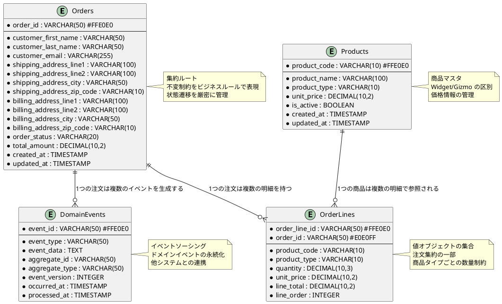

# データモデル設計書 - 注文受付システム

## 概要

本ドキュメントは、Domain Modeling Made Functional の関数型ドメインモデリングアプローチに基づく注文受付システムのデータモデル設計を定義します。F# の型安全性を活用し、Entity Framework Core による永続化を考慮した設計を行います。

## 設計方針

### 基本原則

1. **型安全性**: F# の制約付き型システムを活用したビジネスルール表現
2. **不変性**: ドメインオブジェクトの不変性を保持
3. **Railway Oriented Programming**: Result 型によるエラーハンドリング
4. **イベント駆動**: ドメインイベントによる疎結合アーキテクチャ

### データ設計戦略

- **ドメインファースト**: ビジネス概念を忠実に表現
- **集約境界**: トランザクション境界との一致
- **制約の型表現**: バリデーションロジックの型システム組み込み
- **段階的進化**: TDD による段階的なデータモデル構築

## 全体ER図



## エンティティ詳細設計

### 1. Orders（注文）

#### 物理設計

| カラム名 | データ型 | 制約 | 説明 |
|----------|----------|------|------|
| order_id | VARCHAR(50) | PRIMARY KEY | 注文ID（GUID） |
| customer_first_name | VARCHAR(50) | NOT NULL | 顧客名（名） |
| customer_last_name | VARCHAR(50) | NOT NULL | 顧客名（姓） |
| customer_email | VARCHAR(255) | NOT NULL | メールアドレス |
| shipping_address_line1 | VARCHAR(100) | NOT NULL | 配送先住所1 |
| shipping_address_line2 | VARCHAR(100) | NULL | 配送先住所2 |
| shipping_address_city | VARCHAR(50) | NOT NULL | 配送先市区町村 |
| shipping_address_zip_code | VARCHAR(10) | NOT NULL | 配送先郵便番号 |
| billing_address_line1 | VARCHAR(100) | NOT NULL | 請求先住所1 |
| billing_address_line2 | VARCHAR(100) | NULL | 請求先住所2 |
| billing_address_city | VARCHAR(50) | NOT NULL | 請求先市区町村 |
| billing_address_zip_code | VARCHAR(10) | NOT NULL | 請求先郵便番号 |
| order_status | VARCHAR(20) | NOT NULL | 注文ステータス |
| total_amount | DECIMAL(10,2) | NULL | 合計金額 |
| created_at | TIMESTAMP | NOT NULL DEFAULT CURRENT_TIMESTAMP | 作成日時 |
| updated_at | TIMESTAMP | NOT NULL DEFAULT CURRENT_TIMESTAMP | 更新日時 |

#### F# 型定義

```fsharp
// 制約付き基本型
type String50 = private String50 of string
type EmailAddress = private EmailAddress of string
type ZipCode = private ZipCode of string
type OrderId = private OrderId of string

// 住所値オブジェクト
type Address = {
    AddressLine1: String50
    AddressLine2: String50 option
    City: String50
    ZipCode: ZipCode
}

// 顧客情報値オブジェクト
type CustomerInfo = {
    FirstName: String50
    LastName: String50
    EmailAddress: EmailAddress
}

// 注文ステータス
type OrderStatus =
    | Unvalidated
    | Validated
    | Priced
    | Placed

// 注文エンティティ
type Order = {
    OrderId: OrderId
    CustomerInfo: CustomerInfo
    ShippingAddress: Address
    BillingAddress: Address
    OrderLines: OrderLine list
    Status: OrderStatus
    TotalAmount: decimal option
}
```

#### ビジネスルール

1. **必須項目制約**
   - 顧客名（姓・名）: 50文字以内
   - メールアドレス: 有効な形式
   - 住所: 必須項目の入力

2. **状態遷移制約**
   ```
   Unvalidated → Validated → Priced → Placed
   ```

3. **集約境界**
   - 注文は OrderLines を含む集約ルート
   - 合計金額は明細の積み上げと一致

### 2. OrderLines（注文明細）

#### 物理設計

| カラム名 | データ型 | 制約 | 説明 |
|----------|----------|------|------|
| order_line_id | VARCHAR(50) | PRIMARY KEY | 明細ID（GUID） |
| order_id | VARCHAR(50) | FOREIGN KEY | 注文ID |
| product_code | VARCHAR(10) | NOT NULL | 商品コード |
| product_type | VARCHAR(10) | NOT NULL | 商品タイプ（Widget/Gizmo） |
| quantity | DECIMAL(10,3) | NOT NULL | 数量 |
| unit_price | DECIMAL(10,2) | NULL | 単価 |
| line_total | DECIMAL(10,2) | NULL | 明細合計 |
| line_order | INTEGER | NOT NULL | 明細順序 |

#### F# 型定義

```fsharp
// 商品コード（判別共用体）
type ProductCode =
    | Widget of WidgetCode
    | Gizmo of GizmoCode

and WidgetCode = private WidgetCode of string
and GizmoCode = private GizmoCode of string

// 数量（判別共用体）
type OrderQuantity =
    | Unit of UnitQuantity
    | Kilogram of KilogramQuantity

and UnitQuantity = private UnitQuantity of int
and KilogramQuantity = private KilogramQuantity of decimal

// 価格
type Price = private Price of decimal

// 注文明細
type OrderLine = {
    OrderLineId: OrderLineId
    ProductCode: ProductCode
    Quantity: OrderQuantity
    Price: Price option
}
```

#### ビジネスルール

1. **商品コード制約**
   - Widget: "W" + 4桁数字（例: W1234）
   - Gizmo: "G" + 3桁数字（例: G123）

2. **数量制約**
   - Widget: 1〜1000個
   - Gizmo: 0.05〜100.00kg

3. **価格計算**
   - 明細合計 = 単価 × 数量
   - 注文合計 = 全明細の合計

### 3. Products（商品マスタ）

#### 物理設計

| カラム名 | データ型 | 制約 | 説明 |
|----------|----------|------|------|
| product_code | VARCHAR(10) | PRIMARY KEY | 商品コード |
| product_name | VARCHAR(100) | NOT NULL | 商品名 |
| product_type | VARCHAR(10) | NOT NULL | 商品タイプ |
| unit_price | DECIMAL(10,2) | NOT NULL | 単価 |
| is_active | BOOLEAN | NOT NULL DEFAULT TRUE | 有効フラグ |
| created_at | TIMESTAMP | NOT NULL DEFAULT CURRENT_TIMESTAMP | 作成日時 |
| updated_at | TIMESTAMP | NOT NULL DEFAULT CURRENT_TIMESTAMP | 更新日時 |

#### インデックス設計

```sql
-- 主キー
ALTER TABLE Products ADD CONSTRAINT PK_Products PRIMARY KEY (product_code);

-- 商品タイプ別検索
CREATE INDEX IX_Products_ProductType ON Products (product_type, is_active);

-- 有効商品検索
CREATE INDEX IX_Products_Active ON Products (is_active, product_code);
```

### 4. DomainEvents（ドメインイベント）

#### 物理設計

| カラム名 | データ型 | 制約 | 説明 |
|----------|----------|------|------|
| event_id | VARCHAR(50) | PRIMARY KEY | イベントID（GUID） |
| event_type | VARCHAR(50) | NOT NULL | イベントタイプ |
| event_data | TEXT | NOT NULL | イベントデータ（JSON） |
| aggregate_id | VARCHAR(50) | NOT NULL | 集約ID |
| aggregate_type | VARCHAR(50) | NOT NULL | 集約タイプ |
| event_version | INTEGER | NOT NULL | イベントバージョン |
| occurred_at | TIMESTAMP | NOT NULL | 発生日時 |
| processed_at | TIMESTAMP | NULL | 処理日時 |

#### F# 型定義

```fsharp
// ドメインイベント
type PlaceOrderEvent =
    | OrderPlaced of OrderPlaced
    | BillableOrderPlaced of BillableOrderPlaced
    | AcknowledgmentSent of AcknowledgmentSent

and OrderPlaced = {
    OrderId: OrderId
    CustomerInfo: CustomerInfo
    ShippingAddress: Address
    OrderLines: PricedOrderLine list
    AmountToBill: decimal
}

and BillableOrderPlaced = {
    OrderId: OrderId
    BillingAddress: Address
    AmountToBill: decimal
}

and AcknowledgmentSent = {
    OrderId: OrderId
    EmailAddress: EmailAddress
}
```

## Entity Framework Core マッピング

### DbContext 設計

```fsharp
type OrderContext(options: DbContextOptions<OrderContext>) =
    inherit DbContext(options)

    [<DefaultValue>] val mutable orders : DbSet<OrderEntity>
    member this.Orders with get() = this.orders and set v = this.orders <- v

    [<DefaultValue>] val mutable orderLines : DbSet<OrderLineEntity>
    member this.OrderLines with get() = this.orderLines and set v = this.orderLines <- v

    [<DefaultValue>] val mutable products : DbSet<ProductEntity>
    member this.Products with get() = this.products and set v = this.products <- v

    [<DefaultValue>] val mutable domainEvents : DbSet<DomainEventEntity>
    member this.DomainEvents with get() = this.domainEvents and set v = this.domainEvents <- v

    override this.OnModelCreating(modelBuilder: ModelBuilder) =
        base.OnModelCreating(modelBuilder)

        // Orders エンティティ設定
        modelBuilder.Entity<OrderEntity>(fun entity ->
            entity.HasKey(fun e -> e.OrderId) |> ignore
            entity.Property(fun e -> e.CustomerFirstName).HasMaxLength(50).IsRequired() |> ignore
            entity.Property(fun e -> e.CustomerLastName).HasMaxLength(50).IsRequired() |> ignore
            entity.Property(fun e -> e.CustomerEmail).HasMaxLength(255).IsRequired() |> ignore

            // 住所関連
            entity.Property(fun e -> e.ShippingAddressLine1).HasMaxLength(100).IsRequired() |> ignore
            entity.Property(fun e -> e.ShippingZipCode).HasMaxLength(10).IsRequired() |> ignore

            // 関連設定
            entity.HasMany(fun e -> e.OrderLines)
                  .WithOne(fun ol -> ol.Order)
                  .HasForeignKey(fun ol -> ol.OrderId) |> ignore
        ) |> ignore

        // OrderLines エンティティ設定
        modelBuilder.Entity<OrderLineEntity>(fun entity ->
            entity.HasKey(fun e -> e.OrderLineId) |> ignore
            entity.Property(fun e -> e.ProductCode).HasMaxLength(10).IsRequired() |> ignore
            entity.Property(fun e -> e.Quantity).HasPrecision(10, 3).IsRequired() |> ignore
            entity.Property(fun e -> e.UnitPrice).HasPrecision(10, 2) |> ignore
        ) |> ignore
```

### エンティティクラス

```fsharp
// EF Core用エンティティ
[<CLIMutable>]
type OrderEntity = {
    mutable OrderId: string
    mutable CustomerFirstName: string
    mutable CustomerLastName: string
    mutable CustomerEmail: string
    mutable ShippingAddressLine1: string
    mutable ShippingAddressLine2: string
    mutable ShippingAddressCity: string
    mutable ShippingZipCode: string
    mutable BillingAddressLine1: string
    mutable BillingAddressLine2: string
    mutable BillingAddressCity: string
    mutable BillingZipCode: string
    mutable OrderStatus: string
    mutable TotalAmount: decimal option
    mutable CreatedAt: DateTime
    mutable UpdatedAt: DateTime
    mutable OrderLines: ICollection<OrderLineEntity>
}

[<CLIMutable>]
type OrderLineEntity = {
    mutable OrderLineId: string
    mutable OrderId: string
    mutable ProductCode: string
    mutable ProductType: string
    mutable Quantity: decimal
    mutable UnitPrice: decimal option
    mutable LineTotal: decimal option
    mutable LineOrder: int
    mutable Order: OrderEntity
}
```

## データ変換（マッピング）

### ドメインモデル ↔ エンティティ変換

```fsharp
module OrderMapping =

    let toDomainOrder (entity: OrderEntity) : Result<Order, string> =
        result {
            let! orderId = OrderId.create entity.OrderId
            let! firstName = String50.create entity.CustomerFirstName
            let! lastName = String50.create entity.CustomerLastName
            let! email = EmailAddress.create entity.CustomerEmail

            let customerInfo = {
                FirstName = firstName
                LastName = lastName
                EmailAddress = email
            }

            let! shippingAddress =
                result {
                    let! line1 = String50.create entity.ShippingAddressLine1
                    let! city = String50.create entity.ShippingAddressCity
                    let! zipCode = ZipCode.create entity.ShippingZipCode
                    let line2 =
                        if String.IsNullOrEmpty(entity.ShippingAddressLine2) then None
                        else String50.create entity.ShippingAddressLine2 |> Result.map Some |> Result.defaultValue None

                    return {
                        AddressLine1 = line1
                        AddressLine2 = line2
                        City = city
                        ZipCode = zipCode
                    }
                }

            // OrderLines の変換（省略）

            return {
                OrderId = orderId
                CustomerInfo = customerInfo
                ShippingAddress = shippingAddress
                BillingAddress = shippingAddress // 簡略化
                OrderLines = []  // 実装時に詳細化
                Status = parseOrderStatus entity.OrderStatus
                TotalAmount = entity.TotalAmount
            }
        }

    let toEntity (order: Order) : OrderEntity =
        {
            OrderId = order.OrderId |> OrderId.value
            CustomerFirstName = order.CustomerInfo.FirstName |> String50.value
            CustomerLastName = order.CustomerInfo.LastName |> String50.value
            CustomerEmail = order.CustomerInfo.EmailAddress |> EmailAddress.value
            ShippingAddressLine1 = order.ShippingAddress.AddressLine1 |> String50.value
            ShippingAddressLine2 =
                order.ShippingAddress.AddressLine2
                |> Option.map String50.value
                |> Option.defaultValue null
            ShippingAddressCity = order.ShippingAddress.City |> String50.value
            ShippingZipCode = order.ShippingAddress.ZipCode |> ZipCode.value
            // 他のフィールドも同様にマッピング
            BillingAddressLine1 = order.BillingAddress.AddressLine1 |> String50.value
            BillingAddressLine2 =
                order.BillingAddress.AddressLine2
                |> Option.map String50.value
                |> Option.defaultValue null
            BillingAddressCity = order.BillingAddress.City |> String50.value
            BillingZipCode = order.BillingAddress.ZipCode |> ZipCode.value
            OrderStatus = order.Status.ToString()
            TotalAmount = order.TotalAmount
            CreatedAt = DateTime.UtcNow
            UpdatedAt = DateTime.UtcNow
            OrderLines = ResizeArray()
        }
```

## テストデータ設計

### テスト用データビルダー

```fsharp
module TestDataBuilders =

    type OrderBuilder() =
        let mutable orderId = "ORDER001"
        let mutable customerInfo = {
            FirstName = String50.create "太郎" |> Result.defaultValue (String50 "太郎")
            LastName = String50.create "田中" |> Result.defaultValue (String50 "田中")
            EmailAddress = EmailAddress.create "tanaka@example.com" |> Result.defaultValue (EmailAddress "tanaka@example.com")
        }
        let mutable shippingAddress = {
            AddressLine1 = String50.create "東京都渋谷区" |> Result.defaultValue (String50 "東京都渋谷区")
            AddressLine2 = None
            City = String50.create "渋谷区" |> Result.defaultValue (String50 "渋谷区")
            ZipCode = ZipCode.create "12345" |> Result.defaultValue (ZipCode "12345")
        }

        member this.WithOrderId(id: string) =
            orderId <- id
            this

        member this.WithCustomer(firstName: string, lastName: string, email: string) =
            customerInfo <- {
                FirstName = String50.create firstName |> Result.defaultValue (String50 firstName)
                LastName = String50.create lastName |> Result.defaultValue (String50 lastName)
                EmailAddress = EmailAddress.create email |> Result.defaultValue (EmailAddress email)
            }
            this

        member this.Build() = {
            OrderId = OrderId.create orderId |> Result.defaultValue (OrderId orderId)
            CustomerInfo = customerInfo
            ShippingAddress = shippingAddress
            BillingAddress = shippingAddress
            OrderLines = []
            Status = Unvalidated
            TotalAmount = None
        }

    // 使用例
    let validOrder =
        OrderBuilder()
            .WithOrderId("ORDER001")
            .WithCustomer("太郎", "田中", "tanaka@example.com")
            .Build()
```

## パフォーマンス最適化

### インデックス戦略

```sql
-- 注文検索の最適化
CREATE INDEX IX_Orders_CustomerEmail ON Orders (customer_email);
CREATE INDEX IX_Orders_Status_CreatedAt ON Orders (order_status, created_at);
CREATE INDEX IX_Orders_CreatedAt ON Orders (created_at DESC);

-- 明細検索の最適化
CREATE INDEX IX_OrderLines_OrderId ON OrderLines (order_id);
CREATE INDEX IX_OrderLines_ProductCode ON OrderLines (product_code);

-- イベント検索の最適化
CREATE INDEX IX_DomainEvents_AggregateId ON DomainEvents (aggregate_id, occurred_at);
CREATE INDEX IX_DomainEvents_EventType ON DomainEvents (event_type, occurred_at);
CREATE INDEX IX_DomainEvents_Processed ON DomainEvents (processed_at) WHERE processed_at IS NULL;
```

### クエリ最適化

```fsharp
module OptimizedQueries =

    // 注文詳細の効率的な取得
    let getOrderWithLines (context: OrderContext) (orderId: string) =
        async {
            let! orderEntity =
                context.Orders
                    .Include(fun o -> o.OrderLines)
                    .FirstOrDefaultAsync(fun o -> o.OrderId = orderId)
                |> Async.AwaitTask

            return
                if orderEntity <> null then
                    OrderMapping.toDomainOrder orderEntity |> Some
                else None
        }

    // 顧客の注文履歴取得
    let getOrdersByCustomerEmail (context: OrderContext) (email: string) =
        async {
            let! orderEntities =
                context.Orders
                    .Where(fun o -> o.CustomerEmail = email)
                    .OrderByDescending(fun o -> o.CreatedAt)
                    .ToListAsync()
                |> Async.AwaitTask

            return
                orderEntities
                |> Seq.map OrderMapping.toDomainOrder
                |> Seq.choose (Result.toOption)
                |> List.ofSeq
        }
```

## データ移行戦略

### Entity Framework Core マイグレーション

```fsharp
// 初期マイグレーション
// dotnet ef migrations add InitialCreate
// dotnet ef database update

module DatabaseMigrations =

    // データベース初期化
    let initializeDatabase (context: OrderContext) =
        async {
            // データベース作成
            let! created = context.Database.EnsureCreatedAsync() |> Async.AwaitTask

            if created then
                // 初期データ投入
                let sampleProducts = [
                    { ProductCode = "W1234"; ProductName = "Widget A"; ProductType = "Widget"; UnitPrice = 10.00m; IsActive = true; CreatedAt = DateTime.UtcNow; UpdatedAt = DateTime.UtcNow }
                    { ProductCode = "W5678"; ProductName = "Widget B"; ProductType = "Widget"; UnitPrice = 15.00m; IsActive = true; CreatedAt = DateTime.UtcNow; UpdatedAt = DateTime.UtcNow }
                    { ProductCode = "G123"; ProductName = "Gizmo X"; ProductType = "Gizmo"; UnitPrice = 20.00m; IsActive = true; CreatedAt = DateTime.UtcNow; UpdatedAt = DateTime.UtcNow }
                ]

                context.Products.AddRange(sampleProducts)
                let! _ = context.SaveChangesAsync() |> Async.AwaitTask
                ()
        }
```

## セキュリティ考慮事項

### データ保護

1. **個人情報保護**
   - メールアドレスの暗号化（必要に応じて）
   - 住所情報のアクセス制御

2. **SQLインジェクション対策**
   - パラメータ化クエリの使用
   - Entity Framework Core の安全な API 使用

3. **監査ログ**
   - データ変更履歴の記録
   - アクセスログの保持

```fsharp
// 監査ログ用の基底エンティティ
[<AbstractClass>]
type AuditableEntity() =
    [<DefaultValue>] val mutable createdAt : DateTime
    [<DefaultValue>] val mutable updatedAt : DateTime
    [<DefaultValue>] val mutable createdBy : string
    [<DefaultValue>] val mutable updatedBy : string

    member this.CreatedAt with get() = this.createdAt and set v = this.createdAt <- v
    member this.UpdatedAt with get() = this.updatedAt and set v = this.updatedAt <- v
    member this.CreatedBy with get() = this.createdBy and set v = this.createdBy <- v
    member this.UpdatedBy with get() = this.updatedBy and set v = this.updatedBy <- v
```

## まとめ

### 設計の特徴

1. **関数型ドメインモデリング**: F# の型システムを活用したビジネスルール表現
2. **制約付き型**: 不正な値の存在を型レベルで排除
3. **イベント駆動**: ドメインイベントによる疎結合アーキテクチャ
4. **TDD対応**: テストファーストによる段階的なデータモデル構築

### 拡張ポイント

1. **イベントソーシング**: DomainEvents テーブルの活用
2. **CQRS**: 読み取り専用モデルの追加
3. **分散システム**: メッセージング基盤との連携
4. **マイクロサービス**: 集約境界での分割

このデータモデル設計により、型安全で保守性の高い注文受付システムの基盤が構築されます。