# ドメインモデル設計 - 注文受付システム (OrderTaking)

## 概要

本ドキュメントは、`src\OrderTaking\` モジュールの実装を基にしたドメインモデル設計を体系的に記述します。F# の関数型プログラミングとドメイン駆動設計の原則を活用し、「Domain Modeling Made Functional」のアプローチに基づいた実装となっています。

## ドメインモデルの全体像

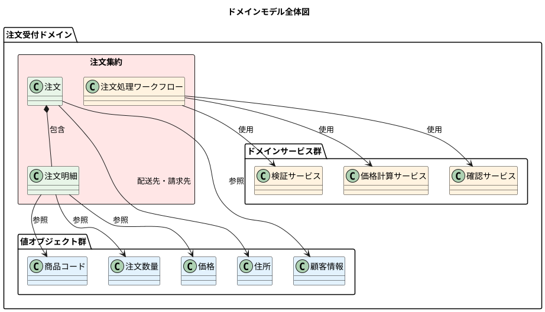

## 値オブジェクト（Value Objects）

### 基本制約型

#### 文字列制約型
```fsharp
/// 50 文字以内の非空文字列
type String50 = private String50 of string

/// メールアドレス（@ を含む文字列）
type EmailAddress = private EmailAddress of string

/// 郵便番号（5 桁の数字）
type ZipCode = private ZipCode of string

/// 注文 ID（50 文字以内の非空文字列）
type OrderId = private OrderId of string

/// 注文明細 ID（50 文字以内の非空文字列）
type OrderLineId = private OrderLineId of string
```

**設計原則**:
- private コンストラクタによる不正値の排除
- 作成時の制約チェック
- 不変性の保証

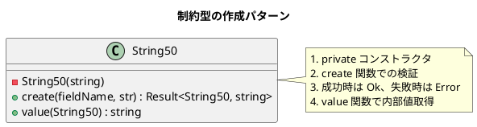

#### 商品コード階層

```fsharp
/// Widget 商品コード（"W" + 4桁数字）
type WidgetCode = private WidgetCode of string

/// Gizmo 商品コード（"G" + 3桁数字）
type GizmoCode = private GizmoCode of string

/// 商品コード（Widget または Gizmo）
type ProductCode =
    | Widget of WidgetCode
    | Gizmo of GizmoCode
```

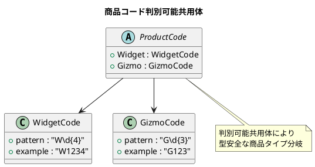

#### 数量と価格

```fsharp
/// 単位数量（1-1000 の整数）
type UnitQuantity = private UnitQuantity of int

/// 重量数量（0.05-100.00 の小数）
type KilogramQuantity = private KilogramQuantity of decimal

/// 注文数量（単位 または 重量）
type OrderQuantity =
    | Unit of UnitQuantity
    | Kilogram of KilogramQuantity

/// 価格（0.0-1000.00 の小数）
type Price = private Price of decimal

/// 請求金額（0.0-10000.00 の小数）
type BillingAmount = private BillingAmount of decimal
```

### 複合値オブジェクト

#### 個人名・顧客情報

```fsharp
/// 個人名
type PersonalName = {
    FirstName : String50
    LastName : String50
}

/// 顧客情報
type CustomerInfo = {
    Name : PersonalName
    EmailAddress : EmailAddress
}
```

#### 住所

```fsharp
/// 住所
type Address = {
    AddressLine1 : String50
    AddressLine2 : String50 option
    AddressLine3 : String50 option
    AddressLine4 : String50 option
    City : String50
    ZipCode : ZipCode
}
```

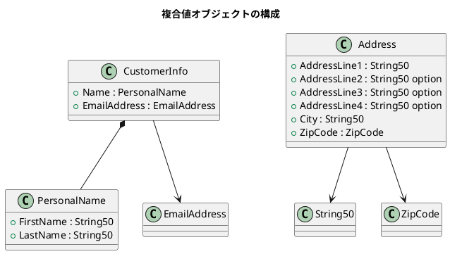

## エンティティ（Entities）

### 注文明細エンティティ

```fsharp
/// 検証済み注文明細
type ValidatedOrderLine = {
    OrderLineId : OrderLineId      // 識別子
    ProductCode : ProductCode
    Quantity : OrderQuantity
}

/// 価格付き注文明細
type PricedOrderLine = {
    OrderLineId : OrderLineId      // 識別子
    ProductCode : ProductCode
    Quantity : OrderQuantity
    LinePrice : Price              // 計算された価格
}
```

### 注文エンティティ（集約ルート）

```fsharp
/// 未検証注文（入力）
type UnvalidatedOrder = {
    OrderId : string                          // 未検証
    CustomerInfo : UnvalidatedCustomerInfo    // 未検証
    ShippingAddress : UnvalidatedAddress      // 未検証
    BillingAddress : UnvalidatedAddress       // 未検証
    Lines : UnvalidatedOrderLine list         // 未検証
}

/// 検証済み注文
type ValidatedOrder = {
    OrderId : OrderId                    // 識別子
    CustomerInfo : CustomerInfo          // 検証済み
    ShippingAddress : Address            // 検証済み
    BillingAddress : Address             // 検証済み
    Lines : ValidatedOrderLine list      // 検証済み
}

/// 価格付き注文（集約ルート）
type PricedOrder = {
    OrderId : OrderId                    // 識別子
    CustomerInfo : CustomerInfo
    ShippingAddress : Address
    BillingAddress : Address
    AmountToBill : BillingAmount         // 計算された請求金額
    Lines : PricedOrderLine list         // 価格付き明細
}
```

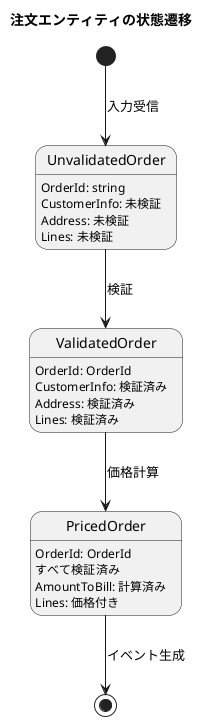

## 集約（Aggregates）

### 注文集約

```fsharp
/// 注文集約の境界
/// PricedOrder が集約ルートとして整合性を保証
type OrderAggregate = PricedOrder

/// 集約内の整合性ルール
/// 1. AmountToBill = Sum(Lines.LinePrice)
/// 2. すべての Lines.OrderLineId は一意
/// 3. Lines は空でない
```

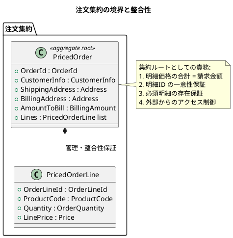

## ドメインサービス（Domain Services）

### 検証サービス

```fsharp
/// 商品コード存在確認
type CheckProductCodeExists = ProductCode -> bool

/// 住所検証結果
type AddressValidationError =
    | InvalidFormat
    | AddressNotFound

/// 検証済み住所
type CheckedAddress = CheckedAddress of UnvalidatedAddress

/// 住所存在確認
type CheckAddressExists =
    UnvalidatedAddress -> AsyncResult<CheckedAddress, AddressValidationError>

/// 注文検証サービス
type ValidateOrder =
    CheckProductCodeExists
    -> CheckAddressExists
    -> UnvalidatedOrder
    -> AsyncResult<ValidatedOrder, ValidationError>
```

### 価格計算サービス

```fsharp
/// 商品価格取得
type GetProductPrice = ProductCode -> Price

/// 価格計算サービス
type PriceOrder =
    GetProductPrice
    -> ValidatedOrder
    -> Result<PricedOrder, PricingError>
```

### 確認サービス

```fsharp
/// HTML 文字列
type HtmlString = HtmlString of string

/// 注文確認書
type OrderAcknowledgment = {
    EmailAddress : EmailAddress
    Letter : HtmlString
}

/// 確認書作成
type CreateOrderAcknowledgmentLetter = PricedOrder -> HtmlString

/// 送信結果
type SendResult = Sent | NotSent

/// 確認書送信
type SendOrderAcknowledgment = OrderAcknowledgment -> SendResult

/// 注文確認サービス
type AcknowledgeOrder =
    CreateOrderAcknowledgmentLetter
    -> SendOrderAcknowledgment
    -> PricedOrder
    -> OrderAcknowledgmentSent option
```

```plantuml
@startuml
title ドメインサービスの相互作用

participant "ValidateOrder" as validate
participant "CheckProductCodeExists" as checkProduct
participant "CheckAddressExists" as checkAddress
participant "PriceOrder" as price
participant "GetProductPrice" as getPrice
participant "AcknowledgeOrder" as acknowledge

activate validate
validate -> checkProduct : 商品コード確認
activate checkProduct
checkProduct --> validate : bool
deactivate checkProduct

validate -> checkAddress : 住所確認
activate checkAddress
checkAddress --> validate : AsyncResult<CheckedAddress, Error>
deactivate checkAddress

validate --> price : ValidatedOrder
deactivate validate

activate price
price -> getPrice : 商品価格取得
activate getPrice
getPrice --> price : Price
deactivate getPrice

price --> acknowledge : PricedOrder
deactivate price

activate acknowledge
acknowledge --> acknowledge : 確認書送信
acknowledge --> [*] : OrderAcknowledgmentSent option
deactivate acknowledge
@enduml
```

## ワークフロー（Application Services）

### PlaceOrder ワークフロー

```fsharp
/// 注文受付ワークフローの型シグネチャ
type PlaceOrder =
    UnvalidatedOrder -> AsyncResult<PlaceOrderEvent list, PlaceOrderError>

/// ワークフローの実装
let placeOrder
    (checkProductExists: CheckProductCodeExists)
    (checkAddressExists: CheckAddressExists)
    (getProductPrice: GetProductPrice)
    (createAcknowledgmentLetter: CreateOrderAcknowledgmentLetter)
    (sendAcknowledgment: SendOrderAcknowledgment)
    : PlaceOrder =

    fun unvalidatedOrder ->
        asyncResult {
            // 1. 検証フェーズ
            let! validatedOrder =
                validateOrder checkProductExists checkAddressExists unvalidatedOrder
                |> AsyncResult.mapError PlaceOrderError.Validation

            // 2. 価格計算フェーズ
            let! pricedOrder =
                priceOrder getProductPrice validatedOrder
                |> AsyncResult.ofResult
                |> AsyncResult.mapError PlaceOrderError.Pricing

            // 3. 確認フェーズ
            let acknowledgmentOption =
                acknowledgeOrder createAcknowledgmentLetter sendAcknowledgment pricedOrder

            // 4. イベント生成
            let events =
                createEvents pricedOrder acknowledgmentOption

            return events
        }
```

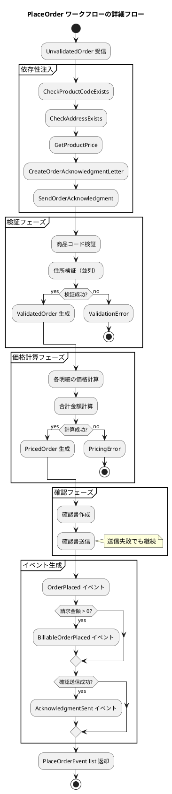

## ドメインイベント

### イベント定義

```fsharp
/// 注文確定イベント（配送システム向け）
type OrderPlaced = PricedOrder

/// 請求可能注文イベント（請求システム向け）
type BillableOrderPlaced = {
    OrderId : OrderId
    BillingAddress : Address
    AmountToBill : BillingAmount
}

/// 確認送信済みイベント（監査向け）
type OrderAcknowledgmentSent = {
    OrderId : OrderId
    EmailAddress : EmailAddress
}

/// 注文受付イベント群
type PlaceOrderEvent =
    | OrderPlaced of OrderPlaced
    | BillableOrderPlaced of BillableOrderPlaced
    | AcknowledgmentSent of OrderAcknowledgmentSent
```

### イベント生成ロジック

```fsharp
/// イベント生成関数
let createEvents : CreateEvents =
    fun pricedOrder acknowledgmentEventOpt ->
        let acknowledgmentEvents =
            acknowledgmentEventOpt
            |> Option.map PlaceOrderEvent.AcknowledgmentSent
            |> Option.toList

        let orderPlacedEvents =
            pricedOrder
            |> PlaceOrderEvent.OrderPlaced
            |> List.singleton

        let billingEvents =
            if pricedOrder.AmountToBill |> BillingAmount.value > 0M then
                {
                    OrderId = pricedOrder.OrderId
                    BillingAddress = pricedOrder.BillingAddress
                    AmountToBill = pricedOrder.AmountToBill
                }
                |> PlaceOrderEvent.BillableOrderPlaced
                |> List.singleton
            else
                []

        acknowledgmentEvents @ orderPlacedEvents @ billingEvents
```

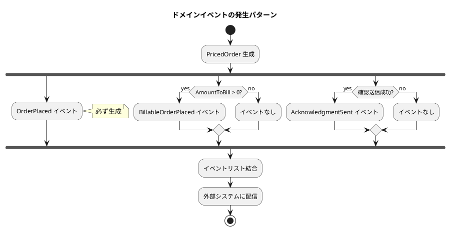

## エラーモデル

### エラー階層

```fsharp
/// 検証エラー
type ValidationError = ValidationError of string

/// 価格計算エラー
type PricingError = PricingError of string

/// サービス情報
type ServiceInfo = {
    Name : string
    Endpoint : System.Uri
}

/// リモートサービスエラー
type RemoteServiceError = {
    Service : ServiceInfo
    Exception : System.Exception
}

/// 注文受付エラー
type PlaceOrderError =
    | Validation of ValidationError
    | Pricing of PricingError
    | RemoteService of RemoteServiceError
```

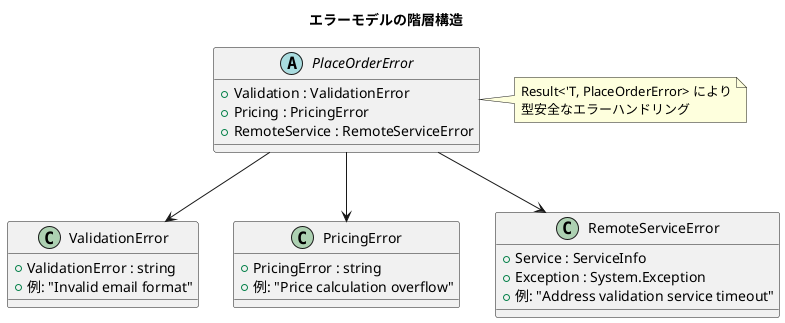

## Result モナドによるエラーハンドリング

### Result 型の活用

```fsharp
/// Result 型（F# 標準ライブラリ）
type Result<'T, 'TError> =
    | Ok of 'T
    | Error of 'TError

/// AsyncResult 型（非同期版）
type AsyncResult<'T, 'TError> = Async<Result<'T, 'TError>>
```

### エラー変換パターン

```fsharp
/// エラー型の変換例
let validateCustomerInfo (unvalidatedCustomerInfo: UnvalidatedCustomerInfo) =
    result {
        let! firstName =
            unvalidatedCustomerInfo.FirstName
            |> String50.create "FirstName"
            |> Result.mapError ValidationError  // string -> ValidationError

        let! lastName =
            unvalidatedCustomerInfo.LastName
            |> String50.create "LastName"
            |> Result.mapError ValidationError

        let! emailAddress =
            unvalidatedCustomerInfo.EmailAddress
            |> EmailAddress.create "EmailAddress"
            |> Result.mapError ValidationError

        return {
            Name = { FirstName = firstName; LastName = lastName }
            EmailAddress = emailAddress
        }
    }
```

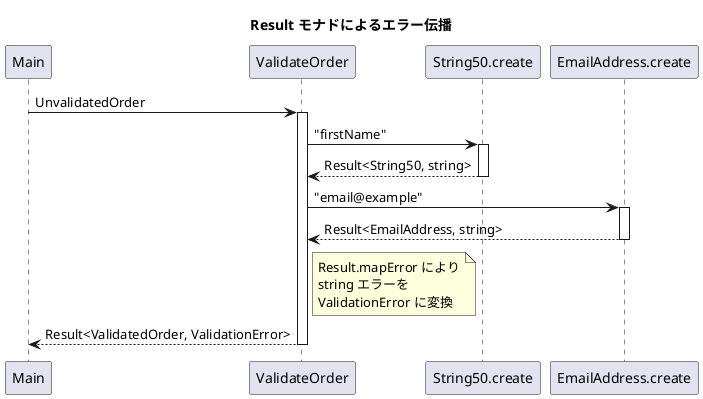

## 依存関係管理

### ポートとアダプターパターン

```fsharp
/// ポート（インターフェース）定義
module Ports =
    type CheckProductCodeExists = ProductCode -> bool
    type CheckAddressExists = UnvalidatedAddress -> AsyncResult<CheckedAddress, AddressValidationError>
    type GetProductPrice = ProductCode -> Price

/// アダプター（実装）例
module Adapters =
    /// ダミー実装（テスト・開発用）
    let checkProductExists : CheckProductCodeExists =
        fun productCode -> true  // 常に true を返す

    let checkAddressExists : CheckAddressExists =
        fun address ->
            // ダミー実装：常に有効な住所として返す
            CheckedAddress address
            |> AsyncResult.ofSuccess

    let getProductPrice : GetProductPrice =
        fun productCode -> Price.unsafeCreate 1M  // 固定価格
```

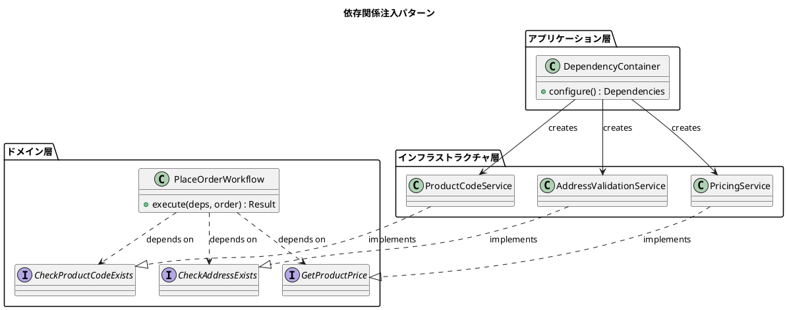

## 実装パターンとベストプラクティス

### 1. 型による制約の表現

```fsharp
/// 制約をコンパイル時にチェック
let processValidatedOrder (order: ValidatedOrder) =
    // ValidatedOrder 型により、検証済みであることが保証される
    // 実行時チェック不要
    order.CustomerInfo.EmailAddress  // 型安全にアクセス可能
```

### 2. 関数合成による複雑性の管理

```fsharp
/// 小さな関数の組み合わせ
let validateOrderLine =
    toOrderLineId
    >> Result.bind (fun id -> toProductCode checkProductExists)
    >> Result.bind (fun pc -> toOrderQuantity pc)
    >> Result.map (createValidatedOrderLine id pc)
```

### 3. 非同期処理の型安全な実装

```fsharp
/// AsyncResult による非同期エラーハンドリング
let validateAddresses unvalidatedOrder =
    asyncResult {
        let! shippingAddress =
            unvalidatedOrder.ShippingAddress
            |> checkAddressExists
            |> AsyncResult.mapError ValidationError

        let! billingAddress =
            unvalidatedOrder.BillingAddress
            |> checkAddressExists
            |> AsyncResult.mapError ValidationError

        return (shippingAddress, billingAddress)
    }
```

## テスト戦略

### 単体テストパターン

```fsharp
/// 値オブジェクトのテスト
[<Test>]
let ``String50 should reject empty string`` () =
    // Given
    let emptyString = ""

    // When
    let result = String50.create "TestField" emptyString

    // Then
    match result with
    | Error msg -> msg |> should contain "must not be null or empty"
    | Ok _ -> failwith "Expected error"

/// ドメインサービスのテスト
[<Test>]
let ``PriceOrder should calculate total correctly`` () =
    // Given
    let getProductPrice = fun _ -> Price.unsafeCreate 10M
    let validatedOrder = createTestValidatedOrder()

    // When
    let result = priceOrder getProductPrice validatedOrder

    // Then
    match result with
    | Ok pricedOrder ->
        pricedOrder.AmountToBill
        |> BillingAmount.value
        |> should equal 20M  // 2明細 × 10M
    | Error _ -> failwith "Expected success"
```

### 統合テストパターン

```fsharp
/// ワークフロー全体のテスト
[<Test>]
let ``PlaceOrder workflow should handle valid order`` () =
    // Given
    let testDependencies = createTestDependencies()
    let unvalidatedOrder = createTestUnvalidatedOrder()

    // When
    let result =
        placeOrder
            testDependencies.checkProductExists
            testDependencies.checkAddressExists
            testDependencies.getProductPrice
            testDependencies.createAcknowledgmentLetter
            testDependencies.sendAcknowledgment
            unvalidatedOrder
        |> Async.RunSynchronously

    // Then
    match result with
    | Ok events ->
        events |> should haveLength 3  // OrderPlaced + BillableOrderPlaced + AcknowledgmentSent
        events |> should contain (OrderPlaced expectedPricedOrder)
    | Error _ -> failwith "Expected successful processing"
```

## パフォーマンス考慮事項

### 1. 不変データ構造による効率性

```fsharp
/// 構造共有による効率的なデータ変換
let addPriceToOrder pricedLines validatedOrder =
    { validatedOrder with
        Lines = pricedLines  // 新しいリストを設定
        // 他のフィールドは構造共有される
    }
```

### 2. 遅延評価の活用

```fsharp
/// seq による遅延評価
let validateOrderLines checkProductExists lines =
    lines
    |> Seq.map (validateOrderLine checkProductExists)  // 遅延評価
    |> Seq.toList  // 必要時に評価
```

### 3. 並列処理の活用

```fsharp
/// 独立した処理の並列実行
let validateAddressesInParallel unvalidatedOrder =
    [
        checkAddressExists unvalidatedOrder.ShippingAddress
        checkAddressExists unvalidatedOrder.BillingAddress
    ]
    |> Async.Parallel  // 並列実行
    |> Async.map Result.sequence
```

## まとめ

このドメインモデル設計は、以下の原則に基づいています：

### 設計の利点

1. **型安全性**: F# の型システムによる compile-time での制約保証
2. **不変性**: データの予期しない変更を防ぐ設計
3. **関数合成**: 小さな関数の組み合わせによる複雑なロジックの実現
4. **エラーハンドリング**: Result モナドによる例外のない安全な実装
5. **テスタビリティ**: 純粋関数と依存関係注入による高いテスト容易性
6. **表現力**: ドメインの概念を直接的にコードで表現

### 関数型 DDD の効果

- **Make Illegal States Unrepresentable**: 不正な状態を型システムで排除
- **Parse, Don't Validate**: 検証済みデータを型で保証
- **Functional Core, Imperative Shell**: 純粋な関数コアと副作用のある外殻の分離

このアーキテクチャは、「変更を楽に安全にできて役に立つソフトウェア」の実現に向けた実践的な例となっています。