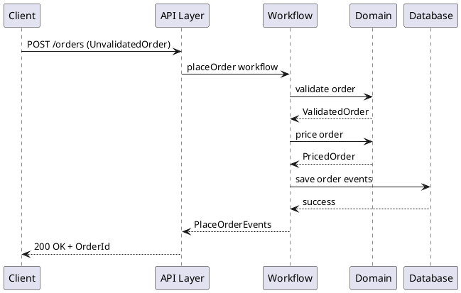

# 技術スタック定義書

## 概要

本プロジェクトは「Domain Modeling Made Functional」の F# による関数型ドメインモデリングを基に、ASP.NET Core 最小 API を組み合わせた注文受付システムの技術スタックを定義します。

## アーキテクチャ方針

### 設計アプローチ
- **関数型ドメインモデリング**: F# による型安全なドメイン設計
- **制約付き型システム**: ビジネスルールを型で表現
- **Railway Oriented Programming**: Result 型によるエラーハンドリング
- **イベント駆動アーキテクチャ**: ドメインイベントによるシステム連携

### アーキテクチャパターン
- **ドメインモデルパターン**: 中核業務領域での複雑なビジネスロジック
- **ポートとアダプターアーキテクチャ**: 外部システムとの疎結合
- **CQRS**: コマンドとクエリの分離（将来拡張）

## 技術スタック一覧

| カテゴリ | 技術 | バージョン | 用途 | 理由 |
|----------|------|------------|------|------|
| **言語・ランタイム** | | | | |
| プログラミング言語 | F# | 9.0 | ドメインモデリング | 関数型プログラミング、型安全性 |
| ランタイム | .NET | 9.0 | アプリケーション実行環境 | 最新の安定版、パフォーマンス向上 |
| **Web フレームワーク** | | | | |
| Web API | ASP.NET Core | 9.0 | REST API 提供 | 最小 API パターン、F# 対応 |
| **データベース・永続化** | | | | |
| Micro ORM | Dapper | 2.1.35 | データアクセス | 軽量、高速、F# 対応 |
| マイグレーション | FluentMigrator | 6.2.0 | スキーマ管理 | コードファーストマイグレーション |
| データベース（開発） | SQLite | - | 開発・テスト用 | 軽量、設定不要、ファイルベース |
| データベース（本番） | PostgreSQL | 16+ | 本番環境 | 信頼性、拡張性、オープンソース |
| **API ドキュメント** | | | | |
| API 仕様書 | NSwag | 14.2.0 | Swagger UI 生成 | F# サポート、OpenAPI 対応 |
| **ライブラリ・パッケージ** | | | | |
| JSON シリアライゼーション | System.Text.Json | 5.0.2 | JSON 変換 | 高パフォーマンス、標準ライブラリ |
| **開発・テスト** | | | | |
| テストフレームワーク | xUnit | 2.6.2 | 単体・統合テスト | .NET標準、F# 対応 |
| アサーションライブラリ | FsUnit.xUnit | 6.0.0 | F# テスト支援 | F#らしいアサーション記述 |
| プロパティベーステスト | FsCheck | 最新 | Property-based Testing | 関数型テスト手法 |
| コードカバレッジ | coverlet.collector | 6.0.0 | カバレッジ測定 | クロスプラットフォーム対応 |
| レポート生成 | ReportGenerator | 5.2.0 | カバレッジ可視化 | HTML レポート生成 |
| **静的解析・品質管理** | | | | |
| 静的解析 | FSharpLint | 最新 | F#専用コード解析 | 循環複雑度制限、命名規則 |
| コードフォーマッター | Fantomas.Tool | 6.2.3 | コード整形 | 一貫したフォーマット |
| **ビルド自動化** | | | | |
| ビルドシステム | Cake.Tool | 最新 | タスク自動化 | C#で記述可能なビルドツール |
| パッケージ管理 | Directory.Packages.props | - | 依存関係統一管理 | 中央集約バージョン管理 |

## ドメインモデル設計

### 型システム設計

```fsharp
// 制約付き基本型
type String50 = private String50 of string
type EmailAddress = private EmailAddress of string
type OrderId = private OrderId of string

// 商品コード（判別共用体）
type ProductCode =
    | Widget of WidgetCode
    | Gizmo of GizmoCode

// 数量（判別共用体）
type OrderQuantity =
    | Unit of UnitQuantity
    | Kilogram of KilogramQuantity
```

### エラーハンドリング

```fsharp
// Result 型による Railway Oriented Programming
type Result<'Success, 'Failure> =
    | Ok of 'Success
    | Error of 'Failure

// ドメインエラー
type ValidationError =
    | FieldIsMissing of string
    | FieldOutOfRange of string * int * int
```

### ワークフロー設計

```fsharp
// 注文受付ワークフロー
type PlaceOrderWorkflow =
    UnvalidatedOrder -> AsyncResult<PlaceOrderEvents, PlaceOrderError>
```

## アプリケーション構成

### プロジェクト構造

```
app/backend/
├── OrderTaking.Domain/                 # ドメインライブラリ
│   ├── Common.SimpleTypes.fs           # 基本型定義
│   ├── Common.CompoundTypes.fs         # 複合型定義
│   ├── PlaceOrder.PublicTypes.fs       # パブリック型
│   ├── PlaceOrder.Implementation.fs    # ビジネスロジック
│   ├── PlaceOrder.Dto.fs               # データ転送オブジェクト
│   └── PlaceOrder.Api.fs               # API 層
├── OrderTaking.Application/            # アプリケーション層
├── OrderTaking.Infrastructure/         # インフラストラクチャ層
│   ├── Adapters.fs                     # 外部システムアダプター
│   ├── DependencyContainer.fs          # 依存性注入設定
│   ├── JsonSerialization.fs            # JSON シリアライゼーション
│   └── Database/                       # データベースアクセス（Dapper + FluentMigrator）
├── OrderTaking.WebApi/                 # Web API プロジェクト
│   ├── Program.fs                      # エントリーポイント
│   ├── Controllers/                    # API コントローラー
│   └── Configuration/                  # 設定ファイル
└── OrderTaking.Tests/                  # テストプロジェクト
```

### レイヤー責務

| レイヤー | ファイル | 責務 |
|----------|----------|------|
| **ドメイン層** | Common.*.fs, PlaceOrder.PublicTypes.fs | ビジネスルール、制約付き型 |
| **アプリケーション層** | PlaceOrder.Implementation.fs | ワークフロー、ユースケース |
| **インフラストラクチャ層** | Adapters.fs, Database/ | 外部システム連携、Dapper による永続化、FluentMigrator マイグレーション |
| **プレゼンテーション層** | PlaceOrder.Dto.fs | データ変換、API 入出力 |

## データフロー

### 注文受付フロー



## 設定・環境

### 開発環境要件

#### 必須ツール

- **IDE**: Visual Studio Code + Ionide / JetBrains Rider
- **SDK**: .NET 9.0 SDK
- **F# コンパイラ**: 9.0（.NET 9.0 SDK に含まれる）
- **パッケージマネージャー**: NuGet

#### 開発ツールチェーン

**ビルドツール**
```bash
# Cake.Tool インストール
dotnet tool install -g Cake.Tool

# Fantomas インストール
dotnet tool install -g fantomas

# FSharpLint インストール
dotnet tool install -g fsharplint
```

**VSCode 統合設定**
```json
// .vscode/tasks.json
{
    "version": "2.0.0",
    "tasks": [
        {
            "label": "build",
            "command": "dotnet",
            "args": ["cake", "--target=Build"],
            "group": "build"
        },
        {
            "label": "test",
            "command": "dotnet",
            "args": ["cake", "--target=Test"],
            "group": "test"
        },
        {
            "label": "coverage",
            "command": "dotnet",
            "args": ["cake", "--target=Coverage"],
            "group": "test"
        }
    ]
}
```

**Git フック設定**
```bash
#!/bin/sh
# .git/hooks/pre-commit
echo "Running pre-commit checks..."

# ビルドチェック
dotnet build
if [ $? -ne 0 ]; then
    echo "Build failed. Commit aborted."
    exit 1
fi

# テスト実行
dotnet test
if [ $? -ne 0 ]; then
    echo "Tests failed. Commit aborted."
    exit 1
fi

echo "Pre-commit checks passed!"
```

### プロジェクト設定

#### F#プロジェクト設定

```xml
<!-- OrderTaking.fsproj -->
<Project Sdk="Microsoft.NET.Sdk">
  <PropertyGroup>
    <TargetFramework>net9.0</TargetFramework>
    <Nullable>enable</Nullable>
    <TreatWarningsAsErrors>true</TreatWarningsAsErrors>
    <GenerateDocumentationFile>true</GenerateDocumentationFile>
    <NoWarn>3388</NoWarn> <!-- F# XML documentation warnings -->
  </PropertyGroup>
</Project>
```

#### 依存関係統一管理

```xml
<!-- Directory.Packages.props -->
<Project>
  <PropertyGroup>
    <ManagePackageVersionsCentrally>true</ManagePackageVersionsCentrally>
  </PropertyGroup>

  <ItemGroup>
    <!-- テスト関連 -->
    <PackageVersion Include="Microsoft.NET.Test.Sdk" Version="17.8.0" />
    <PackageVersion Include="xunit" Version="2.6.2" />
    <PackageVersion Include="xunit.runner.visualstudio" Version="2.5.3" />
    <PackageVersion Include="FsUnit.xUnit" Version="6.0.0" />
    <PackageVersion Include="FsCheck" Version="2.16.6" />
    <PackageVersion Include="FsCheck.Xunit" Version="2.16.6" />

    <!-- ツール関連 -->
    <PackageVersion Include="Fantomas.Tool" Version="6.2.3" />
    <PackageVersion Include="coverlet.collector" Version="6.0.0" />
    <PackageVersion Include="ReportGenerator" Version="5.2.0" />

    <!-- API関連 -->
    <PackageVersion Include="Microsoft.AspNetCore.OpenApi" Version="9.0.0" />
    <PackageVersion Include="NSwag.AspNetCore" Version="14.2.0" />

    <!-- データベース関連 -->
    <PackageVersion Include="Dapper" Version="2.1.35" />
    <PackageVersion Include="FluentMigrator" Version="6.2.0" />
    <PackageVersion Include="FluentMigrator.Runner" Version="6.2.0" />
    <PackageVersion Include="Microsoft.Data.Sqlite" Version="9.0.0" />
    <PackageVersion Include="Npgsql" Version="9.0.1" />
  </ItemGroup>
</Project>
```

#### Cake ビルド設定

```csharp
// build.cake
var target = Argument("target", "Default");
var configuration = Argument("configuration", "Release");

//////////////////////////////////////////////////////////////////////
// TASKS
//////////////////////////////////////////////////////////////////////

Task("Clean")
    .Does(() =>
{
    CleanDirectory("./OrderTaking.Domain/bin");
    CleanDirectory("./OrderTaking.Domain/obj");
    CleanDirectory("./OrderTaking.Application/bin");
    CleanDirectory("./OrderTaking.Application/obj");
    CleanDirectory("./OrderTaking.Infrastructure/bin");
    CleanDirectory("./OrderTaking.Infrastructure/obj");
    CleanDirectory("./OrderTaking.WebApi/bin");
    CleanDirectory("./OrderTaking.WebApi/obj");
    CleanDirectory("./OrderTaking.Tests/bin");
    CleanDirectory("./OrderTaking.Tests/obj");
});

Task("Build")
    .IsDependentOn("Clean")
    .Does(() =>
{
    DotNetBuild("./OrderTaking.sln", new DotNetBuildSettings
    {
        Configuration = configuration
    });
});

Task("Test")
    .IsDependentOn("Build")
    .Does(() =>
{
    DotNetTest("./OrderTaking.Tests/OrderTaking.Tests.fsproj", new DotNetTestSettings
    {
        Configuration = configuration,
        NoBuild = true
    });
});

Task("Coverage")
    .IsDependentOn("Build")
    .Does(() =>
{
    DotNetTest("./OrderTaking.Tests/OrderTaking.Tests.fsproj", new DotNetTestSettings
    {
        Configuration = configuration,
        NoBuild = true,
        ArgumentCustomization = args => args
            .Append("--collect:\"XPlat Code Coverage\"")
            .Append("--results-directory:./coverage")
    });
});

Task("All")
    .IsDependentOn("Clean")
    .IsDependentOn("Build")
    .IsDependentOn("Test")
    .IsDependentOn("Coverage");

Task("Default")
    .IsDependentOn("All");

RunTarget(target);
```

### F# 特有の設定

- **Null 許容参照型**: 有効化（C# との相互運用性向上）
- **F# 9 機能**: 活用（パフォーマンス・型安全性向上）
- **コンパイル順序**: 依存関係を考慮した順序設定

## パフォーマンス・品質

### パフォーマンス方針

- **型安全性**: コンパイル時エラー検出による実行時エラー削減
- **不変性**: 副作用の最小化
- **遅延評価**: 必要時のみデータ処理
- **メモリ効率**: 値型・レコード型の活用
- **データアクセス最適化**: Dapper による高速な SQL 実行（ORM オーバーヘッド最小化）
- **接続管理**: データベース接続プーリング、適切な接続ライフサイクル管理

### 品質保証

#### テスト戦略

**テスト駆動開発（TDD）**

- **Red-Green-Refactor サイクル**: 失敗するテスト → 最小実装 → リファクタリング
- **継続的品質保証**: コード変更の度に品質を自動検証
- **リファクタリング安心感**: 機能を壊さずにコード改善が可能

**テストレベル**

- **単体テスト**: xUnit + FsUnit.xUnit による関数レベルテスト
- **プロパティベーステスト**: FsCheck によるProperty-based Testing
- **統合テスト**: API エンドポイントの動作確認
- **アーキテクチャテスト**: レイヤー依存関係の検証

#### 品質指標

**コードカバレッジ**

- **目標値**: 80% 以上のライン/ブランチカバレッジ
- **測定ツール**: coverlet による測定、ReportGenerator による可視化
- **継続監視**: CI/CD パイプラインでの品質ゲート

**サイクロマティック複雑度**

- **制限値**: 全関数 ≤ 7（FSharpLint による監視）
- **測定対象**: match文を含む分岐複雑度
- **改善手法**: ヘルパー関数抽出、パターンマッチング活用

**静的解析品質**

- **FSharpLint**: 命名規則、型安全性、関数型プログラミングベストプラクティス
- **Fantomas**: 一貫したコードフォーマット
- **コンパイラ警告**: TreatWarningsAsErrors による厳格なチェック

#### テスト自動化

**ビルドパイプライン**
```
Clean → Format → Build → Lint → Test → Coverage → Report
```

**品質ゲート**

- ビルド成功率: 100%
- テスト成功率: 100%
- カバレッジ: ≥ 80%
- 循環複雑度: 全関数 ≤ 7
- Lint エラー: 0 件

## セキュリティ

### セキュリティ方針

- **入力検証**: 制約付き型による不正値の排除
- **型安全性**: コンパイル時の安全性保証
- **エラーハンドリング**: 機密情報の漏洩防止
- **API セキュリティ**: HTTPS、入力サニタイゼーション

## 拡張性・将来計画

### 段階的拡張計画

#### Phase 1: 基本機能
- ドメインモデル実装
- SQLite データベース（開発・テスト環境）
- Dapper による基本的なデータアクセス
- 基本 API エンドポイント

#### Phase 2: 永続化強化
- PostgreSQL 本番環境対応
- Dapper による高速データアクセス
- FluentMigrator によるスキーママイグレーション
- リポジトリパターン実装

#### Phase 3: 開発基盤強化
- **テスト自動化**: xUnit + FsUnit.xUnit + Cake による統合ビルド
- **静的解析**: FSharpLint によるコード品質管理
- **CI/CD**: GitHub Actions による継続的統合・デプロイ
- **品質ゲート**: カバレッジ 80%、サイクロマティック複雑度 ≤ 7

#### Phase 4: 高度な機能
- **プロパティベーステスト**: FsCheck による包括的テスト
- **アーキテクチャテスト**: 依存関係検証
- **パフォーマンステスト**: BenchmarkDotNet 導入
- **セキュリティテスト**: 脆弱性スキャン自動化

#### Phase 5: 運用・監視
- **ログ収集**: Serilog による構造化ログ
- **メトリクス監視**: Application Insights 統合
- **ヘルスチェック**: ASP.NET Core Health Checks
- **分散システム対応**: CQRS パターン、イベントソーシング

### 技術的負債管理

- **定期的リファクタリング**: ドメインモデルの継続改善
- **型システム進化**: F# 新機能の段階的導入
- **依存関係更新**: セキュリティ・パフォーマンス向上
- **アーキテクチャ見直し**: 業務拡張に応じた構造改善

## まとめ

本技術スタックは、F# の関数型プログラミングの利点を活かしつつ、現代的な開発手法であるテスト駆動開発（TDD）と継続的品質管理を統合することで、「変更を楽に安全にできて役に立つソフトウェア」を実現します。

### 主要な特徴

**関数型プログラミングの活用**

- F# 9.0 による型安全性とイミュータブルデータ構造
- Railway Oriented Programming による堅牢なエラーハンドリング
- 制約付き型システムによるビジネスルール表現

**開発生産性の向上**

- xUnit + FsUnit.xUnit によるF#らしいテスト記述
- Cake による自動化されたビルドパイプライン
- FSharpLint + Fantomas による一貫したコード品質

**継続的品質保証**

- TDD サイクルによる安心感のあるリファクタリング
- 80% 以上のコードカバレッジ目標
- サイクロマティック複雑度 ≤ 7 による保守性確保

### 段階的拡張戦略

Phase 1（基本機能）から Phase 5（運用・監視）まで、プロジェクトの成長に応じて段階的に機能を拡張していく戦略を採用。特に Phase 3 の開発基盤強化では、ソフトウェア開発の三種の神器（Git、テスト自動化、タスク自動化）を完全に統合し、現代的な F# 開発環境を確立します。

この技術スタックにより、F# の関数型プログラミングの恩恵を最大限に活用しながら、エンタープライズレベルの品質と生産性を両立する注文受付システムの開発が可能になります。