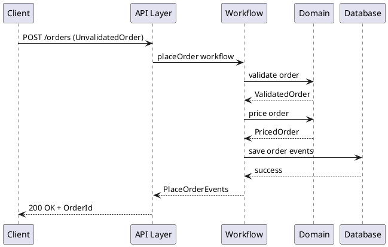

# 技術スタック定義書

## 概要

本プロジェクトは「Domain Modeling Made Functional」の F# による関数型ドメインモデリングを基に、ASP.NET Core 最小 API を組み合わせた注文受付システムの技術スタックを定義します。

## アーキテクチャ方針

### 設計アプローチ
- **関数型ドメインモデリング**: F# による型安全なドメイン設計
- **制約付き型システム**: ビジネスルールを型で表現
- **Railway Oriented Programming**: Result 型によるエラーハンドリング
- **イベント駆動アーキテクチャ**: ドメインイベントによるシステム連携

### アーキテクチャパターン
- **ドメインモデルパターン**: 中核業務領域での複雑なビジネスロジック
- **ポートとアダプターアーキテクチャ**: 外部システムとの疎結合
- **CQRS**: コマンドとクエリの分離（将来拡張）

## 技術スタック一覧

| カテゴリ | 技術 | バージョン | 用途 | 理由 |
|----------|------|------------|------|------|
| **言語・ランタイム** | | | | |
| プログラミング言語 | F# | 9.0 | ドメインモデリング | 関数型プログラミング、型安全性 |
| ランタイム | .NET | 9.0 | アプリケーション実行環境 | 最新の安定版、パフォーマンス向上 |
| **Web フレームワーク** | | | | |
| Web API | ASP.NET Core | 9.0 | REST API 提供 | 最小 API パターン、F# 対応 |
| **データベース・永続化** | | | | |
| ORM | Entity Framework Core | 9.0.3 | データアクセス | F# 対応、InMemory プロバイダー |
| データベース | InMemory Database | - | 開発・テスト用 | 軽量、設定不要 |
| **API ドキュメント** | | | | |
| API 仕様書 | NSwag | 14.2.0 | Swagger UI 生成 | F# サポート、OpenAPI 対応 |
| **ライブラリ・パッケージ** | | | | |
| JSON シリアライゼーション | System.Text.Json | 5.0.2 | JSON 変換 | 高パフォーマンス、標準ライブラリ |
| **開発・テスト** | | | | |
| テストフレームワーク | NUnit/xUnit | 最新 | 単体・統合テスト | F# 対応 |
| モックライブラリ | FsUnit | 最新 | F# テスト支援 | 関数型テスト記述 |

## ドメインモデル設計

### 型システム設計

```fsharp
// 制約付き基本型
type String50 = private String50 of string
type EmailAddress = private EmailAddress of string
type OrderId = private OrderId of string

// 商品コード（判別共用体）
type ProductCode =
    | Widget of WidgetCode
    | Gizmo of GizmoCode

// 数量（判別共用体）
type OrderQuantity =
    | Unit of UnitQuantity
    | Kilogram of KilogramQuantity
```

### エラーハンドリング

```fsharp
// Result 型による Railway Oriented Programming
type Result<'Success, 'Failure> =
    | Ok of 'Success
    | Error of 'Failure

// ドメインエラー
type ValidationError =
    | FieldIsMissing of string
    | FieldOutOfRange of string * int * int
```

### ワークフロー設計

```fsharp
// 注文受付ワークフロー
type PlaceOrderWorkflow =
    UnvalidatedOrder -> AsyncResult<PlaceOrderEvents, PlaceOrderError>
```

## アプリケーション構成

### プロジェクト構造

```
src/
├── OrderTaking/                    # ドメインライブラリ
│   ├── Common.SimpleTypes.fs       # 基本型定義
│   ├── Common.CompoundTypes.fs     # 複合型定義
│   ├── PlaceOrder.PublicTypes.fs   # パブリック型
│   ├── PlaceOrder.Implementation.fs # ビジネスロジック
│   ├── PlaceOrder.Dto.fs           # データ転送オブジェクト
│   └── PlaceOrder.Api.fs           # API 層
└── OrderTaking.WebApi/             # Web API プロジェクト（将来追加）
    ├── Program.fs                  # エントリーポイント
    ├── Controllers/                # API コントローラー
    └── Configuration/              # 設定ファイル
```

### レイヤー責務

| レイヤー | ファイル | 責務 |
|----------|----------|------|
| **ドメイン層** | Common.*.fs, PlaceOrder.PublicTypes.fs | ビジネスルール、制約付き型 |
| **アプリケーション層** | PlaceOrder.Implementation.fs | ワークフロー、ユースケース |
| **インフラストラクチャ層** | PlaceOrder.Api.fs | 外部システム連携、永続化 |
| **プレゼンテーション層** | PlaceOrder.Dto.fs | データ変換、API 入出力 |

## データフロー

### 注文受付フロー



## 設定・環境

### 開発環境要件

- **IDE**: Visual Studio Code + Ionide / JetBrains Rider
- **SDK**: .NET 9.0 SDK
- **F# コンパイラ**: 最新版
- **パッケージマネージャー**: NuGet

### プロジェクト設定

```xml
<PropertyGroup>
  <TargetFramework>net9.0</TargetFramework>
  <Nullable>enable</Nullable>
  <TreatWarningsAsErrors>true</TreatWarningsAsErrors>
</PropertyGroup>
```

### F# 特有の設定

- **Null 許容参照型**: 有効化（C# との相互運用性向上）
- **F# 9 機能**: 活用（パフォーマンス・型安全性向上）
- **コンパイル順序**: 依存関係を考慮した順序設定

## パフォーマンス・品質

### パフォーマンス方針

- **型安全性**: コンパイル時エラー検出による実行時エラー削減
- **不変性**: 副作用の最小化
- **遅延評価**: 必要時のみデータ処理
- **メモリ効率**: 値型・レコード型の活用

### 品質保証

- **静的型チェック**: F# 型システムによる安全性
- **関数型テスト**: プロパティベーステスト
- **ドメインテスト**: ビジネスルールの網羅的テスト
- **統合テスト**: API エンドポイントの動作確認

## セキュリティ

### セキュリティ方針

- **入力検証**: 制約付き型による不正値の排除
- **型安全性**: コンパイル時の安全性保証
- **エラーハンドリング**: 機密情報の漏洩防止
- **API セキュリティ**: HTTPS、入力サニタイゼーション

## 拡張性・将来計画

### 段階的拡張計画

#### Phase 1: 基本機能
- ドメインモデル実装
- InMemory データベース
- 基本 API エンドポイント

#### Phase 2: 永続化強化
- SQL Server / PostgreSQL 対応
- Entity Framework Core 移行
- データベースマイグレーション

#### Phase 3: 高度な機能
- CQRS パターン導入
- イベントソーシング
- 分散システム対応

#### Phase 4: 運用・監視
- ログ収集（Serilog）
- メトリクス監視
- ヘルスチェック

### 技術的負債管理

- **定期的リファクタリング**: ドメインモデルの継続改善
- **型システム進化**: F# 新機能の段階的導入
- **依存関係更新**: セキュリティ・パフォーマンス向上
- **アーキテクチャ見直し**: 業務拡張に応じた構造改善

## まとめ

本技術スタックは、F# の関数型プログラミングの利点を活かしつつ、ASP.NET Core の堅牢な Web API 機能を組み合わせることで、型安全で保守性の高い注文受付システムを実現します。

段階的な拡張計画により、初期は軽量な構成から始め、業務の成長に応じて高度な機能を追加していく戦略を採用しています。