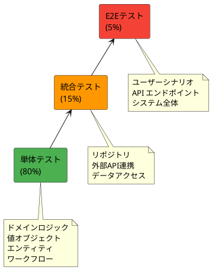
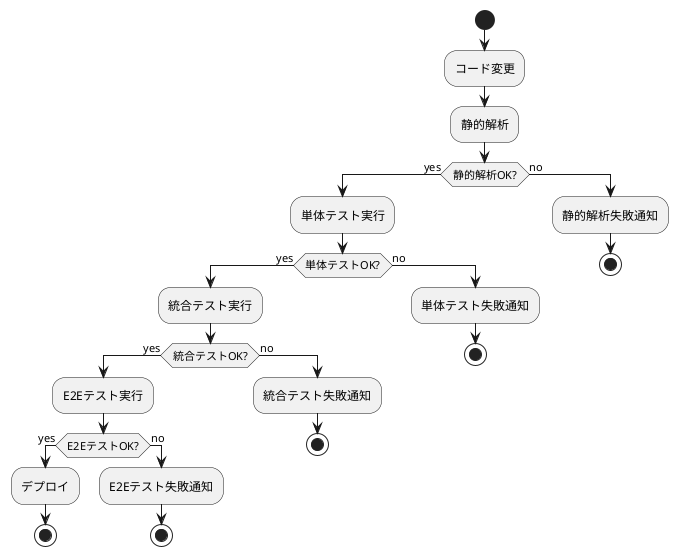
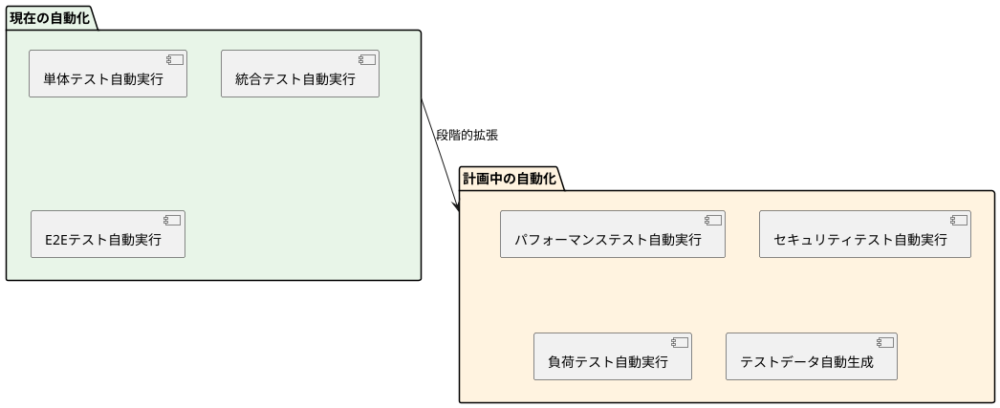

# テスト戦略 - 注文受付システム

## 概要

本ドキュメントは、F# による関数型ドメインモデリングと ASP.NET Core 最小 API を用いた注文受付システムのテスト戦略を定義します。アーキテクチャパターンに基づいたピラミッド形テスト戦略を採用し、変更を楽に安全にできて役に立つソフトウェアの実現を目指します。

## テスト戦略の選択根拠

### アーキテクチャ分析

本プロジェクトは以下の特徴を持ちます：

- **業務領域**: 中核の業務領域（注文受付）
- **データ構造**: 中程度の複雑さ（注文・顧客・商品の関連）
- **アーキテクチャパターン**: ドメインモデルパターン
- **アーキテクチャスタイル**: ポートとアダプターアーキテクチャ

### 採用するテスト戦略

**ピラミッド形テスト戦略**を採用します。



### 選択理由

1. **ドメインモデルパターン**: リッチなビジネスロジックを持つため、単体テスト中心の戦略が最適
2. **関数型プログラミング**: 純粋関数が多く、テスタビリティが高い
3. **型安全性**: F# の型システムにより多くのエラーをコンパイル時に検出可能

## テストレベル別戦略

### 1. 単体テスト（80%）

#### 対象

- **ドメインオブジェクト**: 値オブジェクト、エンティティ
- **ドメインサービス**: ビジネスルール、ドメインロジック
- **ワークフロー**: 注文受付、検証、価格計算のロジック
- **純粋関数**: 変換、計算処理

#### テスト方針

**TDD（テスト駆動開発）を徹底**

```fsharp
// 例：値オブジェクトのテスト
module String50Tests =
    open NUnit.Framework
    open FsUnit

    [<Test>]
    let ``有効な文字列で String50 を作成できる`` () =
        // Arrange
        let validString = "有効な文字列"

        // Act
        let result = String50.create validString

        // Assert
        result |> should equal (Ok (String50 validString))

    [<Test>]
    let ``51文字以上の文字列は拒否される`` () =
        // Arrange
        let longString = String.replicate 51 "a"

        // Act
        let result = String50.create longString

        // Assert
        result |> should be (ofCase <@ Error @>)
```

#### プロパティベーステスト

```fsharp
// 例：商品コードの検証
module ProductCodePropertyTests =
    open FsCheck
    open FsCheck.NUnit

    [<Property>]
    let ``Widget コードは常に W で始まり4桁の数字が続く`` (code: string) =
        match WidgetCode.create code with
        | Ok (WidgetCode value) ->
            value.StartsWith("W") && value.Length = 5
        | Error _ ->
            not (code.StartsWith("W") && code.Length = 5)
```

#### テストカバレッジ目標

- **ドメインロジック**: 100%
- **値オブジェクト**: 100%
- **ワークフロー**: 95%以上

### 2. 統合テスト（15%）

#### 対象

- **リポジトリ実装**: データアクセスロジック
- **外部サービス連携**: 住所検証、メール送信
- **インフラストラクチャ層**: データベース操作
- **アプリケーションサービス**: レイヤー間連携

#### テスト方針

**依存関係を含む結合テスト**

```fsharp
module OrderRepositoryIntegrationTests =
    open NUnit.Framework
    open Microsoft.EntityFrameworkCore

    [<SetUp>]
    let setup () =
        // InMemory データベース初期化
        let options = DbContextOptionsBuilder<OrderContext>()
                         .UseInMemoryDatabase("TestDb")
                         .Options
        new OrderContext(options)

    [<Test>]
    let ``注文を保存し取得できる`` () =
        // Arrange
        use context = setup()
        let repository = OrderRepository(context)
        let order = createValidPricedOrder()

        // Act
        repository.Save(order) |> Async.RunSynchronously
        let retrieved = repository.GetById(order.OrderId) |> Async.RunSynchronously

        // Assert
        retrieved |> should equal (Some order)
```

#### 外部サービステスト

```fsharp
module ExternalServiceTests =
    open NUnit.Framework

    [<Test>]
    let ``住所検証サービスが正常に動作する`` () =
        // Arrange
        let service = AddressValidationService(testConfig)
        let unvalidatedAddress = createTestAddress()

        // Act
        let result = service.ValidateAddress(unvalidatedAddress)
                    |> Async.RunSynchronously

        // Assert
        result |> should be (ofCase <@ Ok @>)
```

### 3. E2Eテスト（5%）

#### 対象

- **主要ユーザーシナリオ**: 注文受付の完全なフロー
- **API エンドポイント**: HTTP レベルでの動作確認
- **エラーハンドリング**: システム全体のエラー処理

#### テスト方針

**実際のユーザー操作をシミュレート**

```fsharp
module E2ETests =
    open NUnit.Framework
    open Microsoft.AspNetCore.Mvc.Testing
    open System.Net.Http

    [<Test>]
    let ``注文受付の完全なフローが正常に動作する`` () =
        // Arrange
        use factory = new WebApplicationFactory<Program>()
        use client = factory.CreateClient()
        let orderRequest = createValidOrderRequest()

        // Act - 注文送信
        let response = client.PostAsync("/api/orders", toJsonContent(orderRequest))
                      |> Async.AwaitTask
                      |> Async.RunSynchronously

        // Assert - 成功レスポンス
        response.IsSuccessStatusCode |> should be True

        // Act - 注文確認
        let orderId = extractOrderId(response)
        let getResponse = client.GetAsync($"/api/orders/{orderId}")
                         |> Async.AwaitTask
                         |> Async.RunSynchronously

        // Assert - 注文データ確認
        getResponse.IsSuccessStatusCode |> should be True
```

## テスト実装詳細

### F# テストフレームワーク構成

#### 推奨テストスタック

| 用途 | ライブラリ | バージョン | 理由 |
|------|------------|------------|------|
| **テストフレームワーク** | NUnit | 最新 | F# との親和性、豊富な機能 |
| **アサーション** | FsUnit | 最新 | F# ネイティブな記述スタイル |
| **プロパティテスト** | FsCheck | 最新 | 関数型プログラミング対応 |
| **モック** | NSubstitute | 最新 | インターフェースベースモック |
| **Web テスト** | Microsoft.AspNetCore.Mvc.Testing | 9.0 | ASP.NET Core 統合テスト |

#### プロジェクト構成

```
tests/
├── OrderTaking.UnitTests/           # 単体テスト
│   ├── Domain/
│   │   ├── ValueObjectTests.fs     # 値オブジェクトテスト
│   │   ├── EntityTests.fs          # エンティティテスト
│   │   └── WorkflowTests.fs        # ワークフローテスト
│   ├── TestHelpers.fs              # テスト共通処理
│   └── OrderTaking.UnitTests.fsproj
├── OrderTaking.IntegrationTests/   # 統合テスト
│   ├── Repository/
│   │   └── OrderRepositoryTests.fs
│   ├── ExternalServices/
│   │   └── AddressValidationTests.fs
│   └── OrderTaking.IntegrationTests.fsproj
└── OrderTaking.E2ETests/           # E2Eテスト
    ├── ApiTests.fs                 # API エンドポイントテスト
    ├── ScenarioTests.fs            # ユーザーシナリオテスト
    └── OrderTaking.E2ETests.fsproj
```

### テストデータ管理

#### テストデータビルダー

```fsharp
module TestDataBuilders =

    type UnvalidatedOrderBuilder() =
        let mutable orderId = "ORDER001"
        let mutable customerName = "田中太郎"
        let mutable email = "tanaka@example.com"
        let mutable lines = []

        member this.WithOrderId(id) = orderId <- id; this
        member this.WithCustomer(name, emailAddr) =
            customerName <- name
            email <- emailAddr
            this
        member this.WithLine(productCode, quantity) =
            let line = {
                OrderLineId = $"LINE{lines.Length + 1}"
                ProductCode = productCode
                Quantity = quantity
            }
            lines <- line :: lines
            this

        member this.Build() = {
            OrderId = orderId
            CustomerInfo = {
                FirstName = customerName.Split(' ').[1]
                LastName = customerName.Split(' ').[0]
                EmailAddress = email
            }
            ShippingAddress = TestAddresses.validAddress
            BillingAddress = TestAddresses.validAddress
            Lines = lines |> List.rev
        }

    // 使用例
    let validOrder =
        UnvalidatedOrderBuilder()
            .WithOrderId("ORDER001")
            .WithCustomer("田中太郎", "tanaka@example.com")
            .WithLine("W1234", 5m)
            .WithLine("G123", 2.5m)
            .Build()
```

### モック戦略

#### 外部依存のモック化

```fsharp
module MockServices =
    open NSubstitute

    let createMockProductService() =
        let mock = Substitute.For<IProductService>()
        mock.CheckProductExists(Arg.Any<ProductCode>())
            .Returns(true)
        mock.GetProductPrice(Arg.Any<ProductCode>())
            .Returns(Some 100m)
        mock

    let createMockAddressService() =
        let mock = Substitute.For<IAddressValidationService>()
        mock.ValidateAddress(Arg.Any<UnvalidatedAddress>())
            .Returns(AsyncResult.ofResult (Ok validAddress))
        mock
```

## CI/CD での実行戦略

### テスト実行フロー



### 実行環境

#### 開発環境

```bash
# 全テスト実行
dotnet test

# 単体テストのみ
dotnet test tests/OrderTaking.UnitTests/

# カバレッジ計測
dotnet test --collect:"XPlat Code Coverage"
```

#### CI/CD 環境

```yaml
# GitHub Actions 例
test:
  runs-on: ubuntu-latest
  steps:
    - uses: actions/checkout@v3
    - name: Setup .NET
      uses: actions/setup-dotnet@v3
      with:
        dotnet-version: '9.0.x'

    - name: Restore dependencies
      run: dotnet restore

    - name: Build
      run: dotnet build --no-restore

    - name: Unit Tests
      run: dotnet test tests/OrderTaking.UnitTests/ --no-build --verbosity normal

    - name: Integration Tests
      run: dotnet test tests/OrderTaking.IntegrationTests/ --no-build --verbosity normal

    - name: E2E Tests
      run: dotnet test tests/OrderTaking.E2ETests/ --no-build --verbosity normal
```

## パフォーマンステスト

### 対象シナリオ

1. **注文受付の性能**: 100 req/sec で安定動作
2. **大量データ処理**: 1000 件の注文を 10 秒以内で処理
3. **メモリ使用量**: 安定したメモリ使用量を維持

### 実装例

```fsharp
module PerformanceTests =
    open NUnit.Framework
    open System.Diagnostics

    [<Test>]
    let ``1000件の注文を10秒以内で処理できる`` () =
        // Arrange
        let orders = generateTestOrders 1000
        let stopwatch = Stopwatch.StartNew()

        // Act
        orders
        |> List.map processOrder
        |> Async.Parallel
        |> Async.RunSynchronously
        |> ignore

        stopwatch.Stop()

        // Assert
        stopwatch.ElapsedMilliseconds |> should be (lessThan 10000)
```

## テスト品質管理

### カバレッジ目標

| テストレベル | カバレッジ目標 | 測定範囲 |
|--------------|----------------|-----------|
| **単体テスト** | 95%以上 | ドメイン層 |
| **統合テスト** | 80%以上 | アプリケーション層 |
| **E2Eテスト** | 主要シナリオ100% | システム全体 |

### 品質メトリクス

```fsharp
// テスト品質の継続監視
module TestQualityMetrics =

    // テスト実行時間監視
    let measureTestExecutionTime testName action =
        let stopwatch = Stopwatch.StartNew()
        let result = action()
        stopwatch.Stop()

        if stopwatch.ElapsedMilliseconds > 1000 then
            printfn $"警告: {testName} が1秒を超過しました ({stopwatch.ElapsedMilliseconds}ms)"

        result

    // テストデータ品質チェック
    let validateTestData data =
        // テストデータの妥当性確認
        // 境界値、異常系データの網羅性確認
        ()
```

## 継続的改善

### テスト戦略の見直し

#### 定期レビューポイント

1. **月次レビュー**
   - テスト実行時間の監視
   - カバレッジ状況の確認
   - 失敗テストの傾向分析

2. **四半期レビュー**
   - テスト戦略の有効性評価
   - 新しいテスト手法の導入検討
   - チームのテストスキル向上計画

3. **プロジェクト完了時**
   - テスト戦略の総合評価
   - 次プロジェクトへの知見蓄積

### 改善活動

#### テスト自動化の拡張



## まとめ

### テスト戦略の特徴

1. **F# の特性を活かした戦略**: 関数型プログラミングの利点を最大化
2. **アーキテクチャ連動**: ドメインモデルパターンに最適化されたピラミッド形テスト
3. **段階的品質保証**: 単体→統合→E2E の各レベルで品質を担保
4. **継続的改善**: 定期的な見直しと改善サイクル

### 成功要因

- **TDD の徹底実践**: 設計品質とテスト品質の両立
- **型安全性の活用**: F# の型システムによる早期エラー検出
- **適切なテスト分散**: 80:15:5 の比率によるバランス
- **自動化の推進**: CI/CD パイプラインでの完全自動化

この戦略により、変更を楽に安全にできて役に立つソフトウェアの実現を目指します。