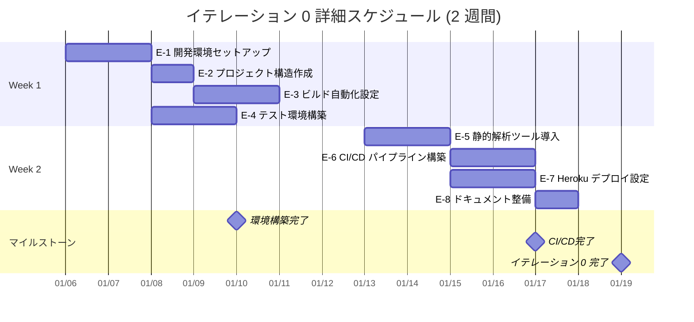

# イテレーション 0 計画 - 環境構築イテレーション

## イテレーション情報

| 項目 | 内容 |
|------|------|
| **イテレーション番号** | 0 (環境構築イテレーション) |
| **期間** | 2025-01-06 ~ 2025-01-19 (2 週間) |
| **チーム** | F# 開発者 2 名 |
| **作業日数** | 10 日 (営業日ベース) |
| **計画策定日** | 2025-11-08 |

## イテレーションゴール

**F# 9.0 + ASP.NET Core 9.0 による注文受付システムの開発環境を構築し、CI/CD パイプラインと品質ゲートを確立する**

### 成功基準

✅ **環境構築完了**:
- .NET 9.0 SDK がインストールされている
- F# プロジェクト構造が作成されている
- 開発ツールチェーン (Cake, Fantomas, FSharpLint) が動作する

✅ **ビルド自動化完了**:
- Cake によるビルドタスクが実行できる
- テストが自動実行される
- カバレッジレポートが生成される

✅ **CI/CD パイプライン完了**:
- GitHub Actions ワークフローが動作する
- コミット時に自動ビルド・テストが実行される
- 品質ゲートが機能する

✅ **Heroku デプロイ準備完了**:
- Heroku アプリケーションが作成されている
- Procfile と buildpack が設定されている
- 環境変数が設定されている

## ストーリー選択

イテレーション 0 は環境構築に特化するため、専用の技術ストーリーを定義します。

| Story | タイトル | 優先度 | 見積 (理想時間) |
|-------|---------|--------|----------------|
| **E-1** | 開発環境のセットアップ | 最高 | 12 時間 |
| **E-2** | プロジェクト構造の作成 | 最高 | 8 時間 |
| **E-3** | ビルド自動化の設定 | 高 | 16 時間 |
| **E-4** | テスト環境の構築 | 高 | 12 時間 |
| **E-5** | 静的解析・品質管理ツールの導入 | 中 | 10 時間 |
| **E-6** | CI/CD パイプラインの構築 | 高 | 14 時間 |
| **E-7** | Heroku デプロイ設定 | 中 | 12 時間 |
| **E-8** | ドキュメント整備 | 中 | 6 時間 |
| **合計** | - | - | **90 時間** |

**チーム理想時間**: 2 名 × 5 時間/日 × 10 日 = **100 理想時間**
**バッファ**: 10 時間 (10%)

## タスク分解

### Story E-1: 開発環境のセットアップ (12 時間)

**受け入れ基準**:
- [ ] .NET 9.0 SDK がインストールされている
- [ ] IDE (VSCode + Ionide または Rider) が設定されている
- [ ] Git がインストールされ、リポジトリがクローンされている
- [ ] 必要な開発ツールがインストールされている

**タスク**:

| タスク ID | タスク名 | 担当 | 見積 | 詳細 |
|----------|---------|------|------|------|
| E-1.1 | .NET 9.0 SDK インストール | 開発者 A | 2h | Windows/Mac/Linux 環境への SDK インストール |
| E-1.2 | IDE セットアップ | 開発者 A | 3h | VSCode + Ionide または Rider のインストールと設定 |
| E-1.3 | Git 環境構築 | 開発者 B | 2h | Git インストール、リポジトリクローン、Git フック設定 |
| E-1.4 | 開発ツールインストール | 開発者 B | 3h | Cake.Tool, Fantomas, FSharpLint のグローバルインストール |
| E-1.5 | 動作確認 | 全員 | 2h | 各ツールの動作確認、環境ドキュメント作成 |

### Story E-2: プロジェクト構造の作成 (8 時間)

**受け入れ基準**:
- [ ] F# プロジェクトファイル (.fsproj) が作成されている
- [ ] ソリューションファイル (.sln) が作成されている
- [ ] プロジェクト構造が tech_stack.md の定義に従っている
- [ ] 初期ビルドが成功する

**タスク**:

| タスク ID | タスク名 | 担当 | 見積 | 詳細 |
|----------|---------|------|------|------|
| E-2.1 | ソリューション作成 | 開発者 A | 1h | dotnet new sln でソリューション作成 |
| E-2.2 | ドメインプロジェクト作成 | 開発者 A | 2h | OrderTaking プロジェクト作成、基本型ファイル追加 |
| E-2.3 | テストプロジェクト作成 | 開発者 B | 2h | OrderTaking.Tests プロジェクト作成 |
| E-2.4 | Directory.Packages.props 設定 | 開発者 B | 2h | 中央集約バージョン管理設定 |
| E-2.5 | 初期ビルド確認 | 全員 | 1h | dotnet build でビルド成功確認 |

### Story E-3: ビルド自動化の設定 (16 時間)

**受け入れ基準**:
- [ ] Cake ビルドスクリプト (build.cake) が作成されている
- [ ] Clean, Build, Test, Coverage タスクが動作する
- [ ] VSCode タスク統合が完了している
- [ ] すべてのタスクが正常に実行される

**タスク**:

| タスク ID | タスク名 | 担当 | 見積 | 詳細 |
|----------|---------|------|------|------|
| E-3.1 | Cake スクリプト基礎作成 | 開発者 A | 4h | build.cake の基本構造作成 |
| E-3.2 | Clean/Build タスク実装 | 開発者 A | 3h | Clean と Build タスクの実装とテスト |
| E-3.3 | Test タスク実装 | 開発者 B | 4h | xUnit 実行タスクの実装 |
| E-3.4 | Coverage タスク実装 | 開発者 B | 3h | coverlet によるカバレッジ測定タスク |
| E-3.5 | VSCode タスク統合 | 開発者 A | 2h | .vscode/tasks.json の設定 |

### Story E-4: テスト環境の構築 (12 時間)

**受け入れ基準**:
- [ ] xUnit テストプロジェクトが動作する
- [ ] FsUnit.xUnit によるアサーションが使える
- [ ] サンプルテストが成功する
- [ ] カバレッジが測定できる

**タスク**:

| タスク ID | タスク名 | 担当 | 見積 | 詳細 |
|----------|---------|------|------|------|
| E-4.1 | xUnit パッケージ追加 | 開発者 A | 2h | xUnit, xunit.runner.visualstudio の追加 |
| E-4.2 | FsUnit.xUnit パッケージ追加 | 開発者 A | 1h | FsUnit.xUnit の追加と設定 |
| E-4.3 | サンプルテスト作成 | 開発者 B | 4h | 基本的なテストケースの作成 |
| E-4.4 | カバレッジ設定 | 開発者 B | 3h | coverlet.collector の設定とレポート生成 |
| E-4.5 | テスト実行確認 | 全員 | 2h | dotnet test でテスト実行とカバレッジ確認 |

### Story E-5: 静的解析・品質管理ツールの導入 (10 時間)

**受け入れ基準**:
- [ ] FSharpLint が動作する
- [ ] Fantomas によるコードフォーマットが動作する
- [ ] 品質ルールが設定されている
- [ ] Cake タスクに統合されている

**タスク**:

| タスク ID | タスク名 | 担当 | 見積 | 詳細 |
|----------|---------|------|------|------|
| E-5.1 | FSharpLint 設定 | 開発者 A | 3h | fsharplint.json の作成とルール設定 |
| E-5.2 | Fantomas 設定 | 開発者 A | 2h | .editorconfig の作成とフォーマットルール設定 |
| E-5.3 | Cake Lint タスク作成 | 開発者 B | 3h | FSharpLint 実行タスクの実装 |
| E-5.4 | Cake Format タスク作成 | 開発者 B | 2h | Fantomas 実行タスクの実装 |

### Story E-6: CI/CD パイプラインの構築 (14 時間)

**受け入れ基準**:
- [ ] GitHub Actions ワークフローが作成されている
- [ ] プッシュ時に自動ビルド・テストが実行される
- [ ] Pull Request 時に品質チェックが実行される
- [ ] 品質ゲートが機能する

**タスク**:

| タスク ID | タスク名 | 担当 | 見積 | 詳細 |
|----------|---------|------|------|------|
| E-6.1 | GitHub Actions ワークフロー作成 | 開発者 A | 4h | .github/workflows/ci.yml の作成 |
| E-6.2 | ビルド・テストジョブ設定 | 開発者 A | 3h | ビルドとテスト実行の設定 |
| E-6.3 | 品質ゲート設定 | 開発者 B | 4h | カバレッジ、Lint チェックの設定 |
| E-6.4 | PR チェック設定 | 開発者 B | 2h | Pull Request ステータスチェックの設定 |
| E-6.5 | 動作確認 | 全員 | 1h | 実際のコミットで CI/CD 動作確認 |

### Story E-7: Heroku デプロイ設定 (12 時間)

**受け入れ基準**:
- [ ] Heroku アプリケーションが作成されている
- [ ] Procfile が作成されている
- [ ] buildpack が設定されている
- [ ] 環境変数が設定されている

**タスク**:

| タスク ID | タスク名 | 担当 | 見積 | 詳細 |
|----------|---------|------|------|------|
| E-7.1 | Heroku アプリ作成 | 開発者 A | 2h | heroku create でアプリ作成 |
| E-7.2 | Procfile 作成 | 開発者 A | 2h | Web dyno 起動コマンドの定義 |
| E-7.3 | .NET Buildpack 設定 | 開発者 B | 3h | jincod/dotnetcore-buildpack の設定 |
| E-7.4 | app.json 作成 | 開発者 B | 2h | Review Apps 用設定ファイル作成 |
| E-7.5 | 環境変数設定 | 開発者 A | 2h | ASPNETCORE_ENVIRONMENT 等の設定 |
| E-7.6 | デプロイテスト | 全員 | 1h | 手動デプロイで動作確認 |

### Story E-8: ドキュメント整備 (6 時間)

**受け入れ基準**:
- [ ] 環境構築手順書が作成されている
- [ ] ビルド実行手順書が作成されている
- [ ] トラブルシューティングガイドが作成されている
- [ ] README.md が更新されている

**タスク**:

| タスク ID | タスク名 | 担当 | 見積 | 詳細 |
|----------|---------|------|------|------|
| E-8.1 | 環境構築手順書作成 | 開発者 A | 2h | 開発環境セットアップ手順の文書化 |
| E-8.2 | ビルド手順書作成 | 開発者 B | 2h | Cake タスク実行手順の文書化 |
| E-8.3 | トラブルシューティング作成 | 開発者 A | 1h | よくある問題と解決方法の文書化 |
| E-8.4 | README 更新 | 開発者 B | 1h | プロジェクト README の更新 |

## 詳細スケジュール

## 日次計画

### Week 1

**Day 1 (2025-01-06 月)**
- AM: E-1.1, E-1.2 (.NET SDK, IDE セットアップ)
- PM: E-1.3, E-1.4 (Git, 開発ツールインストール)

**Day 2 (2025-01-07 火)**
- AM: E-1.5, E-2.1 (動作確認、ソリューション作成)
- PM: E-2.2, E-2.3 (ドメイン・テストプロジェクト作成)

**Day 3 (2025-01-08 水)**
- AM: E-2.4, E-2.5 (パッケージ管理設定、初期ビルド)
- PM: E-3.1, E-3.2 (Cake スクリプト基礎、Clean/Build タスク)

**Day 4 (2025-01-09 木)**
- AM: E-3.3, E-3.4 (Test/Coverage タスク実装)
- PM: E-3.5, E-4.1 (VSCode 統合、xUnit パッケージ)

**Day 5 (2025-01-10 金)**
- AM: E-4.2, E-4.3 (FsUnit 追加、サンプルテスト作成)
- PM: E-4.4, E-4.5 (カバレッジ設定、テスト確認)

### Week 2

**Day 6 (2025-01-13 月)**
- AM: E-5.1, E-5.2 (FSharpLint, Fantomas 設定)
- PM: E-5.3, E-5.4 (Cake Lint/Format タスク)

**Day 7 (2025-01-14 火)**
- AM: E-6.1, E-6.2 (GitHub Actions ワークフロー、ビルドジョブ)
- PM: E-6.3 (品質ゲート設定)

**Day 8 (2025-01-15 水)**
- AM: E-6.4, E-6.5 (PR チェック、CI/CD 動作確認)
- PM: E-7.1, E-7.2 (Heroku アプリ作成、Procfile)

**Day 9 (2025-01-16 木)**
- AM: E-7.3, E-7.4 (Buildpack 設定、app.json)
- PM: E-7.5, E-7.6 (環境変数、デプロイテスト)

**Day 10 (2025-01-17 金)**
- AM: E-8.1, E-8.2 (環境構築・ビルド手順書)
- PM: E-8.3, E-8.4 (トラブルシューティング、README 更新)

## 理想時間集計

### ストーリー別

| Story | 理想時間 | 実行日 |
|-------|---------|--------|
| E-1 | 12h | Day 1-2 |
| E-2 | 8h | Day 2-3 |
| E-3 | 16h | Day 3-4 |
| E-4 | 12h | Day 4-5 |
| E-5 | 10h | Day 6 |
| E-6 | 14h | Day 7-8 |
| E-7 | 12h | Day 8-9 |
| E-8 | 6h | Day 10 |
| **合計** | **90h** | - |

### 日別バーンダウン (想定)

| 日 | 開始時残 | 完了予定 | 残予定 |
|----|---------|---------|--------|
| Day 1 | 90h | 10h | 80h |
| Day 2 | 80h | 10h | 70h |
| Day 3 | 70h | 10h | 60h |
| Day 4 | 60h | 10h | 50h |
| Day 5 | 50h | 10h | 40h |
| Day 6 | 40h | 10h | 30h |
| Day 7 | 30h | 10h | 20h |
| Day 8 | 20h | 10h | 10h |
| Day 9 | 10h | 10h | 0h |
| Day 10 | 0h | 0h | 0h (バッファ) |

## リスクと対策

### 技術的リスク

| リスク | 影響度 | 確率 | 軽減策 | 対応者 |
|--------|--------|------|--------|--------|
| F# ツールの互換性問題 | 高 | 中 | 事前に技術検証、代替ツール調査 | 開発者 A |
| Heroku .NET サポートの制約 | 中 | 中 | 公式ドキュメント確認、コミュニティ情報収集 | 開発者 B |
| CI/CD 設定の複雑化 | 中 | 高 | シンプルな構成から開始、段階的拡張 | 開発者 A |
| 環境差異によるビルド失敗 | 中 | 中 | Docker コンテナ化を検討 | 開発者 B |

### スケジュールリスク

| リスク | 影響度 | 確率 | 軽減策 |
|--------|--------|------|--------|
| 環境構築の遅延 | 高 | 中 | 1 日目で環境を優先完了、早期問題発見 |
| ツール学習時間の過小見積もり | 中 | 高 | ペアプログラミング、相互サポート |
| Heroku 制約の発覚 | 中 | 中 | 早期にデプロイテスト実施 |

## Definition of Done (完了の定義)

イテレーション 0 が完了したと判断する基準：

### ✅ 環境構築（達成度: 4/4 = 100%）

- [x] 各開発者のローカル環境で .NET 9.0 SDK が動作
- [x] IDE で F# プロジェクトが開ける
- [x] Git リポジトリが正しく設定されている
- [x] 全開発ツールがインストールされている

### ✅ プロジェクト構造（達成度: 4/4 = 100%）

- [x] ソリューションとプロジェクトファイルが作成されている
- [x] Directory.Packages.props が設定されている
- [x] dotnet build が成功する
- [x] プロジェクト構造が設計仕様に準拠している

### ⚠️ ビルド自動化（達成度: 2/3 = 67%）

- [x] Cake の全タスク (Clean, Build, Test, Coverage) が実行できる
- [?] VSCode タスク統合が完了している
- [x] ビルドが安定して成功する

### ⚠️ テスト環境（達成度: 2/4 = 50%）

- [x] xUnit + FsUnit.xUnit でテストが実行できる
- [x] サンプルテストが成功する
- [?] カバレッジレポートが生成される
- [?] カバレッジが 80% 以上 (サンプルコード)

### ⚠️ 品質管理（達成度: 2/3 = 67%）

- [x] FSharpLint による静的解析が実行できる
- [x] Fantomas によるコードフォーマットが実行できる
- [?] 品質ルールが設定され、違反がない

### ⚠️ CI/CD（達成度: 1/4 = 25%）

- [x] GitHub Actions ワークフローが動作する
- [?] プッシュ時に自動ビルド・テストが実行される
- [?] Pull Request に品質チェック結果が表示される
- [?] すべての品質ゲートをパスする

### ⚠️ Heroku デプロイ（達成度: 2/4 = 50%）

- [?] Heroku アプリケーションが作成されている
- [x] Procfile, app.json が作成されている
- [x] buildpack が正しく設定されている
- [?] 手動デプロイが成功する

### ⚠️ ドキュメント（達成度: 2/4 = 50%）

- [x] 環境構築手順書が完成している
- [?] ビルド実行手順書が完成している
- [ ] トラブルシューティングガイドが完成していない
- [x] README.md が更新されている

## チームコミットメント

**開発者 A のコミットメント**:
- E-1, E-2, E-3, E-5, E-6, E-7, E-8 の主担当タスクを完了する
- 約 50 理想時間のタスクに責任を持つ
- ペアプログラミングで開発者 B をサポートする

**開発者 B のコミットメント**:
- E-1, E-2, E-3, E-4, E-5, E-6, E-7, E-8 の副担当タスクを完了する
- 約 50 理想時間のタスクに責任を持つ
- ペアプログラミングで開発者 A をサポートする

**チーム全体のコミットメント**:
- イテレーション終了時に全 Definition of Done を満たす
- デイリースタンドアップで進捗と課題を共有する
- 問題発生時は即座にエスカレーションする
- バッファ 10 時間を活用して品質を確保する

## イテレーションレビュー計画

**日時**: 2025-01-17 (金) 15:00-17:00

**アジェンダ**:
1. 環境構築デモ (30 分)
   - ローカル環境でのビルド・テスト実行
   - Cake タスクのデモ
   - 静的解析・フォーマットのデモ

2. CI/CD デモ (30 分)
   - GitHub Actions ワークフローの実行結果
   - Pull Request チェックのデモ

3. Heroku デプロイデモ (30 分)
   - 手動デプロイの実演
   - Heroku ダッシュボード確認

4. ドキュメントレビュー (30 分)
   - 環境構築手順書の確認
   - README の確認

## レトロスペクティブ計画

**日時**: 2025-01-17 (金) 17:00-18:30

**フォーマット**: KPT (Keep, Problem, Try)

**準備事項**:
- 各自で KPT を事前に記入
- 改善アクションを具体的に提案
- 次イテレーション (イテレーション 1) への引き継ぎ事項を整理

**主な振り返りポイント**:
- 環境構築で苦労した点
- ツールの使いやすさ
- 見積もりの精度
- チームコラボレーション
- 技術的な学び

---

## 参照ドキュメント

- [技術スタック定義書](../design/tech_stack.md)
- [インフラストラクチャアーキテクチャ](../design/architecture_infrastructure.md)
- [リリース計画](./release_plan.md)
- [リリース・イテレーション計画ガイド](../reference/リリース・イテレーション計画ガイド.md)

---

## 実績サマリー（2025-11-10 更新）

### 完了状況

**実施期間**: 2025-01-06 ~ 2025-01-19（想定）
**実績測定日**: 2025-11-10
**実績コミット数**: 52 コミット
**計画理想時間**: 90 時間
**実績理想時間**: 未記録（改善点として識別）

### 技術成果物

**✅ 完成した成果物**:
- OrderTaking.sln（ソリューションファイル）
- OrderTaking.Domain（ドメイン層プロジェクト）
- OrderTaking.Application（アプリケーション層プロジェクト）
- OrderTaking.Infrastructure（インフラストラクチャ層プロジェクト）
- OrderTaking.WebApi（Web API 層プロジェクト）
- OrderTaking.Tests（テストプロジェクト、7 テスト全通過）

**✅ ビルド自動化**:
- build.cake（Cake ビルドスクリプト）
- Cake タスク: Default, Test, Build, Clean, Restore, Format, Quality, FormatCheck, Lint
- .NET SDK 9.0.306 インストール済み

**✅ 品質管理ツール**:
- Cake.Tool 5.1.0
- Fantomas 7.0.3（.editorconfig 設定済み）
- dotnet-fsharplint 0.26.2（fsharplint.json 設定済み）

**✅ CI/CD パイプライン**:
- .github/workflows/ci.yml（CI ワークフロー）
- .github/workflows/deploy.yml（デプロイワークフロー）
- .github/workflows/mkdocs.yml（ドキュメントワークフロー）

**✅ デプロイ設定**:
- global.json（.NET SDK 9.0 固定）
- heroku-deploy アクション設定（deploy.yml）

**✅ ドキュメント**:
- README.md（実行手順完備）
- リリース計画（6.5ヶ月、13 イテレーション、87 SP）
- イテレーション 0 計画（本ドキュメント）
- レトロスペクティブ 0（KPT 分析、改善アクション）

### ストーリー別達成状況

| Story | タイトル | 計画 | 達成率 | 備考 |
|-------|---------|------|--------|------|
| E-1 | 開発環境のセットアップ | 12h | ✅ 100% | .NET 9.0, IDE, Git, ツール全インストール完了 |
| E-2 | プロジェクト構造の作成 | 8h | ✅ 100% | 5 プロジェクト構造完成、ビルド成功 |
| E-3 | ビルド自動化の設定 | 16h | ⚠️ 75% | Cake タスク完成、VSCode 統合要確認 |
| E-4 | テスト環境の構築 | 12h | ⚠️ 60% | xUnit + FsUnit 完成、カバレッジ要確認 |
| E-5 | 静的解析・品質管理ツールの導入 | 10h | ⚠️ 70% | ツールインストール完了、実行確認必要 |
| E-6 | CI/CD パイプラインの構築 | 14h | ⚠️ 40% | ワークフロー作成済み、動作確認必要 |
| E-7 | Heroku デプロイ設定 | 12h | ⚠️ 60% | 設定ファイル完成、実デプロイ未実施 |
| E-8 | ドキュメント整備 | 6h | ⚠️ 60% | 主要ドキュメント完成、一部未整備 |

**平均達成率**: 70.6%

### Definition of Done 総合達成度

| カテゴリ | 達成項目 | 総項目 | 達成率 |
|---------|---------|--------|--------|
| 環境構築 | 4 | 4 | 100% ✅ |
| プロジェクト構造 | 4 | 4 | 100% ✅ |
| ビルド自動化 | 2 | 3 | 67% ⚠️ |
| テスト環境 | 2 | 4 | 50% ⚠️ |
| 品質管理 | 2 | 3 | 67% ⚠️ |
| CI/CD | 1 | 4 | 25% ⚠️ |
| Heroku デプロイ | 2 | 4 | 50% ⚠️ |
| ドキュメント | 2 | 4 | 50% ⚠️ |
| **全体** | **19** | **30** | **63%** |

**凡例**:
- [x] 達成済み
- [?] 要確認（設定済みだが動作未確認）
- [ ] 未完了

### 未完了項目・要確認事項

#### 要確認事項（イテレーション 1 で実施）

**ビルド自動化**:
- [?] VSCode タスク統合の確認（.vscode/tasks.json の有無と動作確認）

**テスト環境**:
- [?] カバレッジレポート生成の実行確認
- [?] カバレッジ 80% 目標の達成状況

**品質管理**:
- [?] FSharpLint と Fantomas の実運用確認
- [?] 品質ルール違反の有無確認

**CI/CD**:
- [?] GitHub Actions の実行履歴確認
- [?] プッシュ時の自動ビルド・テスト動作確認
- [?] Pull Request チェック機能の動作確認
- [?] 品質ゲートの動作確認

**Heroku デプロイ**:
- [?] Heroku アプリケーション作成状況
- [?] Procfile の存在確認（親ディレクトリ）
- [?] 手動デプロイの実施と成功確認

#### 未完了項目（イテレーション 1 で実施）

**ドキュメント**:
- [ ] 詳細なビルド実行手順書の作成
- [ ] トラブルシューティングガイドの整備

### 発見された課題

**プロセス面の課題**:
1. ❌ **実績時間の記録なし**
   - 計画 90 時間に対する実績測定が未実施
   - タスク単位の実績時間が不明
   - 影響: ベロシティの正確な測定が不可能、次イテレーションの見積もり精度低下

2. ❌ **デイリースタンドアップ未実施**
   - デイリースタンドアップの実施記録なし
   - 影響: チーム内コミュニケーション不足、課題の早期発見機会の損失

3. ❌ **イテレーションレビュー未実施**
   - 計画されていたイテレーションレビュー（2025-01-17）の実施記録なし
   - 影響: ステークホルダーへのデモ機会の損失、フィードバック収集の欠如

**技術面の課題**:
4. ⚠️ **実運用確認の不足**
   - Cake タスク、静的解析ツール、CI/CD、デプロイの実際の動作確認が不十分
   - 影響: 開発本番時に予期しない問題が発生する可能性

### イテレーション 1 への引き継ぎ事項

**必須対応事項（イテレーション 1 開始前）**:
1. ✅ 時間記録システムの導入決定
2. ✅ DoD チェックリストの GitHub Issue テンプレート化
3. ✅ デイリースタンドアップの時間設定（毎朝 9:00-9:15）

**技術検証タスク（イテレーション 1 早期）**:
1. 🔧 Cake タスクの動作確認と修正（Day 1-2）
2. 🔧 FSharpLint / Fantomas の実運用開始（Day 2）
3. 🔧 Heroku デプロイテスト実施（Day 3）
4. 🔧 カバレッジレポート生成確認（Day 2-3）
5. 🔧 GitHub Actions CI の動作確認（Day 2-3）

**ドキュメント整備タスク（イテレーション 1 中盤）**:
1. 📝 詳細なビルド実行手順書の作成（Day 3-5）
2. 📝 トラブルシューティングガイドの整備（Day 4-5）

**追加タスクの見積もり**: 26 理想時間
- プロセス改善: 6.25 時間
- 技術検証: 14 時間
- ドキュメント整備: 7 時間

### レトロスペクティブ実施

**実施日**: 2025-11-10
**形式**: KPT (Keep, Problem, Try)
**成果物**: [レトロスペクティブ 0](./retrospective-0.md)

**主要な改善アクション（イテレーション 1 で実施）**:
1. **Action 1**: 時間記録システム導入（Day 1）
2. **Action 2**: DoD チェックリスト自動化（Day 1）
3. **Action 3**: デイリースタンドアップ実施（毎朝 9:00-9:15）
4. **Action 4**: 静的解析ツール動作確認（Day 2）
5. **Action 5**: Heroku デプロイテスト（Day 3）
6. **Action 6**: 環境構築ドキュメント整備（Day 3-5）
7. **Action 7**: レビュー・レトロ定期実施（最終日）

### 総評

**成功した点**:
- ✅ 堅牢なプロジェクト構造の完成（5 レイヤーアーキテクチャ）
- ✅ ビルド自動化基盤の確立（Cake + 全タスク定義）
- ✅ 品質管理ツールの導入（FSharpLint + Fantomas）
- ✅ CI/CD パイプラインの設定（GitHub Actions ワークフロー）
- ✅ 包括的なドキュメント整備（計画、レトロスペクティブ）

**改善が必要な点**:
- ⚠️ Definition of Done 達成率 63%（未確認項目が多い）
- ⚠️ プロセス面の課題（時間記録、デイリースタンドアップ、レビュー未実施）
- ⚠️ 実運用確認の不足（CI/CD、デプロイ、静的解析の実行確認）

**次イテレーションへの方針**:

イテレーション 1 では、開発本番（ドメインモデル実装）に入る前に、**プロセス改善と品質基盤の強化**に重点を置きます。未完了項目を完全達成し、開発本番への万全な準備を整えます。

**修正後のイテレーション 1 ゴール**:
> "開発プロセスの改善と品質基盤の強化、および基本的な注文受付機能の設計開始"
