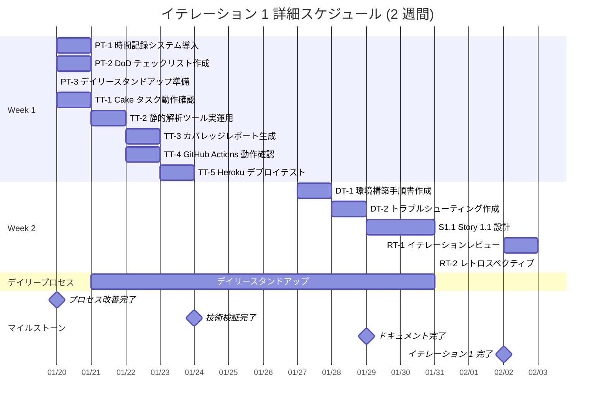

# イテレーション 1 計画 - プロセス改善と品質基盤強化

## イテレーション情報

| 項目 | 内容 |
|------|------|
| **イテレーション番号** | 1 |
| **期間** | 2025-01-20 ~ 2025-02-02 (2 週間) |
| **チーム** | F# 開発者 2 名 |
| **作業日数** | 10 日 (営業日ベース) |
| **計画策定日** | 2025-11-10 |
| **前イテレーション** | [イテレーション 0](./iteration_plan-0.md) - 環境構築（DoD 達成率 63%） |

## イテレーションゴール

**開発プロセスの改善と品質基盤の強化、および基本的な注文受付機能の設計開始**

### 成功基準

✅ **プロセス改善完了**:
- 時間記録システムが導入され、全タスクで実績時間が記録されている
- DoD チェックリストが GitHub Issue に統合されている
- デイリースタンドアップが 80% 以上の頻度で実施されている

✅ **品質基盤強化完了**:
- Cake の全タスクが正常に動作する
- FSharpLint と Fantomas が CI パイプラインで実行される
- Heroku への手動デプロイが成功する
- テストカバレッジが測定され、80% 以上を達成している

✅ **ドキュメント完備**:
- 環境構築手順書が完成している
- トラブルシューティングガイドが整備されている

✅ **開発開始準備**:
- Story 1.1 の設計が完了している（タスク分解、型定義の設計）
- 基本的な制約付き型（String50, EmailAddress など）のサンプル実装

## イテレーション 0 からのフィードバック反映

### イテレーション 0 の実績

**計画理想時間**: 90 時間
**実績コミット数**: 52 コミット
**DoD 達成率**: 63%（19/30 項目達成）
**主な成果**: 5 レイヤーアーキテクチャ完成、CI/CD 設定、Cake ビルド自動化

**未完了項目**:
- VSCode タスク統合（要確認）
- カバレッジレポート生成（要確認）
- 静的解析ツール実運用（要確認）
- GitHub Actions 動作確認（要確認）
- Heroku デプロイ実績（未実施）
- 詳細ドキュメント（未作成）

**発見された課題**:
1. 実績時間の記録なし → ベロシティ測定不可
2. デイリースタンドアップ未実施 → コミュニケーション不足
3. イテレーションレビュー未実施 → フィードバック欠如
4. 実運用確認の不足 → 潜在的問題のリスク

### レトロスペクティブの改善アクション（7 件）

イテレーション 1 では以下の改善アクションを実施：

1. **Action 1**: 時間記録システム導入（Day 1）
2. **Action 2**: DoD チェックリスト自動化（Day 1）
3. **Action 3**: デイリースタンドアップ実施（毎朝 9:00-9:15）
4. **Action 4**: 静的解析ツール動作確認（Day 2）
5. **Action 5**: Heroku デプロイテスト（Day 3）
6. **Action 6**: 環境構築ドキュメント整備（Day 3-5）
7. **Action 7**: レビュー・レトロ定期実施（最終日）

## ストーリー選択

イテレーション 1 は **プロセス改善と品質基盤強化**を最優先し、開発ストーリーは設計のみに限定します。

| カテゴリ | タスク | 優先度 | 見積 (理想時間) |
|---------|-------|--------|----------------|
| **プロセス改善** | PT-1 ~ PT-3 | 最高 | 6.25 時間 |
| **技術検証** | TT-1 ~ TT-5 | 高 | 18 時間 |
| **ドキュメント整備** | DT-1 ~ DT-2 | 中 | 7 時間 |
| **開発** | Story 1.1 設計 | 中 | 16 時間 |
| **デイリースタンドアップ** | 毎日 15 分 × 10 日 | 最高 | 2.5 時間 |
| **レビュー・レトロ** | 最終日 | 最高 | 3.5 時間 |
| **合計** | - | - | **53.25 時間** |

**チーム理想時間**: 2 名 × 5 時間/日 × 10 日 = **100 理想時間**
**バッファ**: 46.75 時間 (46.75%)

**注**: イテレーション 0 の未完了項目対応のため、開発ストーリーは設計のみに抑制しています。

## タスク分解

### プロセス改善タスク (PT)

#### PT-1: 時間記録システムの導入 (2 時間)

**責任者**: 開発者 A, B（全員）
**期限**: Day 1
**優先度**: 最高

**受け入れ基準**:
- [ ] 時間記録方法が決定され、チーム全員に共有されている
- [ ] 記録フォーマットが統一されている
- [ ] 初日から時間記録が開始されている

**タスク**:

| タスク ID | タスク名 | 担当 | 見積 | 詳細 |
|----------|---------|------|------|------|
| PT-1.1 | 時間記録方法の決定 | 開発者 A | 0.5h | Git コミットメッセージ vs 専用ツール |
| PT-1.2 | 記録フォーマットの定義 | 開発者 A | 0.5h | `[時間: Xh] タスク内容` 形式 |
| PT-1.3 | チームへの説明と合意 | 開発者 A | 0.5h | 時間記録の重要性を説明 |
| PT-1.4 | 初回記録の実施 | 全員 | 0.5h | PT-1 自体の時間を記録 |

#### PT-2: DoD チェックリストの GitHub Issue テンプレート化 (3 時間)

**責任者**: 開発者 A
**期限**: Day 1
**優先度**: 最高

**受け入れ基準**:
- [ ] `.github/ISSUE_TEMPLATE/` に DoD テンプレートが作成されている
- [ ] イテレーション 0 の DoD 項目が含まれている
- [ ] 新規 Issue 作成時に自動でテンプレートが適用される

**タスク**:

| タスク ID | タスク名 | 担当 | 見積 | 詳細 |
|----------|---------|------|------|------|
| PT-2.1 | DoD テンプレートファイル作成 | 開発者 A | 1h | `.github/ISSUE_TEMPLATE/iteration-dod.md` |
| PT-2.2 | DoD 項目の整理と記載 | 開発者 A | 1.5h | イテレーション 0 の 8 カテゴリ 30 項目 |
| PT-2.3 | テンプレート動作確認 | 開発者 A | 0.5h | テスト Issue 作成で確認 |

#### PT-3: デイリースタンドアップの確立 (1.25 時間 + 毎日 15 分)

**責任者**: スクラムマスター（開発者 A）
**頻度**: 毎営業日 9:00-9:15
**優先度**: 最高

**受け入れ基準**:
- [ ] 毎営業日 9:00-9:15 にスタンドアップが実施されている
- [ ] 3 つの質問（昨日の成果、今日の予定、ブロッカー）に全員が回答している
- [ ] 実施率が 80% 以上である

**タスク**:

| タスク ID | タスク名 | 担当 | 見積 | 詳細 |
|----------|---------|------|------|------|
| PT-3.1 | カレンダー招待送信 | 開発者 A | 0.25h | 定期ミーティング設定 |
| PT-3.2 | スタンドアップフォーマット共有 | 開発者 A | 0.5h | 3 つの質問を文書化 |
| PT-3.3 | 初回スタンドアップ実施 | 全員 | 0.25h | Day 2 朝 9:00 |
| PT-3.4 | 毎日のスタンドアップ | 全員 | 0.25h × 10 日 | 継続実施 |

**合計見積もり**: 1.25h（準備） + 2.5h（10 日分） = **3.75 時間**

### 技術検証タスク (TT)

#### TT-1: Cake タスクの動作確認と修正 (4 時間)

**責任者**: 開発者 B
**期限**: Day 1-2
**優先度**: 高

**受け入れ基準**:
- [ ] `dotnet cake` で全タスクがエラーなく実行される
- [ ] Clean, Build, Test, Coverage, Format, Quality タスクが正常動作
- [ ] VSCode タスク統合（.vscode/tasks.json）が完了している

**タスク**:

| タスク ID | タスク名 | 担当 | 見積 | 詳細 |
|----------|---------|------|------|------|
| TT-1.1 | Cake タスクの個別実行確認 | 開発者 B | 1.5h | 各タスクを順に実行してエラー確認 |
| TT-1.2 | エラー修正とパス調整 | 開発者 B | 1.5h | パス設定やパラメータの修正 |
| TT-1.3 | VSCode タスク統合 | 開発者 B | 1h | `.vscode/tasks.json` の作成 |

#### TT-2: 静的解析ツールの実運用開始 (4 時間)

**責任者**: 開発者 B
**期限**: Day 2
**優先度**: 高

**受け入れ基準**:
- [ ] FSharpLint が実行でき、結果が出力される
- [ ] Fantomas によるコードフォーマットが実行できる
- [ ] Cake の Quality タスクで両方が実行される
- [ ] 既存コードに品質違反がないことを確認

**タスク**:

| タスク ID | タスク名 | 担当 | 見積 | 詳細 |
|----------|---------|------|------|------|
| TT-2.1 | FSharpLint 実行と結果確認 | 開発者 B | 1.5h | `dotnet fsharplint lint` 実行 |
| TT-2.2 | Fantomas 実行と結果確認 | 開発者 B | 1h | `dotnet fantomas` 実行 |
| TT-2.3 | Cake Quality タスク確認 | 開発者 B | 1h | `dotnet cake --target=Quality` |
| TT-2.4 | 品質違反の修正 | 開発者 B | 0.5h | 検出された違反を修正 |

#### TT-3: カバレッジレポート生成確認 (2 時間)

**責任者**: 開発者 B
**期限**: Day 2-3
**優先度**: 高

**受け入れ基準**:
- [ ] coverlet によるカバレッジ測定が実行される
- [ ] カバレッジレポートが生成される
- [ ] カバレッジが 80% 以上であることを確認（サンプルコード）
- [ ] Cake の Coverage タスクで実行できる

**タスク**:

| タスク ID | タスク名 | 担当 | 見積 | 詳細 |
|----------|---------|------|------|------|
| TT-3.1 | coverlet 実行確認 | 開発者 B | 1h | `dotnet test --collect:"XPlat Code Coverage"` |
| TT-3.2 | レポート生成と確認 | 開発者 B | 0.5h | coverage.cobertura.xml の確認 |
| TT-3.3 | Cake Coverage タスク確認 | 開発者 B | 0.5h | `dotnet cake --target=Coverage` |

#### TT-4: GitHub Actions CI の動作確認 (4 時間)

**責任者**: 開発者 A
**期限**: Day 2-3
**優先度**: 高

**受け入れ基準**:
- [ ] GitHub Actions ワークフローが実行される
- [ ] プッシュ時に自動ビルド・テストが実行される
- [ ] Pull Request に品質チェック結果が表示される
- [ ] すべての品質ゲートをパスする

**タスク**:

| タスク ID | タスク名 | 担当 | 見積 | 詳細 |
|----------|---------|------|------|------|
| TT-4.1 | ワークフロー実行履歴確認 | 開発者 A | 1h | GitHub Actions タブで過去の実行確認 |
| TT-4.2 | テストプッシュで動作確認 | 開発者 A | 1.5h | 軽微な変更をプッシュして確認 |
| TT-4.3 | PR 作成と品質チェック確認 | 開発者 A | 1h | テスト PR を作成してチェック確認 |
| TT-4.4 | エラー修正と再確認 | 開発者 A | 0.5h | 問題があれば修正 |

#### TT-5: Heroku デプロイテストの実施 (4 時間)

**責任者**: 開発者 A
**期限**: Day 3
**優先度**: 高

**受け入れ基準**:
- [ ] Heroku アプリケーションが作成されている（または既存確認）
- [ ] 手動デプロイが成功する
- [ ] Heroku ダッシュボードでアプリケーション状態を確認できる
- [ ] デプロイログに問題がない

**タスク**:

| タスク ID | タスク名 | 担当 | 見積 | 詳細 |
|----------|---------|------|------|------|
| TT-5.1 | Heroku アプリ状態確認 | 開発者 A | 0.5h | `heroku apps:info` で確認 |
| TT-5.2 | 手動デプロイ実施 | 開発者 A | 2h | `git push heroku development:main` |
| TT-5.3 | ダッシュボード確認 | 開発者 A | 0.5h | Heroku ダッシュボードでログ確認 |
| TT-5.4 | 問題修正と再デプロイ | 開発者 A | 1h | エラーがあれば修正 |

**技術検証タスク合計**: **18 時間**

### ドキュメント整備タスク (DT)

#### DT-1: 環境構築手順書の作成 (4 時間)

**責任者**: 開発者 A
**期限**: Day 3-5
**優先度**: 中

**受け入れ基準**:
- [ ] 環境構築手順書が `docs/setup-guide.md` に作成されている
- [ ] 新メンバーが独力でセットアップできるレベルの詳細度
- [ ] 各ツールのバージョン情報が明記されている
- [ ] スクリーンショット付きで手順が説明されている

**タスク**:

| タスク ID | タスク名 | 担当 | 見積 | 詳細 |
|----------|---------|------|------|------|
| DT-1.1 | ドキュメント構成の設計 | 開発者 A | 0.5h | 目次とセクション構成を決定 |
| DT-1.2 | .NET SDK インストール手順 | 開発者 A | 1h | Windows/Mac/Linux 別の手順 |
| DT-1.3 | 開発ツールインストール手順 | 開発者 A | 1.5h | Cake, FSharpLint, Fantomas |
| DT-1.4 | プロジェクトセットアップ手順 | 開発者 A | 1h | Clone, Build, Test の手順 |

#### DT-2: トラブルシューティングガイドの整備 (3 時間)

**責任者**: 開発者 B
**期限**: Day 4-5
**優先度**: 中

**受け入れ基準**:
- [ ] トラブルシューティングガイドが `docs/troubleshooting.md` に作成されている
- [ ] よくある問題とその解決策が記載されている
- [ ] イテレーション 0 で遭遇した問題が含まれている

**タスク**:

| タスク ID | タスク名 | 担当 | 見積 | 詳細 |
|----------|---------|------|------|------|
| DT-2.1 | ドキュメント構成の設計 | 開発者 B | 0.5h | カテゴリ別の構成 |
| DT-2.2 | ビルドエラーのトラブルシューティング | 開発者 B | 1h | dotnet build 関連 |
| DT-2.3 | テスト実行エラーのトラブルシューティング | 開発者 B | 0.5h | dotnet test 関連 |
| DT-2.4 | ツール関連のトラブルシューティング | 開発者 B | 1h | Cake, Lint, Fantomas 関連 |

**ドキュメント整備タスク合計**: **7 時間**

### 開発タスク - Story 1.1: 基本的な注文受付（設計のみ）

**ストーリーポイント**: 8 SP（リリース計画より）
**イテレーション 1 スコープ**: 設計のみ（実装はイテレーション 2）
**見積もり**: 16 時間（設計フェーズ）

#### Story 1.1: 基本的な注文受付の設計 (16 時間)

**責任者**: 開発者 A, B（協働）
**期限**: Day 6-10
**優先度**: 中

**受け入れ基準**:
- [ ] ドメインモデルの型定義が設計されている
- [ ] 制約付き型（String50, EmailAddress など）のサンプル実装が完了
- [ ] ワークフロー関数のシグネチャが定義されている
- [ ] タスク分解が完了している（イテレーション 2 用）
- [ ] 設計ドキュメントが作成されている

**タスク**:

| タスク ID | タスク名 | 担当 | 見積 | 詳細 |
|----------|---------|------|------|------|
| S1.1-1 | ドメインモデル分析 | 開発者 A, B | 3h | 注文、顧客、商品の概念分析 |
| S1.1-2 | 制約付き型の設計 | 開発者 A | 4h | String50, EmailAddress, ProductCode 等 |
| S1.1-3 | 制約付き型のサンプル実装 | 開発者 A | 3h | 基本的な型の実装とテスト |
| S1.1-4 | ワークフロー関数シグネチャ設計 | 開発者 B | 3h | placeOrder 関数の型定義 |
| S1.1-5 | イテレーション 2 タスク分解 | 開発者 A, B | 2h | 実装タスクの詳細化 |
| S1.1-6 | 設計ドキュメント作成 | 開発者 B | 1h | 型定義と設計方針の文書化 |

**開発タスク合計**: **16 時間**

### レビュー・レトロスペクティブタスク

#### RT-1: イテレーションレビュー (2 時間)

**責任者**: スクラムマスター（開発者 A）
**日時**: Day 10（2025-02-02 金）15:00-17:00
**参加者**: 開発チーム全員、プロダクトオーナー（可能であれば）

**アジェンダ**:
1. プロセス改善デモ（30 分）
   - 時間記録システムの運用状況
   - DoD チェックリストの活用状況
   - デイリースタンドアップの効果

2. 技術検証デモ（45 分）
   - Cake タスクの実行デモ
   - 静的解析ツールの実行結果
   - Heroku デプロイの成功確認
   - カバレッジレポートの確認

3. ドキュメントレビュー（30 分）
   - 環境構築手順書の確認
   - トラブルシューティングガイドの確認

4. Story 1.1 設計レビュー（15 分）
   - ドメインモデル設計の説明
   - 制約付き型のサンプル確認

#### RT-2: レトロスペクティブ (1.5 時間)

**責任者**: スクラムマスター（開発者 A）
**日時**: Day 10（2025-02-02 金）17:00-18:30
**参加者**: 開発チーム全員
**フォーマット**: KPT (Keep, Problem, Try)

**アジェンダ**:
1. KPT の記入（20 分）
   - 各自で付箋に記入

2. Keep の共有（20 分）
   - 続けるべきことの共有と議論

3. Problem の共有（20 分）
   - 問題点の共有と原因分析

4. Try の決定（30 分）
   - 改善アクションの具体化
   - 責任者と期限の決定

5. イテレーション 2 への引き継ぎ事項整理（20 分）

**レビュー・レトロスペクティブ合計**: **3.5 時間**

## 詳細スケジュール

## 日次計画

### Week 1

**Day 1 (2025-01-20 月)**
- AM: PT-1 時間記録システム導入（2h）
- AM: PT-2 DoD チェックリスト作成（開始）（1.5h）
- PM: PT-2 DoD チェックリスト作成（完了）（1.5h）
- PM: PT-3 デイリースタンドアップ準備（1h）
- PM: TT-1 Cake タスク動作確認（開始）（2h）

**Day 2 (2025-01-21 火)**
- 09:00-09:15: デイリースタンドアップ（初回）
- AM: TT-1 Cake タスク動作確認（完了）（2h）
- AM: TT-2 静的解析ツール実運用（開始）（2h）
- PM: TT-2 静的解析ツール実運用（完了）（2h）
- PM: TT-3 カバレッジレポート生成（開始）（1h）

**Day 3 (2025-01-22 水)**
- 09:00-09:15: デイリースタンドアップ
- AM: TT-3 カバレッジレポート生成（完了）（1h）
- AM: TT-4 GitHub Actions 動作確認（開始）（2.5h）
- PM: TT-4 GitHub Actions 動作確認（完了）（1.5h）
- PM: TT-5 Heroku デプロイテスト（開始）（1.5h）

**Day 4 (2025-01-23 木)**
- 09:00-09:15: デイリースタンドアップ
- AM: TT-5 Heroku デプロイテスト（完了）（2.5h）
- PM: 技術検証の総合確認（2h）
- PM: バッファ時間（1.5h）

**Day 5 (2025-01-24 金)**
- 09:00-09:15: デイリースタンドアップ
- AM: Week 1 振り返りとWeek 2 準備（2h）
- PM: バッファ時間（4h）

### Week 2

**Day 6 (2025-01-27 月)**
- 09:00-09:15: デイリースタンドアップ
- AM: DT-1 環境構築手順書作成（開始）（2.5h）
- PM: DT-1 環境構築手順書作成（完了）（1.5h）
- PM: S1.1 Story 1.1 設計（ドメインモデル分析開始）（1.5h）

**Day 7 (2025-01-28 火)**
- 09:00-09:15: デイリースタンドアップ
- AM: S1.1 Story 1.1 設計（ドメインモデル分析完了）（1.5h）
- AM: S1.1 Story 1.1 設計（制約付き型設計開始）（2h）
- PM: DT-2 トラブルシューティング作成（開始）（2h）
- PM: S1.1 Story 1.1 設計（制約付き型設計継続）（1h）

**Day 8 (2025-01-29 水)**
- 09:00-09:15: デイリースタンドアップ
- AM: S1.1 Story 1.1 設計（制約付き型サンプル実装）（3h）
- PM: DT-2 トラブルシューティング作成（完了）（1h）
- PM: S1.1 Story 1.1 設計（ワークフロー関数シグネチャ設計開始）（2h）

**Day 9 (2025-01-30 木)**
- 09:00-09:15: デイリースタンドアップ
- AM: S1.1 Story 1.1 設計（ワークフロー関数シグネチャ設計完了）（1h）
- AM: S1.1 Story 1.1 設計（イテレーション 2 タスク分解開始）（2.5h）
- PM: S1.1 Story 1.1 設計（イテレーション 2 タスク分解完了）（1.5h）
- PM: S1.1 Story 1.1 設計（設計ドキュメント作成）（1h）

**Day 10 (2025-02-02 金)**
- 09:00-09:15: デイリースタンドアップ
- AM: イテレーションレビュー準備（2h）
- PM: RT-1 イテレーションレビュー（15:00-17:00）（2h）
- PM: RT-2 レトロスペクティブ（17:00-18:30）（1.5h）

## 理想時間集計

### カテゴリ別

| カテゴリ | 理想時間 | 比率 |
|---------|---------|------|
| プロセス改善 | 6.25h | 11.7% |
| 技術検証 | 18h | 33.8% |
| ドキュメント整備 | 7h | 13.2% |
| 開発（Story 1.1 設計） | 16h | 30.1% |
| デイリースタンドアップ | 2.5h | 4.7% |
| レビュー・レトロ | 3.5h | 6.6% |
| **合計** | **53.25h** | **100%** |

**チーム理想時間**: 100h
**バッファ**: 46.75h (46.75%)

### 日別バーンダウン (想定)

| 日 | 開始時残 | 完了予定 | 残予定 | 実績完了 | 実績残 |
|----|---------|---------|--------|---------|--------|
| Day 1 | 53.25h | 8h | 45.25h | - | - |
| Day 2 | 45.25h | 5.75h | 39.5h | - | - |
| Day 3 | 39.5h | 6.5h | 33h | - | - |
| Day 4 | 33h | 4.5h | 28.5h | - | - |
| Day 5 | 28.5h | 2h | 26.5h | - | - |
| Day 6 | 26.5h | 5.5h | 21h | - | - |
| Day 7 | 21h | 6.75h | 14.25h | - | - |
| Day 8 | 14.25h | 6.25h | 8h | - | - |
| Day 9 | 8h | 6h | 2h | - | - |
| Day 10 | 2h | 3.75h | -1.75h | - | - |

**注**: Day 10 は実際には 5.5h の作業予定（バッファから充当）

## リスクと対策

### 技術的リスク

| リスク | 影響度 | 確率 | 軽減策 | 対応者 |
|--------|--------|------|--------|--------|
| Cake タスクの互換性問題 | 中 | 中 | 早期に動作確認、代替案検討 | 開発者 B |
| Heroku デプロイエラー | 中 | 中 | ログ詳細分析、公式ドキュメント確認 | 開発者 A |
| カバレッジ 80% 未達 | 低 | 低 | サンプルコードで実績確認済み | 開発者 B |
| GitHub Actions 設定ミス | 低 | 低 | 段階的に確認、エラーログ分析 | 開発者 A |

### スケジュールリスク

| リスク | 影響度 | 確率 | 軽減策 |
|--------|--------|------|--------|
| プロセス改善タスクの遅延 | 高 | 低 | Day 1 に集中実施、最優先対応 |
| 技術検証の長期化 | 中 | 中 | 各タスクを独立実施、並行作業可能 |
| ドキュメント作成の遅延 | 低 | 中 | 最小限の内容で完成、後から拡充可能 |
| Story 1.1 設計の未完了 | 低 | 低 | 設計のみに限定、実装はイテレーション 2 |

### プロセスリスク

| リスク | 影響度 | 確率 | 軽減策 |
|--------|--------|------|--------|
| デイリースタンドアップの形骸化 | 中 | 中 | 3 つの質問を厳守、15 分厳守 |
| 時間記録の忘れ | 中 | 高 | コミット時に必ず記録、相互チェック |
| DoD チェックの不徹底 | 中 | 中 | Day 9 に全項目確認ミーティング |

## Definition of Done (完了の定義)

イテレーション 1 が完了したと判断する基準：

### ✅ プロセス改善

- [ ] 時間記録システムが導入され、Day 1 から全タスクで実績時間が記録されている
- [ ] DoD チェックリストが GitHub Issue テンプレートに組み込まれている
- [ ] デイリースタンドアップが 8 回以上実施されている（実施率 80% 以上）
- [ ] デイリースタンドアップで 3 つの質問（昨日・今日・ブロッカー）が全員回答されている

### ✅ 技術検証

- [ ] Cake の全タスク（Clean, Build, Test, Coverage, Format, Quality）がエラーなく実行できる
- [ ] VSCode タスク統合（.vscode/tasks.json）が完了している
- [ ] FSharpLint と Fantomas が正常に実行でき、結果が出力される
- [ ] Cake の Quality タスクで静的解析が実行される
- [ ] カバレッジレポートが生成され、80% 以上を達成している
- [ ] GitHub Actions ワークフローが実行される
- [ ] プッシュ時に自動ビルド・テストが実行される
- [ ] Pull Request に品質チェック結果が表示される
- [ ] Heroku への手動デプロイが成功する
- [ ] Heroku ダッシュボードでアプリケーション状態を確認できる

### ✅ ドキュメント整備

- [ ] 環境構築手順書（`docs/setup-guide.md`）が完成している
- [ ] トラブルシューティングガイド（`docs/troubleshooting.md`）が完成している
- [ ] 各ツールのバージョン情報が明記されている
- [ ] 新メンバーが独力でセットアップできるレベルの詳細度

### ✅ 開発

- [ ] Story 1.1 のドメインモデル型定義が設計されている
- [ ] 制約付き型（String50, EmailAddress など）のサンプル実装が完了している
- [ ] ワークフロー関数のシグネチャが定義されている
- [ ] イテレーション 2 用のタスク分解が完了している
- [ ] 設計ドキュメントが作成されている

### ✅ レビュー・レトロスペクティブ

- [ ] イテレーションレビューが実施され、デモが完了している
- [ ] レトロスペクティブが実施され、KPT 分析が完了している
- [ ] イテレーション 2 への改善アクションが明確化されている
- [ ] レトロスペクティブドキュメント（`retrospective-1.md`）が作成されている

### ✅ メトリクス

- [ ] 全タスクの実績時間が記録されている
- [ ] イテレーション全体の実績理想時間が集計されている
- [ ] 初回ベロシティが測定されている（完了 SP ÷ イテレーション期間）
- [ ] 見積もり精度が分析されている（計画 vs 実績の差分率）

## チームコミットメント

**開発者 A のコミットメント**:
- PT-1, PT-2, PT-3 の主担当として全プロセス改善タスクを完了する
- TT-4, TT-5 の技術検証タスクを完了する
- DT-1 の環境構築手順書を完成させる
- Story 1.1 の制約付き型設計・実装を完了する
- 約 26 理想時間のタスクに責任を持つ

**開発者 B のコミットメント**:
- TT-1, TT-2, TT-3 の技術検証タスクを完了する
- DT-2 のトラブルシューティングガイドを完成させる
- Story 1.1 のワークフロー関数設計を完了する
- 約 23 理想時間のタスクに責任を持つ

**チーム全体のコミットメント**:
- イテレーション終了時に全 Definition of Done を満たす
- デイリースタンドアップを 80% 以上の頻度で実施する
- 全タスクで実績時間を記録する
- プロセス改善を最優先で完了させる
- Day 9 に DoD 全項目の確認ミーティングを実施する
- イテレーションレビューとレトロスペクティブを必ず実施する

## メトリクス測定

イテレーション 1 では以下のメトリクスを初めて測定します：

### 開発メトリクス

- **実績理想時間**: 各タスクの実績時間を集計（目標: 53.25h ± 20%）
- **ベロシティ**: 完了ストーリーポイント ÷ イテレーション期間
  - Story 1.1 は設計のみのため、0 SP 完了（実装は次イテレーション）
  - イテレーション 0 の未完了項目を完了させることが主目的
- **見積もり精度**: (実績時間 - 計画時間) ÷ 計画時間 × 100%
  - 目標: ±30% 以内

### 品質メトリクス

- **テストカバレッジ**: 80% 以上を維持
- **静的解析違反数**: FSharpLint による検出数（目標: 0 件）
- **ビルド成功率**: CI パイプラインでの成功率（目標: 100%）
- **デプロイ成功率**: Heroku デプロイの成功率（目標: 100%）

### プロセスメトリクス

- **デイリースタンドアップ実施率**: 実施回数 ÷ 営業日数 × 100%（目標: 80% 以上）
- **DoD 達成率**: 完了項目 ÷ 総項目 × 100%（目標: 100%）
- **コミット頻度**: 1 日あたりの平均コミット数
- **時間記録率**: 時間記録されたタスク ÷ 総タスク × 100%（目標: 100%）

## イテレーションレビュー計画

**日時**: 2025-02-02 (金) 15:00-17:00

**アジェンダ**:
1. プロセス改善デモ (30 分)
   - 時間記録システムの運用状況とデータ
   - DoD チェックリストの活用例
   - デイリースタンドアップの効果と気づき

2. 技術検証デモ (45 分)
   - Cake タスクの実行デモ（全タスク）
   - FSharpLint と Fantomas の実行結果
   - カバレッジレポートの確認
   - GitHub Actions CI の動作確認
   - Heroku デプロイの成功確認

3. ドキュメントレビュー (30 分)
   - 環境構築手順書の確認とフィードバック
   - トラブルシューティングガイドの確認

4. Story 1.1 設計レビュー (15 分)
   - ドメインモデル設計の説明
   - 制約付き型のサンプルコード確認
   - イテレーション 2 のタスク分解確認

## レトロスペクティブ計画

**日時**: 2025-02-02 (金) 17:00-18:30

**フォーマット**: KPT (Keep, Problem, Try)

**準備事項**:
- 各自で KPT を事前に記入（付箋または電子フォーム）
- メトリクスデータを準備（実績時間、ベロシティ、DoD 達成率）
- 改善アクションを具体的に提案（責任者・期限付き）

**主な振り返りポイント**:
- プロセス改善の効果（時間記録、デイリースタンドアップ、DoD チェックリスト）
- 技術検証での学び
- 見積もりの精度
- チームコラボレーション
- イテレーション 2 への引き継ぎ事項

**成果物**:
- レトロスペクティブドキュメント（`retrospective-1.md`）
- イテレーション 2 への改善アクション一覧
- ベロシティと見積もり精度の分析結果

---

## 参照ドキュメント

- [リリース計画](./release_plan.md)
- [イテレーション 0 計画](./iteration_plan-0.md)
- [イテレーション 0 レトロスペクティブ](./retrospective-0.md)
- [リリース・イテレーション計画ガイド](../reference/リリース・イテレーション計画ガイド.md)
- [技術スタック定義書](../design/tech_stack.md)
