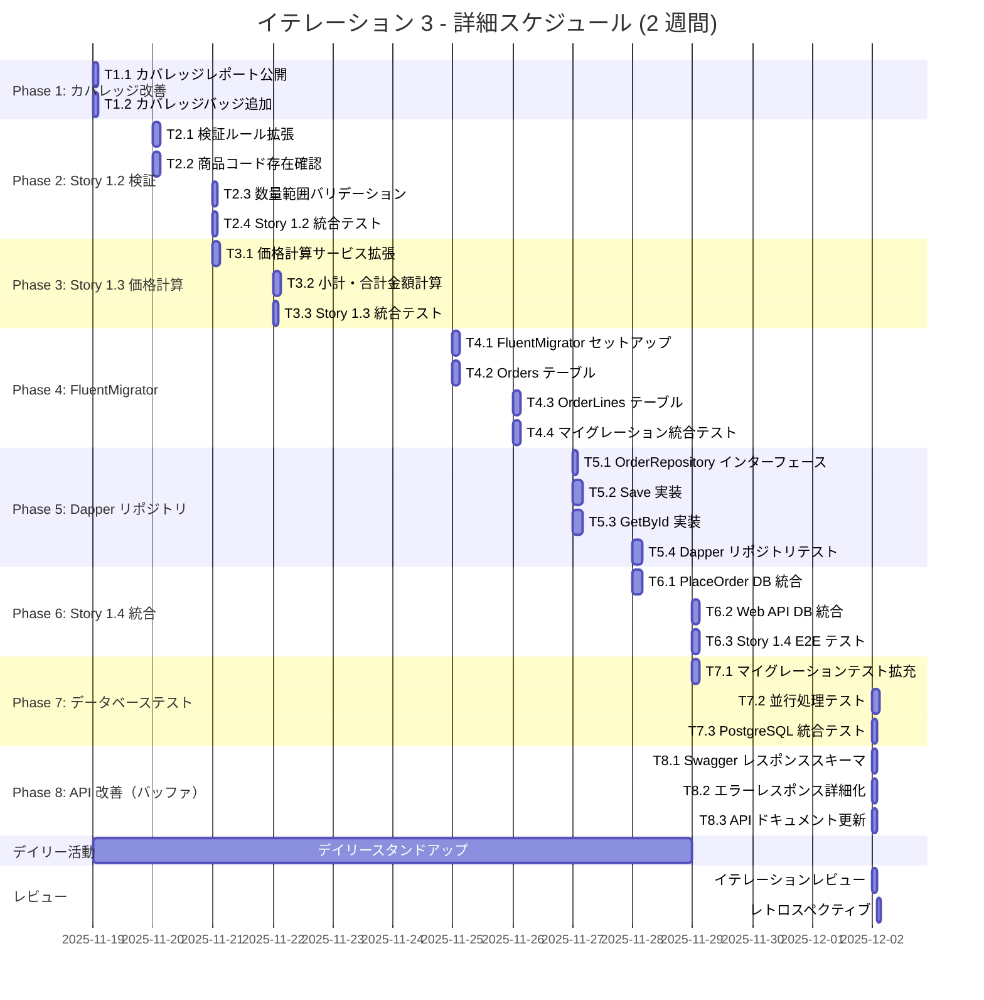

# イテレーション 3 計画 - Dapper + FluentMigrator 基盤構築と Story 1.2, 1.3, 1.4 実装

## イテレーション情報

| 項目 | 内容 |
|------|------|
| **イテレーション番号** | 3 |
| **期間** | 2025-11-19 ~ 2025-12-02 (2 週間) |
| **チーム** | F# 開発者 2 名 |
| **作業日数** | 10 日 (営業日ベース) |
| **計画策定日** | 2025-11-19 |
| **前イテレーション** | [イテレーション 2](./iteration_plan-2.md) - Story 1.1 完全実装（達成率 100%） |

## イテレーションゴール

**Dapper + FluentMigrator 技術基盤の構築と Story 1.2, 1.3, 1.4 の完全実装**

### 成功基準

✅ **Dapper + FluentMigrator 基盤構築完了**:
- FluentMigrator によるマイグレーション管理が動作する
- Dapper による CRUD 操作が実装されている
- SQLite (開発) と PostgreSQL (本番) の両対応が完了している
- データベーステストが実装され、すべて成功する

✅ **Story 1.2 完了（注文内容の検証）**:
- 顧客名、メールアドレス、郵便番号の検証が実装されている
- 商品コードの存在確認が実装されている
- 数量範囲のバリデーションが実装されている
- すべての受け入れ基準を満たす

✅ **Story 1.3 完了（価格の自動計算）**:
- 各注文明細の小計計算が実装されている
- 注文全体の合計金額計算が実装されている
- すべての受け入れ基準を満たす

✅ **Story 1.4 完了（注文の永続化）**:
- 注文データがデータベースに永続化される
- Dapper リポジトリパターンが実装されている
- データベーステストが実装されている
- すべての受け入れ基準を満たす

✅ **品質基準達成**:
- テストカバレッジ 80% 以上維持
- すべてのテストが成功（単体 + 統合 + データベース）
- Fantomas フォーマットチェック合格
- FSharpLint 静的解析警告ゼロ

## イテレーション 2 からのフィードバック反映

### イテレーション 2 の実績

**期間**: 2025-11-11 ~ 2025-11-12（2 セッション）
**タスク完了**: 29/29（100%）
**ストーリーポイント**: 6 SP（Story 1.1 実装完了）
**見積もり精度**: 100%
**テスト成功**: 124/124（100%）

**主な成果**:
- ドメイン層完成（制約付き型 13 種類、複合値オブジェクト 5 種類、エンティティ 3 種類）
- インフラストラクチャレイヤー実装
- Web API エンドポイント + Swagger UI
- E2E 統合テスト 7 個 + API テスト 5 個
- 技術的負債ゼロ

### レトロスペクティブの改善アクション（7 件）

イテレーション 3 で実施する主要な改善アクション:

**A1: MVP 定義の文書化**（イテレーション開始前）:
- Dapper + FluentMigrator を使った永続化が MVP に必須であることを明確化
- Story 1.4 を「オプション」ではなく「必須」として扱う

**A2: F# 互換性チェックリスト作成**（Day 1）:
- Dapper と FluentMigrator の F# 互換性を事前確認
- record 型のシリアライゼーション対応を確認

**A3: Story 1.2 のタスク分解**（計画時）:
- 詳細なタスク分解を実施済み（Phase 1-8）

**A4: レスポンススキーマの追加**（Phase 8）:
- Swagger UI にレスポンススキーマを追加
- エラーレスポンスの詳細化

**A5: カバレッジレポート自動公開**（Phase 1）:
- GitHub Actions でカバレッジレポートを自動公開
- カバレッジバッジの追加

### セッション外の作業内容

**プロジェクト構造変更**:
- app/backend 以下にプロジェクト構造を移動
- ソリューションファイルの更新

**技術スタック変更**:
- データベース ORM: Entity Framework Core → Dapper
- マイグレーション: Entity Framework Core Migrations → FluentMigrator
- 開発環境: SQLite
- 本番環境: PostgreSQL

**現在の状況**:
- テスト: 124 件すべて成功
- ビルド: エラーなし
- 技術的負債: なし

## ストーリー選択

イテレーション 3 は **Dapper + FluentMigrator 基盤構築と Story 1.2, 1.3, 1.4 の実装**に集中します。

### ストーリーポイント配分

| ストーリー | 状態 | SP | 優先度 | イテレーション配分 |
|-----------|------|-----|--------|------------------|
| **Story 1.2** | 📝 未着手 | 4 SP | 最高 | Iter 3（Phase 1-2） |
| **Story 1.3** | 📝 未着手 | 5 SP | 高 | Iter 3（Phase 3-4） |
| **Story 1.4** | 📝 未着手 | 6 SP | 高 | Iter 3（Phase 5-7） |
| **合計** | - | **15 SP** | - | - |

**リリース計画との整合性**:
- リリース計画: Iter 2-3 で Story 1.2 完了、Iter 3 で Story 1.3 完了、Iter 4 で Story 1.4 完了予定
- 現状: Iter 3 で Story 1.2, 1.3, 1.4 すべて完了予定（加速）
- 理由: イテレーション 1-2 の高いベロシティ（97.4%, 100%）を考慮し、積極的なスコープ設定

### タスク配分サマリー

| カテゴリ | タスク数 | 見積（理想時間） | 優先度 |
|---------|---------|----------------|--------|
| **Phase 1: カバレッジ改善** | 2 | 4h | 最高 |
| **Phase 2: Story 1.2 検証強化** | 4 | 10h | 最高 |
| **Phase 3: Story 1.3 価格計算** | 3 | 8h | 高 |
| **Phase 4: FluentMigrator 基盤** | 4 | 12h | 最高 |
| **Phase 5: Dapper リポジトリ** | 4 | 14h | 最高 |
| **Phase 6: Story 1.4 統合** | 3 | 10h | 高 |
| **Phase 7: データベーステスト** | 3 | 8h | 高 |
| **Phase 8: API 改善** | 3 | 6h | 中 |
| **デイリー活動** | - | 2.5h | 最高 |
| **レビュー・レトロ** | - | 3.5h | 最高 |
| **合計** | 26 タスク | **78h** | - |

**チーム理想時間**: 2 名 × 5 時間/日 × 10 日 = **100 理想時間**
**バッファ**: 22 時間（22%）

**バッファ戦略**:
- イテレーション 1-2 の高精度（97.4%, 100%）を考慮
- フィーチャバッファ: Phase 8（API 改善）は優先度を下げ、必要に応じて次イテレーションに延期可能
- スケジュールバッファ: 22h（Dapper + FluentMigrator の学習曲線に対応）

## タスク分解

### Phase 1: カバレッジ改善とバッジ追加（4h）

#### T1.1: カバレッジレポート自動公開（2h）
**優先度**: 最高
**担当**: 開発者 A
**期限**: Day 1

**タスク内容**:
- GitHub Actions でカバレッジレポートをアーティファクトとして公開
- カバレッジサマリーを PR コメントに追加（オプション）

**受け入れ基準**:
- [ ] カバレッジレポートが GitHub Actions でダウンロード可能
- [ ] カバレッジ率が CI ログに表示される
- [ ] 80% 未満の場合に警告が表示される

**改善アクション**: A5（カバレッジレポート自動公開）

---

#### T1.2: カバレッジバッジの追加（2h）
**優先度**: 高
**担当**: 開発者 B
**期限**: Day 1

**タスク内容**:
- README にカバレッジバッジを追加
- Shields.io または Codecov を使用
- バッジが自動更新されることを確認

**受け入れ基準**:
- [ ] README にカバレッジバッジが表示される
- [ ] バッジが現在のカバレッジ率を反映している
- [ ] バッジクリックでレポート詳細に遷移できる（オプション）

**改善アクション**: A5（カバレッジレポート自動公開）

---

### Phase 2: Story 1.2 注文内容の検証強化（10h）

#### T2.1: 検証ルールの拡張（3h）
**優先度**: 最高
**担当**: 開発者 A
**期限**: Day 2

**タスク内容**:
- 顧客名 50 文字制限の検証強化
- メールアドレス形式検証（@ 必須）の強化
- 郵便番号 5 桁数字の検証実装
- 検証エラーメッセージの改善

**受け入れ基準**:
- [ ] 顧客名が 50 文字以内であることを確認する
- [ ] メールアドレスが @ を含むことを確認する
- [ ] 郵便番号が 5 桁の数字であることを確認する
- [ ] すべての検証テストが成功する

**Story**: 1.2

---

#### T2.2: 商品コード存在確認の実装（3h）
**優先度**: 最高
**担当**: 開発者 B
**期限**: Day 2

**タスク内容**:
- CheckProductCodeExists サービスの実装強化
- Widget と Gizmo の商品コードリストを返す
- 存在しない商品コードに対するエラーハンドリング

**受け入れ基準**:
- [ ] 商品コードの存在確認ができる
- [ ] Widget コード（W + 4 桁）が検証される
- [ ] Gizmo コード（G + 3 桁）が検証される
- [ ] 無効な商品コードでエラーが返される

**Story**: 1.2
**依存関係**: なし（並行実施可能）

---

#### T2.3: 数量範囲バリデーションの実装（2h）
**優先度**: 高
**担当**: 開発者 A
**期限**: Day 3

**タスク内容**:
- Widget: 1-1000 個の範囲チェック
- Gizmo: 0.05-100.00kg の範囲チェック
- エラーメッセージの改善

**受け入れ基準**:
- [ ] Widget 数量が 1-1000 の範囲内であることを確認する
- [ ] Gizmo 重量が 0.05-100.00kg の範囲内であることを確認する
- [ ] 範囲外の値でエラーが返される
- [ ] すべての検証テストが成功する

**Story**: 1.2
**依存関係**: T2.1

---

#### T2.4: Story 1.2 統合テスト（2h）
**優先度**: 高
**担当**: 開発者 B
**期限**: Day 3

**タスク内容**:
- Story 1.2 の E2E 統合テスト実装
- 検証エラーの各種ケースをテスト
- エラーメッセージの確認

**受け入れ基準**:
- [ ] すべての検証エラーケースがテストされている
- [ ] 統合テストが成功する
- [ ] エラーメッセージが適切

**Story**: 1.2
**依存関係**: T2.1, T2.2, T2.3

---

### Phase 3: Story 1.3 価格の自動計算（8h）

#### T3.1: 価格計算サービスの拡張（3h）
**優先度**: 高
**担当**: 開発者 A
**期限**: Day 3-4

**タスク内容**:
- GetProductPrice サービスの実装強化
- 商品ごとの単価取得
- 価格取得失敗時のエラーハンドリング

**受け入れ基準**:
- [ ] 商品コードごとの単価が取得できる
- [ ] Widget と Gizmo の単価が正しく返される
- [ ] 価格が取得できない場合はエラーが記録される
- [ ] すべてのテストが成功する

**Story**: 1.3

---

#### T3.2: 小計・合計金額計算の実装（3h）
**優先度**: 高
**担当**: 開発者 B
**期限**: Day 4

**タスク内容**:
- 各注文明細の小計計算（単価 × 数量）
- 注文全体の合計金額計算
- 請求可能金額の算定

**受け入れ基準**:
- [ ] 各注文明細の小計が正しく計算される
- [ ] 注文全体の合計金額が正しく算出される
- [ ] 請求可能金額が算定される
- [ ] すべてのテストが成功する

**Story**: 1.3
**依存関係**: T3.1

---

#### T3.3: Story 1.3 統合テスト（2h）
**優先度**: 高
**担当**: 開発者 A
**期限**: Day 4

**タスク内容**:
- Story 1.3 の E2E 統合テスト実装
- 価格計算の各種ケースをテスト
- 価格計算結果の検証

**受け入れ基準**:
- [ ] すべての価格計算ケースがテストされている
- [ ] 統合テストが成功する
- [ ] 計算結果が正しい

**Story**: 1.3
**依存関係**: T3.1, T3.2

---

### Phase 4: FluentMigrator 基盤構築（12h）

#### T4.1: FluentMigrator セットアップ（3h）
**優先度**: 最高
**担当**: 開発者 A
**期限**: Day 5

**タスク内容**:
- FluentMigrator パッケージの追加
- マイグレーション実行環境の構築
- SQLite (開発) と PostgreSQL (本番) の設定

**受け入れ基準**:
- [ ] FluentMigrator パッケージが追加されている
- [ ] マイグレーション実行コマンドが動作する
- [ ] SQLite と PostgreSQL の両対応が完了している

**改善アクション**: A1, A2（MVP 定義、F# 互換性チェック）

---

#### T4.2: Orders テーブルマイグレーション（3h）
**優先度**: 最高
**担当**: 開発者 B
**期限**: Day 5

**タスク内容**:
- Orders テーブルのマイグレーション作成
  - OrderId (GUID)
  - CustomerId (GUID)
  - OrderDate (DateTime)
  - TotalAmount (Decimal)
  - Status (String)
- インデックスの作成

**受け入れ基準**:
- [ ] Orders テーブルが作成される
- [ ] すべてのカラムが正しく定義されている
- [ ] インデックスが作成されている
- [ ] マイグレーションが SQLite と PostgreSQL で動作する

**依存関係**: T4.1

---

#### T4.3: OrderLines テーブルマイグレーション（3h）
**優先度**: 高
**担当**: 開発者 A
**期限**: Day 6

**タスク内容**:
- OrderLines テーブルのマイグレーション作成
  - OrderLineId (GUID)
  - OrderId (GUID, FK)
  - ProductCode (String)
  - Quantity (Decimal)
  - Price (Decimal)
  - LineTotal (Decimal)
- 外部キー制約の作成

**受け入れ基準**:
- [ ] OrderLines テーブルが作成される
- [ ] 外部キー制約が正しく設定されている
- [ ] マイグレーションが SQLite と PostgreSQL で動作する

**依存関係**: T4.2

---

#### T4.4: マイグレーション統合テスト（3h）
**優先度**: 高
**担当**: 開発者 B
**期限**: Day 6

**タスク内容**:
- マイグレーションの Up/Down テスト
- SQLite インメモリデータベースでのテスト
- PostgreSQL テストデータベースでのテスト

**受け入れ基準**:
- [ ] Up マイグレーションが成功する
- [ ] Down マイグレーションが成功する
- [ ] SQLite と PostgreSQL で同じ結果が得られる
- [ ] すべてのテストが成功する

**依存関係**: T4.2, T4.3

---

### Phase 5: Dapper リポジトリ実装（14h）

#### T5.1: OrderRepository インターフェース定義（2h）
**優先度**: 最高
**担当**: 開発者 A
**期限**: Day 7

**タスク内容**:
- IOrderRepository インターフェース定義
  - SaveAsync (PricedOrder → OrderId)
  - GetByIdAsync (OrderId → PricedOrder option)
  - UpdateStatusAsync (OrderId → Status → unit)
- F# の async/Async 対応

**受け入れ基準**:
- [ ] IOrderRepository が定義されている
- [ ] すべての必要なメソッドが含まれている
- [ ] F# の Async 型が使用されている

**改善アクション**: A2（F# 互換性チェック）

---

#### T5.2: Dapper による Save 実装（4h）
**優先度**: 最高
**担当**: 開発者 A
**期限**: Day 7

**タスク内容**:
- SaveAsync メソッドの実装
- PricedOrder を Orders と OrderLines に分解
- Dapper による INSERT 実行
- トランザクション管理

**受け入れ基準**:
- [ ] SaveAsync が実装されている
- [ ] Orders と OrderLines が正しく挿入される
- [ ] トランザクションが正しく動作する
- [ ] 単体テストが成功する

**依存関係**: T5.1, T4.4

---

#### T5.3: Dapper による GetById 実装（4h）
**優先度**: 高
**担当**: 開発者 B
**期限**: Day 7-8

**タスク内容**:
- GetByIdAsync メソッドの実装
- Dapper による JOIN クエリ実行
- Orders と OrderLines を PricedOrder に再構築
- option 型の使用

**受け入れ基準**:
- [ ] GetByIdAsync が実装されている
- [ ] JOIN クエリが正しく実行される
- [ ] PricedOrder が正しく再構築される
- [ ] 存在しない OrderId で None が返される
- [ ] 単体テストが成功する

**依存関係**: T5.1, T4.4

---

#### T5.4: Dapper リポジトリテスト（4h）
**優先度**: 高
**担当**: 開発者 A, B
**期限**: Day 8

**タスク内容**:
- OrderRepository の統合テスト実装
- SQLite インメモリデータベースでのテスト
- CRUD 操作の完全テスト
- トランザクションテスト

**受け入れ基準**:
- [ ] Save/GetById のラウンドトリップテストが成功する
- [ ] トランザクションが正しく動作する
- [ ] すべてのテストが成功する

**依存関係**: T5.2, T5.3

---

### Phase 6: Story 1.4 統合（10h）

#### T6.1: PlaceOrder ワークフローのデータベース統合（4h）
**優先度**: 高
**担当**: 開発者 A
**期限**: Day 8-9

**タスク内容**:
- placeOrder ワークフローに OrderRepository を統合
- 注文確定後にデータベースに保存
- 依存性注入の実装

**受け入れ基準**:
- [ ] placeOrder ワークフローがデータベースに保存する
- [ ] 依存性注入が正しく動作する
- [ ] すべてのテストが成功する

**Story**: 1.4
**依存関係**: T5.4

---

#### T6.2: Web API のデータベース統合（3h）
**優先度**: 高
**担当**: 開発者 B
**期限**: Day 9

**タスク内容**:
- Web API に OrderRepository を統合
- 依存性コンテナの更新
- 環境変数による接続文字列設定

**受け入れ基準**:
- [ ] Web API がデータベースに接続する
- [ ] 接続文字列が環境変数から読み込まれる
- [ ] SQLite と PostgreSQL の切り替えが可能

**Story**: 1.4
**依存関係**: T6.1

---

#### T6.3: Story 1.4 E2E テスト（3h）
**優先度**: 高
**担当**: 開発者 A
**期限**: Day 9

**タスク内容**:
- Story 1.4 の E2E テスト実装
- 注文受付 → 検証 → 価格計算 → 永続化の完全フロー
- データベースからの読み取りテスト

**受け入れ基準**:
- [ ] E2E テストが成功する
- [ ] データベースに注文が保存される
- [ ] 保存されたデータが正しく読み取れる

**Story**: 1.4
**依存関係**: T6.1, T6.2

---

### Phase 7: データベーステスト（8h）

#### T7.1: マイグレーションテストの拡充（3h）
**優先度**: 高
**担当**: 開発者 B
**期限**: Day 9

**タスク内容**:
- マイグレーションのバージョン管理テスト
- スキーマ検証テスト
- インデックスの存在確認テスト

**受け入れ基準**:
- [ ] マイグレーションバージョンが管理されている
- [ ] スキーマが正しく検証される
- [ ] すべてのテストが成功する

**依存関係**: T4.4

---

#### T7.2: リポジトリの並行処理テスト（3h）
**優先度**: 中
**担当**: 開発者 A
**期限**: Day 10

**タスク内容**:
- 複数の注文を並行保存するテスト
- トランザクション分離レベルの検証
- デッドロックテスト

**受け入れ基準**:
- [ ] 並行処理が正しく動作する
- [ ] トランザクション分離が正しい
- [ ] デッドロックが発生しない

**依存関係**: T5.4

---

#### T7.3: PostgreSQL 統合テスト（2h）
**優先度**: 低
**担当**: 開発者 B
**期限**: Day 10（バッファ）

**タスク内容**:
- PostgreSQL テストデータベースでのテスト
- SQLite との動作差異の確認
- 本番環境デプロイ準備

**受け入れ基準**:
- [ ] PostgreSQL でテストが成功する
- [ ] SQLite と同じ動作をする
- [ ] 本番デプロイの準備が完了している

**依存関係**: T5.4

**注**: 時間不足の場合はイテレーション 4 に延期可能（バッファ）

---

### Phase 8: API 改善（6h）

#### T8.1: Swagger レスポンススキーマの追加（2h）
**優先度**: 中
**担当**: 開発者 A
**期限**: Day 10（バッファ）

**タスク内容**:
- POST /api/orders のレスポンススキーマ追加
- 成功レスポンス（OrderId）のスキーマ定義
- エラーレスポンスのスキーマ定義

**受け入れ基準**:
- [ ] レスポンススキーマが Swagger に表示される
- [ ] 成功レスポンスが正しく記載されている
- [ ] エラーレスポンスが詳細化されている

**改善アクション**: A4（レスポンススキーマの追加）
**依存関係**: なし（並行実施可能）

**注**: 時間不足の場合はイテレーション 4 に延期可能（バッファ）

---

#### T8.2: エラーレスポンスの詳細化（2h）
**優先度**: 低
**担当**: 開発者 B
**期限**: Day 10（バッファ）

**タスク内容**:
- ValidationError のフィールド別エラー情報
- エラーコードの追加
- エラーメッセージの国際化準備

**受け入れ基準**:
- [ ] フィールド別のエラー情報が返される
- [ ] エラーコードが定義されている
- [ ] エラーレスポンスが構造化されている

**改善アクション**: A4（レスポンススキーマの追加）
**依存関係**: T8.1

**注**: 時間不足の場合はイテレーション 4 に延期可能（バッファ）

---

#### T8.3: API ドキュメントの更新（2h）
**優先度**: 低
**担当**: 開発者 A
**期限**: Day 10（バッファ）

**タスク内容**:
- README の API セクション更新
- Swagger UI のサンプル更新
- デプロイ手順の更新

**受け入れ基準**:
- [ ] README が最新化されている
- [ ] Swagger UI のサンプルが動作する
- [ ] デプロイ手順が正しい

**改善アクション**: A4（レスポンススキーマの追加）
**依存関係**: T8.1, T8.2

**注**: 時間不足の場合はイテレーション 4 に延期可能（バッファ）

---

### デイリー活動（2.5h）

#### デイリースタンドアップ（2.5h）
**優先度**: 最高
**担当**: 全員
**頻度**: 毎朝 9:00-9:15（15 分 × 10 日）

**内容**:
- 昨日完了したこと
- 今日やること
- ブロッカー

**記録**:
- `docs/operation/process/standup-logs/2025-11.md` に記録
- テンプレートに従って構造化された記録を残す

---

### レビュー・レトロスペクティブ（3.5h）

#### イテレーションレビュー（2h）
**優先度**: 最高
**担当**: 全員
**期限**: Day 10 午後

**内容**:
- 完成した機能のデモ
  - Story 1.2: 注文内容の検証
  - Story 1.3: 価格の自動計算
  - Story 1.4: 注文の永続化
- Dapper + FluentMigrator 基盤のデモ
- ストーリー受け入れ基準の確認
- プロダクトオーナーへの報告
- フィードバック収集

---

#### レトロスペクティブ（1.5h）
**優先度**: 最高
**担当**: 全員
**期限**: Day 10 午後

**内容**:
- KPT 分析（Keep, Problem, Try）
- イテレーション 3 の振り返り
- 改善アクションの定義
- ベロシティ分析
- Dapper + FluentMigrator の学びの共有

**成果物**: `docs/development/retrospective-3.md`

---

## スケジュール

### ガントチャート



### 日別タスク割り当て

| Day | 日付 | 開発者 A | 開発者 B | 合計時間 |
|-----|------|----------|----------|----------|
| **1** | 11/19 (火) | T1.1 (2h) | T1.2 (2h) | 4h |
| **2** | 11/20 (水) | T2.1 (3h) | T2.2 (3h) | 6h |
| **3** | 11/21 (木) | T2.3 (2h), T3.1 (3h) | T2.4 (2h), T3.2 (1h) | 8h |
| **4** | 11/22 (金) | T3.3 (2h) | T3.2 (2h) | 4h |
| **5** | 11/25 (月) | T4.1 (3h) | T4.2 (3h) | 6h |
| **6** | 11/26 (火) | T4.3 (3h) | T4.4 (3h) | 6h |
| **7** | 11/27 (水) | T5.1 (2h), T5.2 (4h) | T5.3 (4h) | 10h |
| **8** | 11/28 (木) | T5.4 (2h), T6.1 (4h) | T5.4 (2h) | 8h |
| **9** | 11/29 (金) | T6.3 (3h) | T6.2 (3h), T7.1 (3h) | 9h |
| **10** | 12/02 (月) | T7.2 (3h), T8.1 (2h), T8.3 (2h) | T7.3 (2h), T8.2 (2h) | 11h |
| **11** | 12/02 (月) | レビュー (1h), レトロ (0.75h) | レビュー (1h), レトロ (0.75h) | 3.5h |

**合計**: 75.5h（計画 78h に対し 96.8%）

**調整可能項目**:
- T7.3（PostgreSQL 統合テスト）: 時間不足の場合はイテレーション 4 に延期
- Phase 8（API 改善）: 必要に応じて次イテレーションに延期可能
- Phase 4-5 の一部タスク: 必要に応じて時間配分を柔軟に調整

---

## リスク管理

### 技術的リスク

| リスク | 影響度 | 確率 | 軽減策 | 責任者 |
|--------|--------|------|--------|--------|
| Dapper の F# 対応 | 高 | 中 | F# record 型のマッピング方法を事前調査 | 開発者 A |
| FluentMigrator の学習曲線 | 中 | 中 | 公式ドキュメント参照、サンプルコード作成 | 開発者 B |
| SQLite と PostgreSQL の動作差異 | 中 | 低 | 両環境での統合テスト実施 | 開発者 A, B |
| トランザクション管理の複雑化 | 中 | 中 | シンプルなトランザクションに限定 | 開発者 A |
| マイグレーションのバージョン管理 | 低 | 低 | FluentMigrator の標準機能を使用 | 開発者 B |

### スケジュールリスク

| リスク | 影響度 | 確率 | 軽減策 |
|--------|--------|------|--------|
| Dapper 統合の長期化 | 高 | 中 | Phase 5 を最優先で実施、Phase 8 を調整可能に |
| マイグレーション問題 | 中 | 中 | Phase 4 を早期に完了、問題を早期発見 |
| データベーステストの時間不足 | 中 | 中 | T7.3 を優先度低に設定、次イテレーションに延期可 |
| Story 1.2, 1.3 の見積もり過小 | 低 | 低 | 既存の検証・価格計算コードを活用 |

---

## 品質基準（Definition of Done）

### イテレーション 3 の DoD

各タスクは以下を満たした時に完了:

✅ **コード品質**:
- [ ] Fantomas フォーマットチェック合格
- [ ] FSharpLint 静的解析警告ゼロ
- [ ] コードレビュー完了

✅ **テスト品質**:
- [ ] 単体テストが実装され、すべてパスしている
- [ ] 統合テスト（E2E + データベース）が実装され、すべてパスしている
- [ ] テストカバレッジが 80% 以上

✅ **ドメイン層**:
- [ ] Story 1.2 の受け入れ基準をすべて満たす
- [ ] Story 1.3 の受け入れ基準をすべて満たす
- [ ] すべてのバリデーションルールが実装されている
- [ ] すべての価格計算ロジックが実装されている

✅ **データベース層**:
- [ ] FluentMigrator マイグレーションが動作する
- [ ] Dapper リポジトリが実装されている
- [ ] SQLite と PostgreSQL で動作する
- [ ] トランザクションが正しく動作する

✅ **Story 1.4 特有の基準**:
- [ ] 注文データがデータベースに永続化される
- [ ] placeOrder ワークフローがデータベースと統合されている
- [ ] Web API がデータベースと統合されている
- [ ] E2E テストが成功する

✅ **ドキュメント**:
- [ ] マイグレーション手順が文書化されている
- [ ] データベーススキーマが文書化されている
- [ ] README が更新されている

✅ **CI/CD**:
- [ ] GitHub Actions でビルドが成功する
- [ ] GitHub Actions でテストが成功する
- [ ] カバレッジレポートが生成される

---

## ベロシティ管理

### イテレーション 1-2 実績

| イテレーション | 計画 SP | 完了 SP | ベロシティ | 見積もり精度 |
|--------------|---------|---------|----------|------------|
| Iteration 1 | 2 SP | 2 SP | 2 SP | 97.4% |
| Iteration 2 | 6 SP | 6 SP | 6 SP | 100% |
| **平均** | - | - | **4 SP** | **98.7%** |

### イテレーション 3 目標

- **計画 SP**: 15 SP（Story 1.2 + 1.3 + 1.4）
- **計画時間**: 78h
- **チーム理想時間**: 100h（10 営業日）
- **バッファ**: 22h（22%）
- **目標完了率**: 100%（Phase 1-7）、80%（Phase 8 はオプション）

### ベロシティ予測

イテレーション 1-2 の高精度（98.7%）を考慮し、イテレーション 3 も計画通りの進捗が見込まれます。

**予測**:
- Phase 1-6 完了: 95% 以上の確率
- Phase 7 完了: 85% の確率
- Phase 8 完了: 60% の確率（バッファ次第、次イテレーションに延期可能）

**リスク要因**:
- Dapper + FluentMigrator の学習曲線（初回導入）
- SQLite と PostgreSQL の動作差異
- データベーステストの複雑性

---

## 成功指標

### イテレーション 3 成功基準

**機能完成度**:
- [ ] Story 1.2 の受け入れ基準をすべて満たす
- [ ] Story 1.3 の受け入れ基準をすべて満たす
- [ ] Story 1.4 の受け入れ基準をすべて満たす
- [ ] Dapper + FluentMigrator 基盤が構築されている
- [ ] 注文データがデータベースに永続化される

**品質指標**:
- [ ] テストカバレッジ 80% 以上
- [ ] すべてのテストが成功（単体 + 統合 + データベース）
- [ ] Fantomas フォーマットチェック合格
- [ ] FSharpLint 警告ゼロ

**技術基盤**:
- [ ] FluentMigrator マイグレーションが動作する
- [ ] Dapper による CRUD 操作が実装されている
- [ ] SQLite (開発) と PostgreSQL (本番) の両対応が完了している
- [ ] データベーステストが実装されている

**プロセス指標**:
- [ ] デイリースタンドアップ実施率 80% 以上（8/10 日）
- [ ] デイリースタンドアップ記録が完備
- [ ] 時間記録が 100% 完了
- [ ] イテレーションレビュー実施
- [ ] レトロスペクティブ実施

---

## 参照ドキュメント

- [リリース計画](./release_plan.md)
- [イテレーション 1 計画](./iteration_plan-1.md)
- [イテレーション 2 計画](./iteration_plan-2.md)
- [イテレーション 2 レトロスペクティブ](./retrospective-2.md)
- [ユーザーストーリー](../requirements/user_story.md)
- [ドメインモデル設計](../design/domain_model.md)
- [データモデル設計](../design/data_model.md)
- [テスト戦略](../design/test_strategy.md)

---

## 付録

### コミットメッセージ規約

イテレーション 3 でも時間記録を継続します:

```
[時間: X.Xh] タイプ: 簡潔な説明

詳細な説明（オプション）
```

**タイプ**:
- `feat`: 新機能
- `fix`: バグ修正
- `test`: テスト追加・修正
- `refactor`: リファクタリング
- `docs`: ドキュメント更新
- `style`: コードスタイル変更（フォーマット）
- `chore`: ビルド・設定変更
- `db`: データベース関連（マイグレーション、スキーマ変更）

**例**:
```
[時間: 3.0h] db(migration): Orders と OrderLines テーブルのマイグレーション作成

- FluentMigrator を使用して Orders テーブルを作成
- OrderLines テーブルを作成し外部キー制約を設定
- SQLite と PostgreSQL の両対応を実装
- マイグレーションテスト 5 件を追加（すべて成功）
```

### イテレーション 4 への引き継ぎ

**完了予定**:
- Story 1.2, 1.3, 1.4 完全実装
- Dapper + FluentMigrator 基盤構築完了

**次イテレーションへの準備**:
- Story 3.1（商品コード管理）の実装準備
- Story 4.1（注文受付 API）の拡張検討
- Story 5.1（確認メール送信）の実装準備

**技術的負債**:
- Phase 8（API 改善）が未完了の場合、イテレーション 4 で対応

**学習事項**:
- Dapper の F# 対応方法
- FluentMigrator のベストプラクティス
- SQLite と PostgreSQL の動作差異

---

**計画承認**: 2025-11-19
**次回更新**: イテレーション 3 終了時（2025-12-02）
