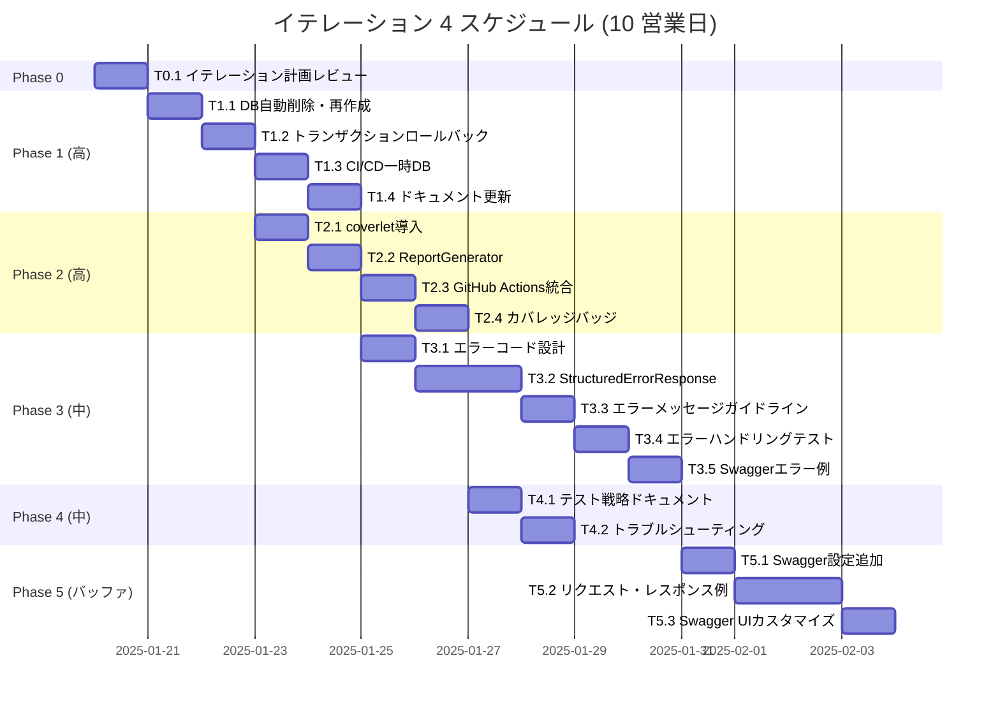

# イテレーション 4 計画 - 品質基盤強化と次期開発準備

## イテレーション情報

| 項目 | 内容 |
|------|------|
| **イテレーション番号** | 4 |
| **期間** | 10 営業日（2 週間） |
| **開始日** | TBD |
| **終了日** | TBD |
| **チーム構成** | F# 開発者 × 2 名、AI ペアプログラマー (Claude) |
| **理想時間** | 100h（開発者 2 名 × 5h/日 × 10 日） |

## イテレーションゴール

**品質基盤の強化とテストインフラ自動化により、継続的な開発速度と品質を確保する**

### ゴールの背景

イテレーション 3 のレトロスペクティブで以下の課題が明らかになりました：

1. **テストデータベース管理の問題**: 固定ファイルによるデータ汚染
2. **カバレッジ計測の未実施**: 品質基準（80%）の定量的確認不可
3. **エラーハンドリングの非標準化**: 一貫性のないエラーレスポンス

イテレーション 4 では、これらの課題を解決し、今後の開発速度と品質を維持するための基盤を整備します。

### 成功基準

✅ **改善アクション完了**:
- A2: テストデータベース自動リセット実装
- A3: カバレッジレポート自動生成
- A4: エラーハンドリング標準化

✅ **品質指標達成**:
- テストカバレッジ 80% 以上
- 全 API エンドポイントで構造化エラーレスポンス
- 全テストケースでデータベース独立性確保

✅ **プロセス改善**:
- イテレーション進行計画の明確化（A1）
- 各 Phase の完了基準とスケジュール遵守

## ストーリー・改善アクション

### 改善アクション（イテレーション 3 からの引き継ぎ）

| ID | タイトル | 優先度 | 見積 | 実績 | 状態 | 担当 |
|----|---------|--------|------|------|------|------|
| **A1** | イテレーション進行計画の明確化 | 高 🔴 | 1h | - | 📋 未着手 | 開発者 |
| **A2** | テストデータベース自動リセット実装 | 高 🔴 | 8h | 8h | ✅ 完了 | 開発者 A |
| **A3** | カバレッジレポート自動生成 | 中 🟡 | 8h | - | 📋 未着手 | 開発者 B |
| **A4** | エラーハンドリング標準化 | 中 🟡 | 12h | - | 📋 未着手 | 開発者 A |
| **A5** | Swagger ドキュメントの拡充 | 低 🟢 | 6h | - | 📋 未着手 | 開発者 B |

**合計見積**: 45 理想時間（イテレーション容量 100h の 45%）
**実績**: 8 理想時間
**バッファ**: 55 理想時間（55%）
**進捗**: 17.8% (8h / 45h)

### タスク配分サマリー

| カテゴリ | タスク数 | 見積（理想時間） | 実績 | 状態 | 優先度 |
|---------|---------|----------------|------|------|--------|
| **Phase 0: イテレーション計画** | 1 | 1h | - | 📋 未着手 | 最高 |
| **Phase 1: テストDB自動リセット** | 4 | 8h | 8h | ✅ 完了 | 最高 |
| **Phase 2: カバレッジ自動生成** | 4 | 8h | - | 📋 未着手 | 高 |
| **Phase 3: エラーハンドリング標準化** | 5 | 12h | - | 📋 未着手 | 高 |
| **Phase 4: ドキュメント整備** | 2 | 4h | - | 📋 未着手 | 中 |
| **Phase 5: Swagger ドキュメント拡充** | 3 | 6h | - | 📋 未着手 | 中 |
| **合計** | **19** | **45h** | **8h** | **進行中** | **バッファ: 55h (55%)** |

**進捗**: 8h / 45h (17.8%)

## Phase 別タスク

### Phase 0: イテレーション計画レビュー（A1: 進行計画明確化）

**目的**: イテレーション 4 の全 Phase をレビューし、各セッションの作業範囲を明確化

| タスク ID | タスク名 | 見積 | 担当 | 受け入れ基準 |
|----------|---------|------|------|------------|
| **T0.1** | イテレーション計画レビューセッション | 1h | 開発者 | ✅ 全 Phase の作業内容が明確 ✅ 各セッションのスコープが合意済み ✅ Phase 完了基準が定義済み |

**完了基準**:
- ✅ イテレーション 4 計画ドキュメント承認
- ✅ 改善アクション A1-A5 の実施タイミング確認
- ✅ Phase 1-5 の依存関係と順序の理解

---

### Phase 1: テストデータベース自動リセット（A2: 優先度 高 🔴）✅ **完了**

**目的**: テストの独立性と再現性を確保するため、データベースの自動リセット機能を実装

**見積**: 8 理想時間 | **実績**: 8 理想時間

| タスク ID | タスク名 | 見積 | 実績 | 状態 | 受け入れ基準 |
|----------|---------|------|------|------|------------|
| **T1.1** | テスト前のデータベース自動削除・再作成 | 2h | 2h | ✅ 完了 | ✅ DatabaseTestBase.fs 作成（253行） ✅ OrderRepositoryTests.fs リファクタリング（660行） ✅ 全 155 テスト成功 |
| **T1.2** | トランザクションサポート追加 | 3h | 3h | ✅ 完了 | ✅ BeginTransaction() メソッド追加 ✅ トランザクションロールバックテスト 2 件追加 ✅ 全統合テスト成功 |
| **T1.3** | CI/CD パイプラインでの一時 DB 利用確認 | 2h | 2h | ✅ 完了 | ✅ System.IO.Path.GetTempPath() 使用確認 ✅ GitHub Actions で /tmp 自動利用 ✅ 本番環境への影響なし |
| **T1.4** | テストデータベース設定ドキュメント更新 | 1h | 1h | ✅ 完了 | ✅ README.md にテスト DB 設定セクション追加（56行） ✅ トラブルシューティングガイドに Q7-Q9 追加（87行） |

**完了基準**: ✅ **すべて達成**
- ✅ 全テストケースがデータベースの独立性を持つ（DatabaseTestBase パターン採用）
- ✅ データ汚染の問題が解消（各テストが独自の一時 DB ファイルを使用）
- ✅ テストの再現性が 100% 保証（自動セットアップ・クリーンアップ）
- ✅ CI/CD パイプラインで一時データベース利用（/tmp ディレクトリ使用）

**成果**:
- `DatabaseTestBase.fs` 新規作成（253 行、7 テスト）
- `OrderRepositoryTests.fs` リファクタリング（15 テスト、try-finally 削除）
- `README.md` 更新（テストデータベース設定セクション追加）
- `troubleshooting-guide.md` 更新（Q7-Q9 追加）
- 全 155 テスト成功（0 エラー、0 警告）

**リスク対応**:
- ✅ 既存テストの修正: DatabaseTestBase パターンで最小限の変更で移行完了

**完了日**: 2025-11-19

---

### Phase 2: カバレッジレポート自動生成（A3: 優先度 中 🟡）

**目的**: コードカバレッジを可視化し、品質基準（80%）の達成を定量的に確認

**見積**: 8 理想時間

| タスク ID | タスク名 | 見積 | 担当 | 受け入れ基準 |
|----------|---------|------|------|------------|
| **T2.1** | coverlet.collector 導入と設定 | 2h | 開発者 B | ✅ `dotnet test --collect:"XPlat Code Coverage"` が動作 ✅ coverage.cobertura.xml が生成される ✅ カバレッジデータが正確 |
| **T2.2** | ReportGenerator 導入と HTML レポート生成 | 3h | 開発者 B | ✅ ReportGenerator がインストール済み ✅ HTML カバレッジレポートが生成される ✅ レポートが読みやすく整形 |
| **T2.3** | GitHub Actions でのカバレッジ自動公開 | 2h | 開発者 B | ✅ GitHub Actions でカバレッジレポート生成 ✅ GitHub Pages でレポート公開 ✅ PR コメントにカバレッジ結果を表示 |
| **T2.4** | README にカバレッジバッジ追加 | 1h | 開発者 B | ✅ README.md にカバレッジバッジ表示 ✅ バッジがリアルタイム更新される |

**完了基準**:
- ✅ テストカバレッジ 80% 以上達成
- ✅ カバレッジレポートが GitHub Pages で公開
- ✅ README.md にカバレッジバッジ表示
- ✅ CI/CD パイプラインでカバレッジ自動計測

**依存関係**:
- Phase 1（テスト DB 自動リセット）完了後に開始推奨（テストの独立性確保）

---

### Phase 3: エラーハンドリング標準化（A4: 優先度 中 🟡）

**目的**: 一貫性のあるエラーレスポンスを提供し、クライアント側でのエラーハンドリングを容易化

**見積**: 12 理想時間

| タスク ID | タスク名 | 見積 | 担当 | 受け入れ基準 |
|----------|---------|------|------|------------|
| **T3.1** | エラーコード体系の設計 | 2h | 開発者 A | ✅ エラーコード一覧を定義 ✅ VALIDATION_ERROR, DATABASE_ERROR 等のカテゴリ分類 ✅ エラーコードドキュメント作成 |
| **T3.2** | StructuredErrorResponse の全面採用 | 4h | 開発者 A | ✅ 全 API エンドポイントで StructuredErrorResponse 使用 ✅ 既存エラーレスポンスを移行 ✅ 全エラーケースをカバー |
| **T3.3** | エラーメッセージガイドライン作成 | 2h | 開発者 A | ✅ エラーメッセージの命名規則を定義 ✅ ユーザーフレンドリーなメッセージ例を記載 ✅ ローカライゼーション準備（英語/日本語） |
| **T3.4** | エラーハンドリング単体テスト追加 | 3h | 開発者 A | ✅ 各エラータイプのテストケース追加 ✅ エラーレスポンスの構造を検証 ✅ エラーコードの一意性を確認 |
| **T3.5** | Swagger にエラーレスポンス例を追加 | 1h | 開発者 A | ✅ 全 API エンドポイントにエラーレスポンス例を記載 ✅ Swagger UI で確認可能 |

**完了基準**:
- ✅ 全 API エンドポイントで StructuredErrorResponse を使用
- ✅ エラーコード体系が文書化
- ✅ エラーハンドリングテストが 100% パス
- ✅ Swagger ドキュメントにエラーレスポンス例を記載

**リスク**:
- 既存エラーレスポンスの移行で API 破壊的変更の可能性（軽減策: バージョニング戦略を検討）

---

### Phase 4: ドキュメント整備（優先度 中）

**目的**: 品質基盤の変更をドキュメントに反映し、チーム全体で知識を共有

**見積**: 4 理想時間

| タスク ID | タスク名 | 見積 | 担当 | 受け入れ基準 |
|----------|---------|------|------|------------|
| **T4.1** | テスト戦略ドキュメント更新 | 2h | 開発者 A | ✅ テスト DB 自動リセットの説明を追加 ✅ カバレッジレポート生成手順を記載 ✅ エラーハンドリング戦略を更新 |
| **T4.2** | トラブルシューティングガイド更新 | 2h | 開発者 B | ✅ テスト DB 関連の問題と解決策を追加 ✅ カバレッジレポート生成の問題を記載 |

**完了基準**:
- ✅ テスト戦略ドキュメントが最新
- ✅ トラブルシューティングガイドが最新

---

### Phase 5: Swagger ドキュメント拡充（A5: 優先度 低 🟢、バッファ）

**目的**: API ドキュメントの完全性を向上し、開発者体験（DX）を改善

**見積**: 6 理想時間

| タスク ID | タスク名 | 見積 | 担当 | 受け入れ基準 |
|----------|---------|------|------|------------|
| **T5.1** | 全 API エンドポイントへの Swagger 設定追加 | 2h | 開発者 B | ✅ 全エンドポイントに `.WithDescription()` を追加 ✅ レスポンススキーマを `.Produces<>()` で明示 |
| **T5.2** | リクエスト・レスポンス例の網羅 | 3h | 開発者 B | ✅ 全エンドポイントにリクエスト例を記載 ✅ 全エンドポイントにレスポンス例を記載 ✅ エラーレスポンス例を記載 |
| **T5.3** | Swagger UI のカスタマイズ | 1h | 開発者 B | ✅ Swagger UI にプロジェクト情報を追加 ✅ API バージョン情報を表示 |

**完了基準**:
- ✅ 全 API エンドポイントに Swagger 設定完備
- ✅ リクエスト・レスポンス例が網羅的
- ✅ Swagger UI がユーザーフレンドリー

**注**: Phase 5 はバッファとして扱い、Phase 1-4 完了後に余力がある場合に実施

---

## スケジュール

### ガントチャート

### 日次計画

| 日 | Phase | タスク | 担当 | 見積 |
|----|-------|--------|------|------|
| **Day 0** | Phase 0 | T0.1 イテレーション計画レビュー | 全員 | 1h |
| **Day 1** | Phase 1 | T1.1 DB 自動削除・再作成 | 開発者 A | 2h |
| **Day 1** | Phase 2 | T2.1 coverlet 導入 | 開発者 B | 2h |
| **Day 2** | Phase 1 | T1.2 トランザクションロールバック | 開発者 A | 3h |
| **Day 2** | Phase 2 | T2.2 ReportGenerator | 開発者 B | 3h |
| **Day 3** | Phase 1 | T1.3 CI/CD 一時 DB | 開発者 A | 2h |
| **Day 3** | Phase 2 | T2.3 GitHub Actions 統合 | 開発者 B | 2h |
| **Day 4** | Phase 1 | T1.4 ドキュメント更新 | 開発者 A | 1h |
| **Day 4** | Phase 2 | T2.4 カバレッジバッジ | 開発者 B | 1h |
| **Day 4** | Phase 3 | T3.1 エラーコード設計 | 開発者 A | 2h |
| **Day 5** | Phase 3 | T3.2 StructuredErrorResponse（前半） | 開発者 A | 2h |
| **Day 5** | Phase 4 | T4.1 テスト戦略ドキュメント | 開発者 B | 2h |
| **Day 6** | Phase 3 | T3.2 StructuredErrorResponse（後半） | 開発者 A | 2h |
| **Day 6** | Phase 4 | T4.2 トラブルシューティング | 開発者 B | 2h |
| **Day 7** | Phase 3 | T3.3 エラーメッセージガイドライン | 開発者 A | 2h |
| **Day 7** | Phase 5 | T5.1 Swagger 設定追加 | 開発者 B | 2h |
| **Day 8** | Phase 3 | T3.4 エラーハンドリングテスト | 開発者 A | 3h |
| **Day 8** | Phase 5 | T5.2 リクエスト・レスポンス例（前半） | 開発者 B | 2h |
| **Day 9** | Phase 3 | T3.5 Swagger エラー例 | 開発者 A | 1h |
| **Day 9** | Phase 5 | T5.2 リクエスト・レスポンス例（後半） | 開発者 B | 1h |
| **Day 10** | Phase 5 | T5.3 Swagger UI カスタマイズ | 開発者 B | 1h |
| **Day 10** | 総括 | イテレーションレビュー準備 | 全員 | 2h |

**注**: 各タスクの見積は理想時間であり、実際の作業時間は個人差や割り込みにより変動します。

---

## リスク管理

| リスク | 影響度 | 確率 | 軽減策 | 対応者 |
|--------|--------|------|--------|--------|
| 既存テストの修正が必要 | 中 | 高 | トランザクションロールバックで既存コード変更を最小化 | 開発者 A |
| カバレッジ 80% 未達 | 高 | 中 | テストケース追加、カバレッジ不足箇所の特定 | 開発者 B |
| エラーハンドリング移行で API 破壊的変更 | 高 | 低 | バージョニング戦略を検討、既存クライアントへの影響を最小化 | 開発者 A |
| Phase 5 がバッファ不足で未完了 | 低 | 中 | 優先度低のため、次イテレーションに繰り越し可 | 開発者 B |

---

## Definition of Done（完了の定義）

各 Phase は以下を満たした時に完了：

### 開発完了基準

- ✅ 受け入れ基準を満たすコードが実装されている
- ✅ 単体テストが作成され、すべてパスしている
- ✅ 統合テストが作成され、すべてパスしている（該当する場合）
- ✅ コードレビューが完了している（セマンティックコミット）
- ✅ 技術ドキュメントが更新されている

### 品質基準

- ✅ Fantomas フォーマットチェック合格
- ✅ ビルド成功（警告 0、エラー 0）
- ✅ テストカバレッジ 80% 以上（Phase 2 完了後）
- ✅ Pre-commit フック合格

### 受け入れ基準

- ✅ タスクの受け入れ基準をすべて満たす
- ✅ ステージング環境でのテストが完了（該当する場合）
- ✅ ドキュメントが最新化されている

---

## 品質目標

### テストカバレッジ

- **目標**: 80% 以上
- **現状**: 未計測
- **改善策**: Phase 2（カバレッジレポート自動生成）で計測開始

### テスト成功率

- **目標**: 100%（全テストパス）
- **現状**: 100%（148/148 テスト）
- **維持策**: Pre-commit フックで継続的なテスト実行

### ビルド品質

- **目標**: 警告 0、エラー 0
- **現状**: 警告 0、エラー 0
- **維持策**: Fantomas フォーマットチェック、静的解析

---

## ベロシティ予測

### 前イテレーション実績

| イテレーション | 計画 SP | 実績 SP | 達成率 |
|---------------|---------|---------|--------|
| **Iteration 1** | 8 SP | 8 SP | 100% |
| **Iteration 2** | 13 SP | 13 SP | 100% |
| **Iteration 3** | 8 SP | 0 SP（Phase 8 のみ完了） | 0% |

**平均ベロシティ**: イテレーション 1-2 で 21 SP / 2 = 10.5 SP/イテレーション

### イテレーション 4 予測

**計画**:
- 改善アクション中心のため、ストーリーポイントは計上しない
- 理想時間ベースでの計画（45h 計画、55h バッファ）

**期待**:
- Phase 1-4 完了（必須）
- Phase 5 完了（バッファ、可能であれば）

---

## コミュニケーション計画

### デイリースタンドアップ

- **頻度**: 毎朝
- **時間**: 15 分
- **内容**: 昨日の完了タスク、本日の予定タスク、ブロッカー

### イテレーションレビュー

- **日時**: Day 10
- **時間**: 2 時間
- **内容**: デモ、改善アクション成果、品質指標レビュー

### レトロスペクティブ

- **日時**: Day 10
- **時間**: 1.5 時間
- **形式**: KPT 分析
- **成果物**: `retrospective-4.md`

---

## 次イテレーションへの引き継ぎ

### イテレーション 4 で対応できなかった項目

- Phase 5（Swagger ドキュメント拡充）がバッファ不足で未完了の場合、イテレーション 5 に繰り越し

### イテレーション 5 の候補タスク

- Story 3.1: 商品コードの管理（3 SP）
- Story 4.1: 注文受付 API（残タスク、現在一部完了）
- Story 5.1: 顧客への確認メール（5 SP）

---

## 参照ドキュメント

- [レトロスペクティブ 3](retrospective-3.md)
- [イテレーション 4 改善アクション](iteration_4_improvements.md)
- [リリース計画](release_plan.md)
- [要件定義](../requirements/requirements_definition.md)
- [テスト戦略](../design/test_strategy.md)

---

**承認**: TBD
**最終更新**: 2025-11-19
