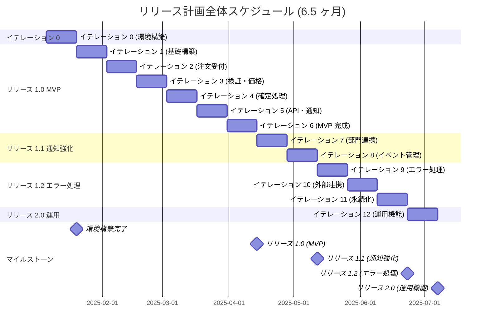

# リリース計画 - 注文受付システム (OrderTaking)

## 計画サマリー

| 項目 | 内容 |
|------|------|
| **プロジェクト名** | 注文受付システム (OrderTaking) |
| **計画作成日** | 2025-11-08 |
| **計画期間** | 6.5 ヶ月 (26 週間) |
| **総ストーリーポイント** | 87 SP |
| **リリース数** | 4 リリース |
| **イテレーション数** | 13 イテレーション (環境構築 1 + 開発 12) |

## 1. 満足条件

### スコープ

**必須機能 (Must Have)**:
- 注文受付と検証機能
- 価格計算と注文確定
- 商品コード管理
- 顧客への確認メール送信

**推奨機能 (Should Have)**:
- 配送部門への通知
- 経理部門への請求通知
- イベントストアの管理

**任意機能 (Could Have)**:
- エラーハンドリングの強化
- 外部サービス連携の高度化
- 注文ステータス照会 API

### スケジュール

| マイルストーン | 目標日 | 期間 |
|---------------|--------|------|
| **イテレーション 0 (環境構築)** | 2025-01-19 | 2 週間 |
| **リリース 1.0 (MVP)** | 2025-03-15 | 12 週間 |
| **リリース 1.1 (通知強化)** | 2025-04-26 | 4 週間 |
| **リリース 1.2 (エラー処理)** | 2025-06-07 | 6 週間 |
| **リリース 2.0 (運用機能)** | 2025-07-05 | 2 週間 |

### リソース

**チーム構成** (想定):
- F# 開発者: 2 名
- テストエンジニア: 1 名
- プロダクトオーナー: 1 名 (兼任)

**作業可能時間**:
- 1 イテレーション: 2 週間
- 1 週間あたり: 5 営業日
- 1 日あたりの理想時間: 5 時間 (会議・割り込みを除く)
- チーム全体の理想時間: 2 名 × 5 時間 × 10 日 = 100 理想時間 / イテレーション

## 2. ベロシティ見積もり

### 基準ストーリー分析

**Story 1.3: 価格の自動計算** (5 SP) を基準ストーリーとして選定

タスク分解:
1. 価格計算ロジックの設計: 4 時間
2. 価格計算関数の実装: 8 時間
3. 単体テストの作成: 4 時間
4. 統合テストの作成: 4 時間
5. ドキュメント作成: 2 時間

合計: 22 理想時間

**ストーリーポイント換算率**: 1 SP = 約 4-5 理想時間

### 初期ベロシティ見積もり

**計算方法**: チーム全体の理想時間 ÷ SP あたりの理想時間

- チーム理想時間: 100 時間 / イテレーション
- SP あたり時間: 4.5 時間
- **初期ベロシティ**: 100 ÷ 4.5 = **約 22 SP / イテレーション**

**保守的見積もり (80% 係数適用)**:
- **計画ベロシティ**: 22 × 0.8 = **約 18 SP / イテレーション**

### ベロシティの仮定

- 新規チームのため、最初の 2-3 イテレーションで実績ベロシティを測定
- イテレーション 4 以降で見直し・調整
- 技術的負債の蓄積を避けるため、品質を維持したベロシティ

## 3. 優先順位マトリックス

### 評価軸

各ストーリーを 4 つの軸で評価 (1-5 点):

1. **金銭価値**: ビジネス価値、収益への影響
2. **コスト**: 開発・運用コスト
3. **知識習得**: 新技術・ドメイン知識の獲得
4. **リスク軽減**: 技術的・ビジネス的リスクの低減

### ストーリー優先順位評価

| Story ID | 金銭価値 | コスト | 知識習得 | リスク軽減 | 優先度スコア | ランク |
|----------|---------|--------|---------|-----------|-------------|--------|
| **1.1** | 5 | 3 | 4 | 5 | 17 | 🥇 1 |
| **1.2** | 5 | 4 | 5 | 5 | 19 | 🥇 2 |
| **1.3** | 5 | 2 | 3 | 4 | 14 | 🥇 3 |
| **1.4** | 5 | 3 | 3 | 4 | 15 | 🥇 4 |
| **3.1** | 4 | 1 | 3 | 4 | 12 | 🥇 5 |
| **4.1** | 4 | 2 | 3 | 3 | 12 | 🥇 6 |
| **5.1** | 4 | 2 | 2 | 3 | 11 | 🥈 7 |
| **5.2** | 3 | 2 | 2 | 2 | 9 | 🥈 8 |
| **5.3** | 3 | 1 | 1 | 2 | 7 | 🥈 9 |
| **3.3** | 3 | 3 | 3 | 3 | 12 | 🥈 10 |
| **2.1** | 2 | 2 | 2 | 3 | 9 | 🥉 11 |
| **2.2** | 2 | 1 | 2 | 2 | 7 | 🥉 12 |
| **2.3** | 2 | 3 | 3 | 4 | 12 | 🥉 13 |
| **3.2** | 3 | 2 | 2 | 2 | 9 | 🥉 14 |
| **4.2** | 2 | 1 | 1 | 1 | 5 | ⬜ 15 |

**優先度スコアの計算**: 金銭価値 + (5 - コスト) + 知識習得 + リスク軽減

## 4. 段階的リリース戦略

### リリース 1.0 - MVP (Minimum Viable Product)

**目標**: 基本的な注文処理機能を提供し、顧客価値を最速で実現

**期間**: 12 週間 (6 イテレーション)
**ストーリーポイント**: 47 SP
**完了基準**:
- 注文の受付・検証・価格計算・確定が動作
- 顧客に確認メールが送信される
- REST API で注文を受け付けられる

**含まれるストーリー**:

| Story | タイトル | SP | イテレーション | 状態 |
|-------|---------|-----|---------------|------|
| 1.1 | 基本的な注文受付 | 8 | 1-2 | ✅ 完了 |
| 1.2 | 注文内容の検証 | 13 | 1-2 | ✅ 完了 |
| 1.3 | 価格の自動計算 | 5 | 2 | ✅ 完了 |
| 1.4 | 注文の確定処理 | 8 | 3 | ✅ 完了 |
| 3.1 | 商品コードの管理 | 3 | 4 | 📋 計画中 |
| 4.1 | 注文受付 API | 5 | 5 | 🔄 進行中（一部完了）|
| 5.1 | 顧客への確認メール | 5 | 5-6 | 📋 計画中 |

**リリース判定基準**:
- ✅ 全ストーリーの受け入れテスト完了
- ✅ テストカバレッジ 80% 以上
- ✅ 本番環境でのスモークテスト成功
- ✅ プロダクトオーナーの承認

### リリース 1.1 - 通知機能強化

**目標**: 部門間連携を強化し、業務フロー全体を改善

**期間**: 4 週間 (2 イテレーション)
**ストーリーポイント**: 16 SP
**完了基準**:
- 配送部門と経理部門への通知が自動化
- イベントストアでイベント履歴を管理

**含まれるストーリー**:

| Story | タイトル | SP | イテレーション |
|-------|---------|-----|---------------|
| 5.2 | 配送部門への通知 | 5 | 7 |
| 5.3 | 経理部門への通知 | 3 | 7 |
| 3.3 | イベントストアの管理 | 8 | 8 |

### リリース 1.2 - エラーハンドリング強化

**目標**: システムの安定性と信頼性を向上

**期間**: 6 週間 (3 イテレーション)
**ストーリーポイント**: 21 SP
**完了基準**:
- 各種エラーが適切に処理される
- エラーログが構造化される
- 外部サービス障害時の復旧ロジックが動作

**含まれるストーリー**:

| Story | タイトル | SP | イテレーション |
|-------|---------|-----|---------------|
| 2.1 | 検証エラーの処理 | 5 | 9 |
| 2.2 | 価格計算エラーの処理 | 3 | 9 |
| 2.3 | 外部サービスエラーの処理 | 8 | 10 |
| 3.2 | 注文データの永続化 | 5 | 10-11 |

### リリース 2.0 - 運用機能

**目標**: 運用性と監視機能を追加

**期間**: 2 週間 (1 イテレーション)
**ストーリーポイント**: 3 SP
**完了基準**:
- 注文ステータス照会 API が動作
- 運用ドキュメントが整備

**含まれるストーリー**:

| Story | タイトル | SP | イテレーション |
|-------|---------|-----|---------------|
| 4.2 | 注文ステータス照会 API | 3 | 12 |

## 5. バッファ戦略

### フィーチャバッファ (30%)

優先度の低いストーリーをバッファとして確保：

**バッファストーリー** (スケジュール遅延時に削除候補):
- Story 2.1: 検証エラーの処理 (5 SP)
- Story 2.2: 価格計算エラーの処理 (3 SP)
- Story 3.2: 注文データの永続化 (5 SP)
- Story 4.2: 注文ステータス照会 API (3 SP)

**合計バッファ**: 16 SP (全体の 18%)

### スケジュールバッファ

**計算方法**: 各ストーリーの 50% 見積もりと 90% 見積もりの差の平方の合計の平方根

主要ストーリーの見積もり幅:

| Story | 50% 見積 | 90% 見積 | 差 | 差の平方 |
|-------|---------|---------|-----|---------|
| 1.1 | 6 SP | 10 SP | 4 | 16 |
| 1.2 | 10 SP | 16 SP | 6 | 36 |
| 1.4 | 6 SP | 10 SP | 4 | 16 |
| 2.3 | 6 SP | 10 SP | 4 | 16 |
| 3.3 | 6 SP | 10 SP | 4 | 16 |

**スケジュールバッファ**: √(16+36+16+16+16) = √100 = **10 SP**

**バッファ期間**: 10 SP ÷ 18 SP/イテレーション = **約 0.5 イテレーション (1 週間)**

## 6. イテレーション別計画概要

### 全体スケジュール

### イテレーション別ストーリー割り当て

| イテレーション | ストーリー | SP | 累計 SP | 残 SP | 実績 |
|---------------|----------|-----|---------|-------|------|
| **Iter 0** | 環境構築 (E-1 ~ E-8) | - | 0 | 87 | ✅ 完了 |
| **Iter 1** | 1.1 (一部) | 8 | 8 | 79 | ✅ 完了 |
| **Iter 2** | 1.1 (完了), 1.2 (一部) | 13 | 21 | 66 | ✅ 完了 |
| **Iter 3** | 1.4 (完了) | 8 | 29 | 58 | ✅ 完了 (Phase 4, 5, 6, 8) |
| **Iter 4** | 改善アクション (A1-A5) | - | 累計 29 SP | 残 58 SP | 📋 計画中（品質基盤強化） |
| **Iter 5** | 4.1, 5.1 (一部) | 8 | 50 | 37 | 📋 計画中 |
| **Iter 6** | 5.1 (完了) | 2 | 52 | 35 | 📋 計画中 |
| **Iter 7** | 5.2, 5.3 | 8 | 60 | 27 | 📋 計画中 |
| **Iter 8** | 3.3 | 8 | 68 | 19 | 📋 計画中 |
| **Iter 9** | 2.1, 2.2 | 8 | 76 | 11 | 📋 計画中 |
| **Iter 10** | 2.3 | 8 | 84 | 3 | 📋 計画中 |
| **Iter 11** | 3.2 (一部) | 3 | 87 | 0 | 📋 計画中 |
| **Iter 12** | 4.2, バッファ | 3 | 87 | 0 | 📋 計画中 |

**注**:
- イテレーション 0 は環境構築専用で、ストーリーポイントは含まれません。詳細は [イテレーション 0 計画](iteration_plan-0.md) を参照してください。
- **イテレーション 3** は Phase 4, 5, 6, 8 完了。Dapper + FluentMigrator 基盤構築と Story 1.4（注文の確定処理）を実装完了。全 148 テスト成功。詳細は [イテレーション 3 計画](iteration_plan-3.md) および [レトロスペクティブ 3](retrospective-3.md) を参照してください。
- **イテレーション 4** は品質基盤強化に焦点を当て、改善アクション A1-A5 を実施します。ストーリーポイントは計上せず、理想時間ベース（45h）で計画。詳細は [イテレーション 4 計画](iteration_plan-4.md) を参照してください。
- **イテレーション 5 以降** は Story 3.1（商品コード管理）から再開予定です。

## 7. リスク管理

### 技術的リスク

| リスク | 影響度 | 確率 | 軽減策 | 対応者 | 状況 |
|--------|--------|------|--------|--------|------|
| F# の学習曲線 | 高 | 高 | スパイクイテレーション、ペアプログラミング | 開発チーム | 継続監視 |
| Entity Framework InMemory の制約 | 中 | 中 | PostgreSQL 移行オプションを設計 | アーキテクト | 継続監視 |
| Heroku の制約 | 中 | 低 | スケーリング戦略を事前検証 | インフラ担当 | 継続監視 |
| 外部サービス連携 | 中 | 中 | モックサービスでの開発、リトライロジック | 開発チーム | 継続監視 |
| **データベースファイル管理** | 中 | 高 | テスト環境の自動リセット、トランザクションロールバック | 開発チーム | **新規（Iter3 教訓）** |
| **テストカバレッジ未計測** | 中 | 中 | カバレッジレポート自動生成の実装 | 開発チーム | **新規（Iter3 教訓）** |

### スケジュールリスク

| リスク | 影響度 | 確率 | 軽減策 | 状況 |
|--------|--------|------|--------|------|
| ベロシティの過大見積もり | 高 | 中 | 保守的見積もり (80%)、バッファ確保 | 継続監視 |
| 要件変更 | 中 | 高 | イテレーション単位での調整、バックログ管理 | 継続監視 |
| チームメンバー不在 | 中 | 低 | ペアプログラミング、ドキュメント整備 | 継続監視 |
| **イテレーション計画の乖離** | 高 | 中 | イテレーション開始時の進行計画確認、各セッションの作業範囲明確化 | **新規（Iter3 教訓）** |

## 8. 品質基準

### Definition of Done (完了の定義)

各ストーリーは以下を満たした時に完了：

✅ **開発完了基準**:
- 受け入れ基準を満たすコードが実装されている
- 単体テストが作成され、すべてパスしている
- 統合テストが作成され、すべてパスしている
- コードレビューが完了している
- 技術ドキュメントが更新されている

✅ **品質基準**:
- 静的解析ツールで品質基準をクリアしている
- テストカバレッジが 80% 以上
- セキュリティチェックをパスしている

✅ **受け入れ基準**:
- プロダクトオーナーによる受け入れテストが完了
- ステージング環境でのテストが完了
- 本番環境でのデプロイ準備が完了

## 9. コミュニケーション計画

### ステークホルダー報告

**頻度**: 各イテレーション終了時

**報告内容**:
- 完了ストーリーと未完了ストーリー
- 実績ベロシティと累計進捗
- リリース目標日の予測 (3 つのシナリオ)
- リスクと課題

**報告形式**:
- イテレーションレビュー (デモ)
- バーンダウンチャート
- パーキングロットチャート

### チーム内コミュニケーション

- **デイリースタンドアップ**: 毎朝 15 分
- **イテレーションプランニング**: 各イテレーション初日 4 時間
- **イテレーションレビュー**: 各イテレーション最終日 2 時間
- **レトロスペクティブ**: 各イテレーション最終日 1.5 時間

## 10. 成功指標

### リリース 1.0 成功基準

**ビジネス指標**:
- 注文処理の自動化率: 90% 以上
- 注文エラー率: 5% 以下
- 顧客満足度: 4.0/5.0 以上

**技術指標**:
- API 応答時間: p95 < 500ms
- システム可用性: 99.5% 以上
- テストカバレッジ: 80% 以上

**プロセス指標**:
- ベロシティ安定性: ±20% 以内
- スプリント完了率: 80% 以上
- バグ密度: 5 bugs/100 SP 以下

## 11. 計画の更新

### 更新タイミング

- 各イテレーション終了時: ベロシティ更新、次イテレーション調整
- 各リリース終了時: リリース全体の振り返り、次リリース計画更新
- 重大な要件変更時: 即座にバックログと計画を見直し

### 更新責任者

- **リリース計画**: プロダクトオーナー + テックリード
- **イテレーション計画**: 開発チーム全員
- **ベロシティ**: スクラムマスター (または開発リーダー)

---

## 付録: 参照ドキュメント

### イテレーション計画とレトロスペクティブ

- [イテレーション 0 計画 (環境構築)](iteration_plan-0.md) / [レトロスペクティブ 0](retrospective-0.md)
- [イテレーション 1 計画](iteration_plan-1.md) / [レトロスペクティブ 1](retrospective-1.md)
- [イテレーション 2 計画](iteration_plan-2.md) / [レトロスペクティブ 2](retrospective-2.md)
- [イテレーション 3 計画](iteration_plan-3.md) / [レトロスペクティブ 3](retrospective-3.md)

### 要件・設計ドキュメント

- [要件定義](../requirements/requirements_definition.md)
- [ユーザーストーリー](../requirements/user_story.md)
- [リリース・イテレーション計画ガイド](../reference/リリース・イテレーション計画ガイド.md)
- [アーキテクチャ設計](../design/architecture.md)
- [インフラ設計](../design/architecture_infrastructure.md)
- [技術スタック](../design/tech_stack.md)
- [テスト戦略](../design/test_strategy.md)
