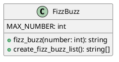
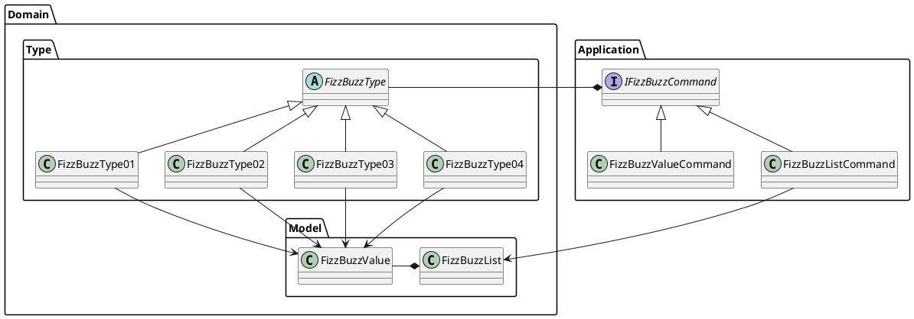

# エピソード3

## 初めに

この記事は [テスト駆動開発から始めるF#入門 ~2時間でTDDとリファクタリングのエッセンスを体験する~](/ja/記事/テスト駆動開発から始めるFSharp入門1) の続編です。

前提として エピソード1を完了して、[テスト駆動開発から始めるF#入門 ~ソフトウェア開発の三種の神器を準備する~](/ja/記事/テスト駆動開発から始めるFSharp入門2) で開発環境を構築したところから始まります。

### 概要

本記事では、**オブジェクト指向プログラム** から **オブジェクト指向設計** そして **モジュール分割** を **テスト駆動開発** を通じて実践していきます。

#### オブジェクト指向プログラム

エピソード1で作成したプログラムの追加仕様を **テスト駆動開発** で実装します。次に **手続き型コード** との比較から **オブジェクト指向プログラム** を構成する **カプセル化** **ポリモーフィズム** **継承** という概念をコードベースの **リファクタリング** を通じて解説します。

具体的には **フィールドのカプセル化** から **setterの削除** を適用することにより **カプセル化** を実現します。続いて、**ポリモーフィズムによる条件記述の置き換え** から **State/Strategyによるタイプコードの置き換え** を適用することにより **ポリモーフィズム** の効果を体験します。そして、**スーパークラスの抽出** から **メソッド名の変更** **メソッドの移動** の適用を通して **継承** の使い方を体験します。さらに **値オブジェクト** と **ファーストクラスコレクション** というオブジェクト指向プログラミングに必要なツールの使い方も学習します。

#### オブジェクト指向設計

次に設計の観点から **単一責任の原則** に違反している `FizzBuzz` クラスを **デザインパターン** の1つである **Commandパターン** を使ったリファクタリングである **メソッドオブジェクトによるメソッドの置き換え** を適用してクラスの責務を分割します。オブジェクト指向設計のイディオムである **デザインパターン** として **Commandパターン** 以外に **Value Objectパターン** **Factory Methodパターン** **Strategyパターン** を **リファクタリング** を適用する過程ですでに実現していたことを説明します。そして、**オープン・クローズドの原則** を満たすコードに **リファクタリング** されたことで既存のコードを変更することなく振る舞いを変更できるようになることを解説します。

加えて、正常系の設計を改善した後 **アサーションの導入** **例外によるエラーコードの置き換え** といった例外系の **リファクタリング** を適用します。最後に **ポリモーフィズム** の応用として **特殊ケースの導入** の適用による **Null Objectパターン** を使った **オープン・クローズドの原則** に従った安全なコードの追加方法を解説します。

#### モジュールの分割

仕上げは、**モノリシック** なファイルから個別のクラスモジュールへの分割を **ドメインオブジェクト** の抽出を通して **ドメインモデル** へと整理することにより **モジュール分割** を実現することを体験してもらいます。最後に **良いコード** と **良い設計** について考えます。

##### Before



##### After



## オブジェクト指向から始めるテスト駆動開発

### テスト駆動開発

エピソード1で作成したプログラムに以下の仕様を追加します。

仕様

    1 から 100 までの数をプリントするプログラムを書け。
    ただし 3 の倍数のときは数の代わりに｢Fizz｣と、5 の倍数のときは｢Buzz｣とプリントし、
    3 と 5 両方の倍数の場合には｢FizzBuzz｣とプリントすること。

#### TODOリスト作成

実装する前に **TODOリスト** を作成します。

TODO

- ~~1を渡したら文字列"1"を返す~~
- ~~3を渡したら文字列"Fizz"を返す~~  
- ~~5を渡したら文字列"Buzz"を返す~~
- ~~15を渡したら文字列"FizzBuzz"を返す~~
- ~~1から100までの数を返す~~
- ~~1から100までのFizzBuzzの配列を返す~~
- **タイプ1（3でも5でも割り切れない数値）を返す**
- **タイプ2（3で割り切れる数値）を返す** 
- **タイプ3（5で割り切れる数値）を返す**
- **タイプその他（15で割り切れる数値）を返す**

追加で実装するのは、**タイプ1の場合** から **タイプその他の場合** の4つです。それではTDDサイクルを開始しましょう。

### タイプ1の場合

3でも5でも割り切れない数値のテストを追加します。

**tests/FizzBuzz.Tests.fs**

```fsharp
[<Fact>]
let ``タイプ1の場合_3でも5でも割り切れない数値を返す`` () =
    fizz_buzz (1) |> should equal "1"
    fizz_buzz (2) |> should equal "2"
    fizz_buzz (4) |> should equal "4"
```

テストを実行します。

```bash
dotnet test
```

```
テスト実行の概要
  合計: 7、成功: 7、失敗: 0、スキップ: 0
```

タイプ1のテストケースはすでに実装済みだったのでテストが通りました。

### タイプ2の場合

3で割り切れる数値のテストを追加します。

**tests/FizzBuzz.Tests.fs**

```fsharp
[<Fact>]
let ``タイプ2の場合_3で割り切れる数値を返す`` () =
    fizz_buzz (3) |> should equal "Fizz"
    fizz_buzz (6) |> should equal "Fizz" 
    fizz_buzz (9) |> should equal "Fizz"
```

テストを実行します。

```bash
dotnet test
```

```
テスト実行の概要
  合計: 8、成功: 8、失敗: 0、スキップ: 0
```

タイプ2のテストケースもすでに実装済みだったのでテストが通りました。

### タイプ3の場合

5で割り切れる数値のテストを追加します。

**tests/FizzBuzz.Tests.fs**

```fsharp
[<Fact>]
let ``タイプ3の場合_5で割り切れる数値を返す`` () =
    fizz_buzz (5) |> should equal "Buzz"
    fizz_buzz (10) |> should equal "Buzz"
    fizz_buzz (20) |> should equal "Buzz"
```

テストを実行します。

```bash
dotnet test
```

```
テスト実行の概要
  合計: 9、成功: 9、失敗: 0、スキップ: 0
```

### タイプその他の場合

15で割り切れる数値のテストを追加します。

**tests/FizzBuzz.Tests.fs**

```fsharp
[<Fact>]
let ``タイプその他の場合_15で割り切れる数値を返す`` () =
    fizz_buzz (15) |> should equal "FizzBuzz"
    fizz_buzz (30) |> should equal "FizzBuzz"
    fizz_buzz (45) |> should equal "FizzBuzz"
```

テストを実行します。

```bash
dotnet test
```

```
テスト実行の概要
  合計: 10、成功: 10、失敗: 0、スキップ: 0
```

### オブジェクト指向

次に追加した4つのテストケースを元に、オブジェクト指向プログラミングの実装に移ります。

#### 手続き型プログラム

現在のFizzBuzzプログラムは**手続き型プログラム**です。

**src/FizzBuzz.fs**

```fsharp
let fizz_buzz number =
    if number % 15 = 0 then "FizzBuzz"
    elif number % 3 = 0 then "Fizz" 
    elif number % 5 = 0 then "Buzz"
    else string number
```

このプログラムの特徴：

- **データ** と **手続き** が分離されている
- 4つの条件分岐で **手続き** を制御
- コードは**線形**に実行される

#### オブジェクト指向プログラム

これを**オブジェクト指向プログラム**に変換していきます。オブジェクト指向の3つの概念を使用します：

- **カプセル化** - データと手続きを一つのオブジェクトにまとめる
- **ポリモーフィズム** - 同じインターフェースで異なる振る舞いを実現  
- **継承** - 共通の性質を基底クラスで定義し、派生クラスで特化

現在のコードをオブジェクト指向にリファクタリングしていきましょう。

### カプセル化

カプセル化は **データ** と **手続き** を一つのオブジェクトにまとめる概念です。F#でオブジェクト指向プログラミングを行うために、まずは **フィールドのカプセル化** から始めます。

#### フィールドのカプセル化

現在の `fizz_buzz` 関数を `FizzBuzz` クラスに変換します。まずはクラスベースのテストを追加します。

**tests/FizzBuzz.Tests.fs**

```fsharp
[<Fact>]
let ``FizzBuzzクラス_配列を生成する`` () =
    let fizzBuzz = FizzBuzz(10)
    let result = fizzBuzz.List
    result.Length |> should equal 10
    result.[0] |> should equal "1"
    result.[2] |> should equal "Fizz"
    result.[4] |> should equal "Buzz"
```

**Red** - テストを実行すると `FizzBuzz` クラスが存在しないため失敗します。

```bash
dotnet test
```

**Green** - 最小限の実装で `FizzBuzz` クラスを作成します。

**src/FizzBuzz.fs**

```fsharp
type FizzBuzz(max: int) =
    let getValue number =
        if number % 15 = 0 then "FizzBuzz"
        elif number % 3 = 0 then "Fizz" 
        elif number % 5 = 0 then "Buzz"
        else string number
    
    let _list = [|1..max|] |> Array.map getValue
    
    member this.List = _list
```

テストを実行します。

```bash
dotnet test
```

```
テスト実行の概要
  合計: 11、成功: 11、失敗: 0、スキップ: 0
```

**Refactor** - 重複した `fizz_buzz` 関数のロジックをクラス内に統合します。後方互換性のため関数版も残しておきます。

**src/FizzBuzz.fs**

```fsharp
type FizzBuzz(max: int) =
    let getValue number =
        if number % 15 = 0 then "FizzBuzz"
        elif number % 3 = 0 then "Fizz" 
        elif number % 5 = 0 then "Buzz"
        else string number
    
    let _list = [|1..max|] |> Array.map getValue
    
    member this.List = _list

// 後方互換性のための関数版
let fizz_buzz number =
    if number % 15 = 0 then "FizzBuzz"
    elif number % 3 = 0 then "Fizz"
    elif number % 5 = 0 then "Buzz"
    else string number
```

この段階で、データ（配列）と手続き（FizzBuzz変換ロジック）が `FizzBuzz` クラスという一つのオブジェクトにまとめられました。これが **カプセル化** の第一歩です。

#### setterの削除

現在の `FizzBuzz` クラスでは、一度作成された配列は変更できません。F#の設計原則に従い **不変性** を保つことで、より安全なコードにしました。これは **setterの削除** に相当するリファクタリングです。

- `_list` フィールドは読み取り専用
- 外部から状態を変更する手段がない
- オブジェクト作成時に一度だけ初期化される

これにより、**カプセル化** の原則に従った安全なクラス設計が完成しました。

### ポリモーフィズム

ポリモーフィズムは **同じインターフェースで異なる振る舞いを実現** する概念です。現在のif-elif条件分岐を、ポリモーフィズムを使った設計に変換していきます。

#### ポリモーフィズムによる条件記述の置き換え

4つのタイプ（Type01, Type02, Type03, Type04）それぞれに対応するクラスを作成し、条件分岐をなくします。

**Step 1: タイプクラスの作成**

まず、各タイプに対応するクラスを作成します。

**src/FizzBuzz.fs**

```fsharp
let private isDivisibleBy divisor number = number % divisor = 0

type FizzBuzzType01() =
    member this.ToValue(number) = string number
    member this.IsMatch(number) = not (isDivisibleBy 3 number || isDivisibleBy 5 number)

type FizzBuzzType02() =
    member this.ToValue(number) = "Fizz"
    member this.IsMatch(number) = isDivisibleBy 3 number && not (isDivisibleBy 5 number)

type FizzBuzzType03() =
    member this.ToValue(number) = "Buzz"
    member this.IsMatch(number) = isDivisibleBy 5 number && not (isDivisibleBy 3 number)

type FizzBuzzType04() =
    member this.ToValue(number) = "FizzBuzz"
    member this.IsMatch(number) = isDivisibleBy 3 number && isDivisibleBy 5 number
```

**Step 2: fizz_buzz関数の更新**

条件分岐を使わずに、適切なタイプクラスを見つけて値を生成するように変更します。

```fsharp
let fizz_buzz number =
    let allTypes = [
        FizzBuzzType04()  // 15で割り切れる場合を最初にチェック
        FizzBuzzType02()  // 3で割り切れる場合
        FizzBuzzType03()  // 5で割り切れる場合
        FizzBuzzType01()  // その他の場合
    ]
    let typeInstance = allTypes |> List.find (fun t -> t.IsMatch(number))
    typeInstance.ToValue(number)
```

この変更により：

- 条件分岐（if-elif-else）が完全になくなりました
- 各タイプの振る舞いが独立したクラスに分離されました
- 同じ `ToValue` メソッドで異なる結果を得る **ポリモーフィズム** が実現されました

#### State/Strategyによるタイプコードの置き換え

さらに効率化するため、**Singleton パターン** を使用してタイプクラスのインスタンスを一度だけ作成します。

```fsharp
type FizzBuzzType01() =
    static let instance = lazy (FizzBuzzType01())
    static member Instance = instance.Value
    member this.ToValue(number) = string number
    member this.IsMatch(number) = not (isDivisibleBy 3 number || isDivisibleBy 5 number)

type FizzBuzzType02() =
    static let instance = lazy (FizzBuzzType02())
    static member Instance = instance.Value
    member this.ToValue(number) = "Fizz"
    member this.IsMatch(number) = isDivisibleBy 3 number && not (isDivisibleBy 5 number)

type FizzBuzzType03() =
    static let instance = lazy (FizzBuzzType03())
    static member Instance = instance.Value
    member this.ToValue(number) = "Buzz"
    member this.IsMatch(number) = isDivisibleBy 5 number && not (isDivisibleBy 3 number)

type FizzBuzzType04() =
    static let instance = lazy (FizzBuzzType04())
    static member Instance = instance.Value
    member this.ToValue(number) = "FizzBuzz"
    member this.IsMatch(number) = isDivisibleBy 3 number && isDivisibleBy 5 number
```

この **State/Strategy パターン** により、各状態（数値の種類）に応じて適切な戦略（変換方法）を選択する設計になりました。

### 継承

継承は **共通の性質を基底クラスで定義し、派生クラスで特化** する概念です。現在の4つのタイプクラスには共通のメソッド（`ToValue`、`IsMatch`）があります。これらを **抽象基底クラス** で統一しましょう。

#### スーパークラスの抽出

共通のインターフェースを持つ抽象基底クラス `FizzBuzzType` を作成します。

**src/FizzBuzz.fs**

```fsharp
[<AbstractClass>]
type FizzBuzzType() =
    abstract member ToValue: int -> string
    abstract member IsMatch: int -> bool
```

各タイプクラスをこの基底クラスから継承するように変更します。

```fsharp
type FizzBuzzType01() =
    inherit FizzBuzzType()
    static let instance = lazy (FizzBuzzType01())
    static member Instance = instance.Value
    override this.ToValue(number) = string number
    override this.IsMatch(number) = not (isDivisibleBy 3 number || isDivisibleBy 5 number)

type FizzBuzzType02() =
    inherit FizzBuzzType()
    static let instance = lazy (FizzBuzzType02())
    static member Instance = instance.Value
    override this.ToValue(number) = "Fizz"
    override this.IsMatch(number) = isDivisibleBy 3 number && not (isDivisibleBy 5 number)

type FizzBuzzType03() =
    inherit FizzBuzzType()
    static let instance = lazy (FizzBuzzType03())
    static member Instance = instance.Value
    override this.ToValue(number) = "Buzz"
    override this.IsMatch(number) = isDivisibleBy 5 number && not (isDivisibleBy 3 number)

type FizzBuzzType04() =
    inherit FizzBuzzType()
    static let instance = lazy (FizzBuzzType04())
    static member Instance = instance.Value
    override this.ToValue(number) = "FizzBuzz"
    override this.IsMatch(number) = isDivisibleBy 3 number && isDivisibleBy 5 number
```

#### メソッド名の変更

RubyからF#に移植する際、より適切な名前に変更しました：
- `Generate` → `ToValue` （値への変換であることを明確にする）

#### メソッドの移動

`fizz_buzz` 関数とFizzBuzzクラス内で使用される型判定ロジックを統一します。

```fsharp
type FizzBuzz(max: int) =
    let allTypes = [
        FizzBuzzType04.Instance :> FizzBuzzType
        FizzBuzzType02.Instance :> FizzBuzzType
        FizzBuzzType03.Instance :> FizzBuzzType
        FizzBuzzType01.Instance :> FizzBuzzType
    ]
    
    let getType number =
        allTypes |> List.find (fun t -> t.IsMatch(number))
    
    let getValue number =
        let typeInstance = getType number
        typeInstance.ToValue(number)
    
    let _list = [|1..max|] |> Array.map getValue
    
    member this.List = _list

// 後方互換性のための関数版も同様の構造で更新
let fizz_buzz number =
    let allTypes = [
        FizzBuzzType04.Instance :> FizzBuzzType
        FizzBuzzType02.Instance :> FizzBuzzType
        FizzBuzzType03.Instance :> FizzBuzzType
        FizzBuzzType01.Instance :> FizzBuzzType
    ]
    let typeInstance = allTypes |> List.find (fun t -> t.IsMatch(number))
    typeInstance.ToValue(number)
```

この継承構造により：

- 共通のインターフェースが抽象基底クラスで定義されました
- 各派生クラスが基底クラスのメソッドをオーバーライドして特化しました
- **ポリモーフィズム** がより強固な型システムで保証されました
- コードの重複がなくなり、保守性が向上しました

### 値オブジェクト

値オブジェクトは **プリミティブな値をオブジェクトでラップする** 設計パターンです。現在は文字列をそのまま返していますが、これを `FizzBuzzValue` という値オブジェクトに置き換えます。

#### オブジェクトによるプリミティブの置き換え

**Step 1: FizzBuzzValue 値オブジェクトの作成**

```fsharp
type FizzBuzzValue(value: string) =
    member this.Value = value
    override this.ToString() = value
    override this.Equals(other) =
        match other with
        | :? FizzBuzzValue as other -> this.Value = other.Value
        | _ -> false
    override this.GetHashCode() = value.GetHashCode()
```

この値オブジェクトの特徴：

- **不変性**: 一度作成されたら値は変更できません
- **等価性**: 内部の値が同じなら等価と判定されます
- **カプセル化**: プリミティブ値をオブジェクトでラップします

**Step 2: タイプクラスの戻り値を変更**

抽象基底クラスとすべての派生クラスの戻り値を `string` から `FizzBuzzValue` に変更します。

```fsharp
[<AbstractClass>]
type FizzBuzzType() =
    abstract member ToValue: int -> FizzBuzzValue  // string から変更
    abstract member IsMatch: int -> bool

type FizzBuzzType01() =
    inherit FizzBuzzType()
    static let instance = lazy (FizzBuzzType01())
    static member Instance = instance.Value
    override this.ToValue(number) = FizzBuzzValue(string number)  // 値オブジェクトを返す
    override this.IsMatch(number) = not (isDivisibleBy 3 number || isDivisibleBy 5 number)

type FizzBuzzType02() =
    inherit FizzBuzzType()
    static let instance = lazy (FizzBuzzType02())
    static member Instance = instance.Value
    override this.ToValue(number) = FizzBuzzValue("Fizz")  // 値オブジェクトを返す
    override this.IsMatch(number) = isDivisibleBy 3 number && not (isDivisibleBy 5 number)

// Type03, Type04も同様に変更...
```

**Step 3: 後方互換性の確保**

既存のテストと関数が動作するよう、最終的に文字列として値を取得できるようにします。

```fsharp
type FizzBuzz(max: int) =
    let allTypes = [
        FizzBuzzType04.Instance :> FizzBuzzType
        FizzBuzzType02.Instance :> FizzBuzzType
        FizzBuzzType03.Instance :> FizzBuzzType
        FizzBuzzType01.Instance :> FizzBuzzType
    ]
    
    let getType number =
        allTypes |> List.find (fun t -> t.IsMatch(number))
    
    let getValue number =
        let typeInstance = getType number
        typeInstance.ToValue(number)
    
    let _list = [|1..max|] |> Array.map (getValue >> (fun v -> v.Value))  // .Valueで文字列を取得
    
    member this.List = _list

// 関数版も同様に更新
let fizz_buzz number =
    let allTypes = [
        FizzBuzzType04.Instance :> FizzBuzzType
        FizzBuzzType02.Instance :> FizzBuzzType
        FizzBuzzType03.Instance :> FizzBuzzType
        FizzBuzzType01.Instance :> FizzBuzzType
    ]
    let typeInstance = allTypes |> List.find (fun t -> t.IsMatch(number))
    let value = typeInstance.ToValue(number)
    value.Value  // 文字列を返して後方互換性を保つ
```

この **オブジェクトによるプリミティブの置き換え** により：

- プリミティブな文字列が意味のある値オブジェクトになりました
- 型安全性が向上しました
- 将来的な機能拡張（例：フォーマット機能、検証機能）が容易になりました
- 後方互換性も維持されています

## まとめ

本記事では、F#を使ってオブジェクト指向プログラミングの3つの重要な概念を実践しました：

### オブジェクト指向プログラム

1. **カプセル化**: データと手続きを `FizzBuzz` クラスにまとめ、不変性を保つ設計を実現
2. **ポリモーフィズム**: 条件分岐を4つのタイプクラスに置き換え、同じインターフェース（`ToValue`、`IsMatch`）で異なる振る舞いを実現
3. **継承**: 抽象基底クラス `FizzBuzzType` を作成し、共通のインターフェースを定義

### 実現されたデザインパターン

- **Strategy パターン**: 各タイプクラスが異なる戦略（変換ロジック）を提供
- **Singleton パターン**: 各タイプクラスのインスタンスを一度だけ作成
- **Value Object パターン**: `FizzBuzzValue` で文字列をオブジェクトとしてラップ
- **Template Method パターン**: 抽象基底クラスで共通の処理フローを定義

### F# の特徴を活用した設計

- **不変性**: すべてのオブジェクトが作成後変更不可
- **型安全性**: 抽象クラスとオーバーライドによる強い型付け
- **関数型 × オブジェクト指向**: F#の柔軟性を活用したハイブリッド設計
- **後方互換性**: 既存の関数版APIを保持

### 学習したリファクタリング技法

1. フィールドのカプセル化
2. setterの削除
3. ポリモーフィズムによる条件記述の置き換え
4. State/Strategyによるタイプコードの置き換え
5. スーパークラスの抽出
6. メソッド名の変更
7. メソッドの移動
8. オブジェクトによるプリミティブの置き換え

これらの技法により、最初の手続き型プログラムから保守しやすく拡張しやすいオブジェクト指向設計へと段階的に改善することができました。

## 参考図書

- **Clean Code** - Robert C. Martin
- **Refactoring** - Martin Fowler
- **Design Patterns** - GoF
- **Domain-Driven Design** - Eric Evans
- **Expert F# 4.0** - Don Syme, Adam Granicz, Antonio Cisternino
- **Real-World Functional Programming** - Tomas Petricek, Jon Skeet