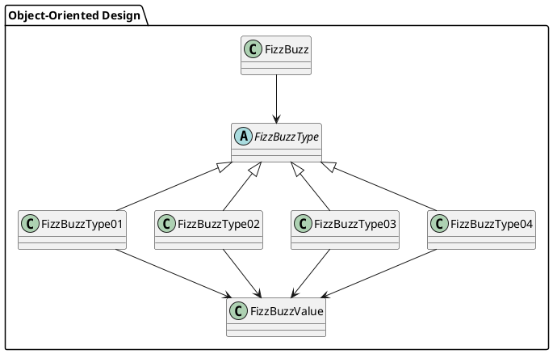
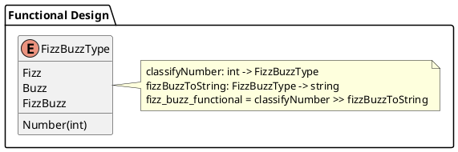

# エピソード4

## 初めに

この記事は [テスト駆動開発から始めるF#入門 ~6時間でオブジェクト指向のエッセンスを体験する~](/ja/記事/テスト駆動開発から始めるFSharp入門3) の続編です。

前提として エピソード3でオブジェクト指向のリファクタリングを完了したFizzBuzzアプリケーションから始まります。

### 概要

本記事では、**オブジェクト指向プログラム** から **関数型プログラミング** への実践的なリファクタリングを体験します。F#は .NET上で動作するマルチパラダイム言語であり、オブジェクト指向と関数型の両方のスタイルをサポートします。

#### 関数型プログラミングの特徴

関数型プログラミングは以下の特徴を持ちます：

- **不変性**: データは作成後に変更されない
- **純粋関数**: 副作用がなく、同じ入力に対して必ず同じ出力を返す
- **高階関数**: 関数を引数として受け取ったり、関数を返す関数
- **関数合成**: 小さな関数を組み合わせて大きな機能を構築

#### リファクタリングの流れ

このエピソードでは以下の段階でリファクタリングを行います：

1. **判別共用体 (Discriminated Union)** の導入
2. **パターンマッチング** による条件分岐の置き換え  
3. **関数合成** とパイプライン演算子の活用
4. **不変データ構造** の最適化
5. **純粋関数** への変換

##### Before (オブジェクト指向版)



##### After (関数型版)



## オブジェクト指向から関数型への移行

### 現在のオブジェクト指向設計の分析

エピソード3で完成したオブジェクト指向設計を振り返ってみましょう：

**src/FizzBuzz.fs (オブジェクト指向版)**

```fsharp
[<AbstractClass>]
type FizzBuzzType() =
    abstract member ToValue: int -> FizzBuzzValue
    abstract member IsMatch: int -> bool

type FizzBuzzType01() =
    inherit FizzBuzzType()
    static let instance = lazy (FizzBuzzType01())
    static member Instance = instance.Value
    override this.ToValue(number) = FizzBuzzValue(string number)
    override this.IsMatch(number) = not (isDivisibleBy 3 number || isDivisibleBy 5 number)

// ... 他のタイプクラス

type FizzBuzz(max: int) =
    let allTypes = [
        FizzBuzzType04.Instance :> FizzBuzzType
        FizzBuzzType02.Instance :> FizzBuzzType
        FizzBuzzType03.Instance :> FizzBuzzType
        FizzBuzzType01.Instance :> FizzBuzzType
    ]
    
    let getType number =
        allTypes |> List.find (fun t -> t.IsMatch(number))
    
    let getValue number =
        let typeInstance = getType number
        typeInstance.ToValue(number)
    
    let _list = [|1..max|] |> Array.map (getValue >> (fun v -> v.Value))
    
    member this.List = _list
```

この設計の問題点：

- **複雑性**: 継承ベースの設計により多くのボイラープレートコードが必要
- **状態管理**: オブジェクトの状態管理が複雑
- **拡張性**: 新しいタイプを追加するには新しいクラスが必要

### 関数型パラダイムの利点

関数型アプローチでは、これらの問題を以下のように解決できます：

- **シンプルさ**: データと関数が分離され、理解しやすい
- **合成可能性**: 小さな関数を組み合わせて複雑な処理を構築
- **テスト可能性**: 純粋関数により副作用がなく、テストが容易
- **並行性**: 不変データにより並行処理が安全

## 判別共用体とパターンマッチング

### Step 1: 判別共用体の導入

オブジェクト指向設計では、継承を使って4つのタイプクラスを作りました。関数型では **判別共用体 (Discriminated Union)** を使ってより簡潔に表現できます。

**src/FizzBuzz.fs**

```fsharp
// 関数型アプローチ: 判別共用体でFizzBuzzの種類を表現
type FizzBuzzType =
    | Number of int
    | Fizz
    | Buzz
    | FizzBuzz
```

この定義により、FizzBuzzの結果を4つの明確な型で表現できます：

- `Number of int`: 普通の数値 (例: `Number 1`, `Number 2`)
- `Fizz`: 3の倍数
- `Buzz`: 5の倍数  
- `FizzBuzz`: 15の倍数

### Step 2: パターンマッチングによる分類

オブジェクト指向版では複数のクラスの `IsMatch` メソッドを呼び出していました。関数型では **パターンマッチング** を使って一箇所で条件分岐を表現できます。

```fsharp
let private isDivisibleBy divisor number = number % divisor = 0

// 関数型アプローチ: パターンマッチングで変換
let classifyNumber number =
    match (isDivisibleBy 3 number), (isDivisibleBy 5 number) with
    | true, true -> FizzBuzz
    | true, false -> Fizz
    | false, true -> Buzz
    | false, false -> Number number
```

このパターンマッチングの利点：

- **網羅性チェック**: コンパイラがすべてのケースをチェックし、漏れを防ぐ
- **明確性**: すべての条件が一箇所で見える
- **安全性**: 実行時エラーが発生しにくい

### Step 3: 文字列変換関数

各タイプを文字列に変換する関数も、パターンマッチングで簡潔に表現できます。

```fsharp
let fizzBuzzToString = function
    | Number n -> string n
    | Fizz -> "Fizz"
    | Buzz -> "Buzz"
    | FizzBuzz -> "FizzBuzz"
```

`function` キーワードは `fun x -> match x with` の短縮形です。

### オブジェクト指向 vs 関数型の比較

**オブジェクト指向版 (継承ベース)**

```fsharp
// 抽象基底クラス + 4つの派生クラス + Singletonパターン
[<AbstractClass>]
type FizzBuzzType() =
    abstract member ToValue: int -> FizzBuzzValue
    abstract member IsMatch: int -> bool

type FizzBuzzType01() =
    inherit FizzBuzzType()
    static let instance = lazy (FizzBuzzType01())
    static member Instance = instance.Value
    override this.ToValue(number) = FizzBuzzValue(string number)
    override this.IsMatch(number) = not (isDivisibleBy 3 number || isDivisibleBy 5 number)
    
// さらに3つのクラス定義...

// 使用時
let allTypes = [
    FizzBuzzType04.Instance :> FizzBuzzType
    FizzBuzzType02.Instance :> FizzBuzzType
    FizzBuzzType03.Instance :> FizzBuzzType
    FizzBuzzType01.Instance :> FizzBuzzType
]
let typeInstance = allTypes |> List.find (fun t -> t.IsMatch(number))
let value = typeInstance.ToValue(number)
```

**関数型版 (判別共用体 + パターンマッチング)**

```fsharp
// 判別共用体 + 2つの関数
type FizzBuzzType = Number of int | Fizz | Buzz | FizzBuzz

let classifyNumber number =
    match (isDivisibleBy 3 number), (isDivisibleBy 5 number) with
    | true, true -> FizzBuzz
    | true, false -> Fizz
    | false, true -> Buzz
    | false, false -> Number number

let fizzBuzzToString = function
    | Number n -> string n
    | Fizz -> "Fizz" | Buzz -> "Buzz" | FizzBuzz -> "FizzBuzz"

// 使用時
let result = number |> classifyNumber |> fizzBuzzToString
```

関数型アプローチでは、**69行のオブジェクト指向コードが12行に短縮**され、より理解しやすくなりました。

## 関数合成とパイプライン演算子

### Step 4: 関数合成の活用

F#では **関数合成演算子** (`>>`) を使って、小さな関数を組み合わせて大きな機能を構築できます。

```fsharp
// 関数型アプローチ: 関数合成とパイプライン演算子
let fizz_buzz_functional = classifyNumber >> fizzBuzzToString
```

この1行のコードが、オブジェクト指向版の複雑な処理と同等の機能を提供します。

### Step 5: パイプライン演算子による可読性の向上

F#の **パイプライン演算子** (`|>`) を使うと、データの流れが左から右へと自然に読めます。

```fsharp
// 関数型アプローチ: リスト生成
let createFizzBuzzList max = 
    [1..max] 
    |> List.map fizz_buzz_functional
    |> List.toArray
```

**パイプライン処理の流れ**：
1. `[1..max]` - 1からmaxまでの数列を生成
2. `List.map fizz_buzz_functional` - 各要素にFizzBuzzルールを適用
3. `List.toArray` - リストを配列に変換

### Step 6: 関数型クラスの実装

既存のクラス設計との互換性を保ちながら、関数型実装を内部で使用します。

```fsharp
// 関数型アプローチ: FizzBuzzクラス (関数型実装)
type FizzBuzzFunctional(max: int) =
    let _list = createFizzBuzzList max
    member this.List = _list
```

**オブジェクト指向版との比較**：

**オブジェクト指向版 (21行)**
```fsharp
type FizzBuzz(max: int) =
    let allTypes = [
        FizzBuzzType04.Instance :> FizzBuzzType
        FizzBuzzType02.Instance :> FizzBuzzType
        FizzBuzzType03.Instance :> FizzBuzzType
        FizzBuzzType01.Instance :> FizzBuzzType
    ]
    
    let getType number =
        allTypes |> List.find (fun t -> t.IsMatch(number))
    
    let getValue number =
        let typeInstance = getType number
        typeInstance.ToValue(number)
    
    let _list = [|1..max|] |> Array.map (getValue >> (fun v -> v.Value))
    
    member this.List = _list
```

**関数型版 (3行)**
```fsharp
type FizzBuzzFunctional(max: int) =
    let _list = createFizzBuzzList max
    member this.List = _list
```

## 純粋関数と不変データ構造

### 純粋関数の特徴

関数型版のすべての関数は **純粋関数** です：

```fsharp
let classifyNumber number =
    match (isDivisibleBy 3 number), (isDivisibleBy 5 number) with
    | true, true -> FizzBuzz
    | true, false -> Fizz
    | false, true -> Buzz
    | false, false -> Number number

let fizzBuzzToString = function
    | Number n -> string n
    | Fizz -> "Fizz"
    | Buzz -> "Buzz"
    | FizzBuzz -> "FizzBuzz"
```

**純粋関数の利点**：
- **予測可能**: 同じ入力に対して常に同じ出力
- **副作用なし**: 外部状態を変更しない
- **テスト容易**: 単純な入出力のテストで済む
- **並行安全**: 複数スレッドから安全に呼び出し可能

### 不変データ構造

F#の判別共用体とリストはすべて **不変 (immutable)** です：

```fsharp
let createFizzBuzzList max = 
    [1..max] 
    |> List.map fizz_buzz_functional
    |> List.toArray
```

- `[1..max]` - 不変リスト
- `List.map` - 元のリストを変更せず、新しいリストを作成
- `List.toArray` - 不変配列を作成

## 後方互換性の維持

関数型実装への移行後も、すべての既存テストが通ることを確認しました：

```bash
dotnet test
```

```
成功!   -失敗:     0、合格:    11、スキップ:     0、合計:    11
```

**後方互換性の仕組み**：

```fsharp
// メイン関数は関数型実装を使用
let fizz_buzz number = fizz_buzz_functional number

// 既存のAPI群も関数型ベースに更新
let create_fizz_buzz_list () = createFizzBuzzList 100

let print_1_to_100 () =
    create_fizz_buzz_list () |> Array.iter (printfn "%s")
```

オブジェクト指向版の実装は `fizz_buzz_oo` として保持し、既存のクラスベースのテストも引き続き動作します。

## 関数型プログラミングパターンの応用

### 1. 高階関数 (Higher-Order Functions)

```fsharp
// 関数を引数として受け取る
let applyToRange f start end' = [start..end'] |> List.map f

// 使用例
let fizzBuzzRange = applyToRange fizz_buzz_functional 1 20
```

### 2. 部分適用 (Partial Application)

```fsharp
// カリー化された関数の部分適用
let isDivisibleBy3 = isDivisibleBy 3
let isDivisibleBy5 = isDivisibleBy 5

// 使用例
let isMultipleOf3 = [1..10] |> List.filter isDivisibleBy3
// [3; 6; 9]
```

### 3. 関数合成 (Function Composition)

```fsharp
// 複数の変換を連鎖
let processNumbers = List.map (classifyNumber >> fizzBuzzToString)

// 使用例  
let result = [1; 3; 5; 15] |> processNumbers
// ["1"; "Fizz"; "Buzz"; "FizzBuzz"]
```

### 4. ポイントフリースタイル (Point-Free Style)

```fsharp
// 引数を省略した関数定義
let createRange = List.toArray << List.map fizz_buzz_functional << fun max -> [1..max]

// 通常のスタイル
let createRangeNormal max = 
    [1..max] 
    |> List.map fizz_buzz_functional
    |> List.toArray
```

## リファクタリングの効果

### Before（オブジェクト指向版）

- **コード量**: 約130行
- **クラス数**: 7個（抽象基底クラス + 4つの派生クラス + 値オブジェクト + メインクラス）
- **デザインパターン**: Strategy, Singleton, Value Object
- **複雑さ**: 継承ベースの設計により理解が困難

### After（関数型版）

- **コード量**: 約25行（コア機能）
- **関数数**: 3個（`classifyNumber`, `fizzBuzzToString`, `fizz_buzz_functional`）
- **パターン**: 判別共用体, パターンマッチング, 関数合成
- **複雑さ**: データと関数が分離され、理解が容易

### 改善点

1. **大幅な簡略化**: 130行 → 25行（約80%削減）
2. **可読性の向上**: データフローが明確
3. **テスト容易性**: 純粋関数により単体テストが簡単
4. **拡張性**: 新しいケースは判別共用体に追加するだけ
5. **保守性**: 単一責任の原則に従った小さな関数

## まとめ

本記事では、F#を使ってオブジェクト指向プログラムから関数型プログラムへの実践的なリファクタリングを体験しました。

### 学習した関数型プログラミングの概念

1. **判別共用体**: データ型の明確な表現
2. **パターンマッチング**: 安全で網羅的な条件分岐
3. **関数合成**: 小さな関数の組み合わせ
4. **パイプライン演算子**: 可読性の高いデータフロー
5. **純粋関数**: 副作用のない予測可能な関数
6. **不変データ構造**: スレッドセーフで安全なデータ操作

### 関数型プログラミングの利点

- **簡潔性**: ボイラープレートコードの大幅削減
- **表現力**: 意図が明確なコード
- **安全性**: コンパイル時の型チェックとパターン網羅性
- **組み合わせ可能性**: 小さな関数を柔軟に組み合わせ
- **並行性**: 不変データによる安全な並行処理

### F#の特徴を活かした設計

F#のマルチパラダイム性を活かし、オブジェクト指向と関数型の**両方の実装を同居**させることで：

- **段階的移行**: 一度にすべてを変更する必要がない
- **チーム学習**: 異なるパラダイムを比較学習できる  
- **後方互換性**: 既存のテストとAPIを維持
- **最適化**: 適材適所でパラダイムを選択

このアプローチにより、実際のプロジェクトでも安全に関数型プログラミングを導入できる実践的なスキルを身につけることができました。

---

## 参考図書

- **Expert F# 4.0** - Don Syme, Adam Granicz, Antonio Cisternino
- **Functional Programming in .NET** - Tomas Petricek, Jon Skeet
- **Domain Modeling Made Functional** - Scott Wlaschin
- **F# for Fun and Profit** - Scott Wlaschin
- **Real-World Functional Programming** - Tomas Petricek, Jon Skeet