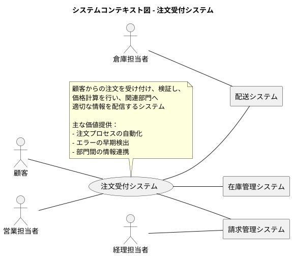
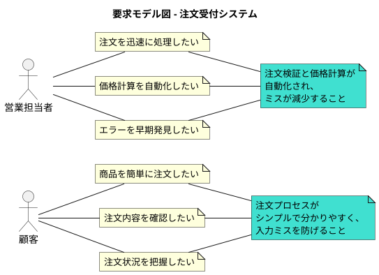
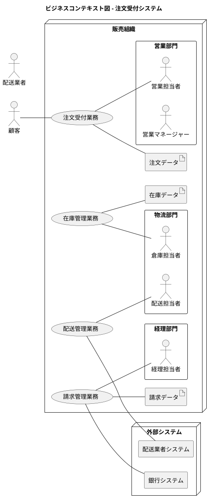
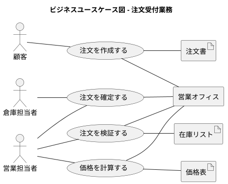
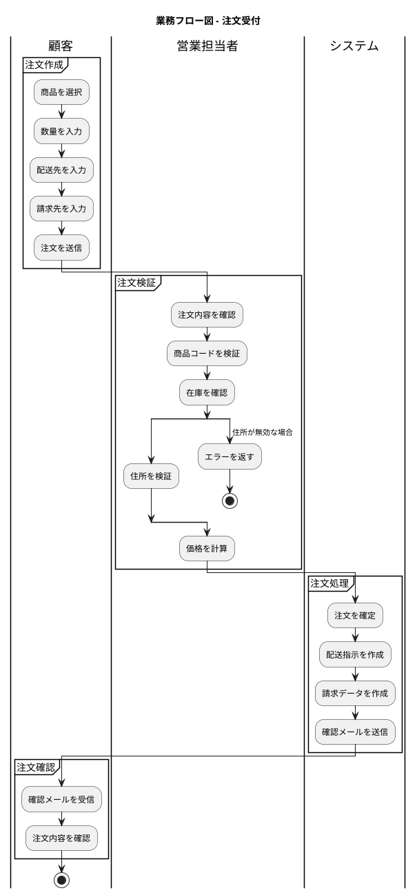
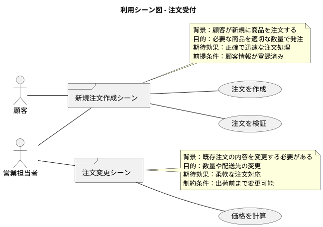
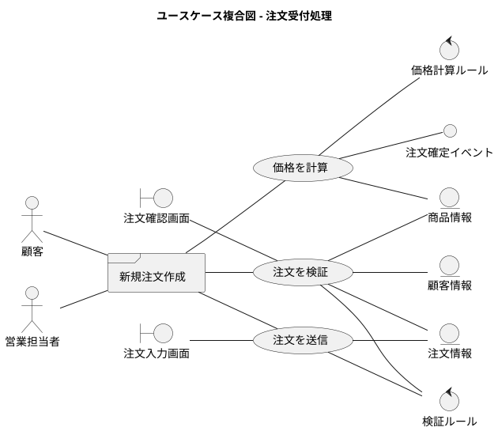
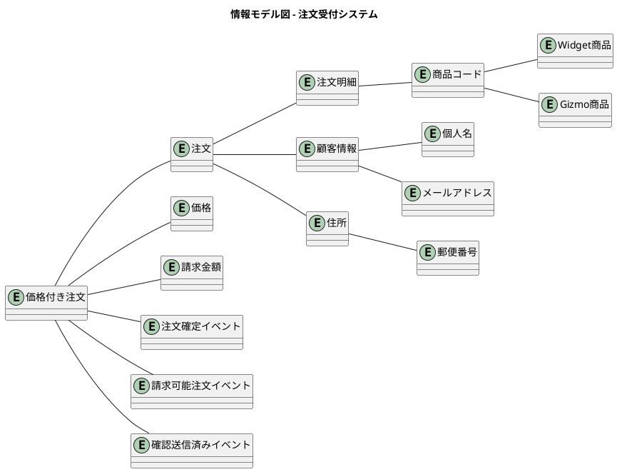
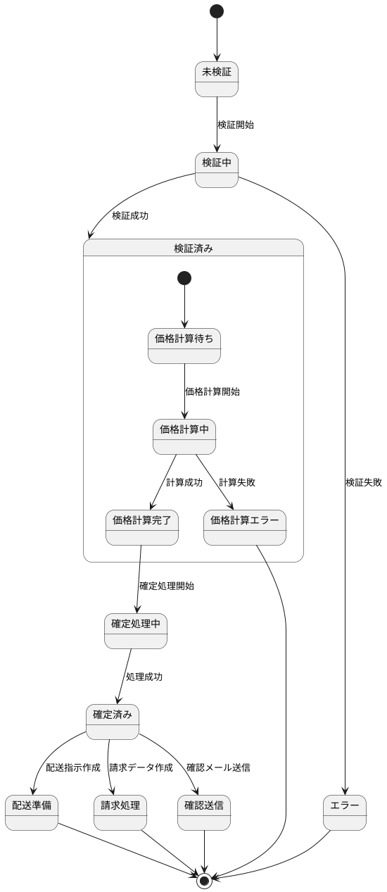
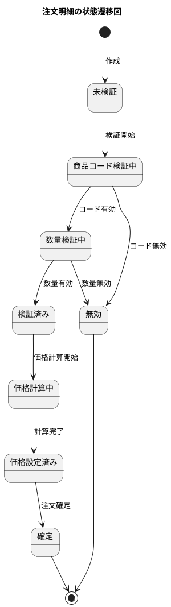

# 要件定義 - 注文受付システム (OrderTaking)

## システム価値

### システムコンテキスト

### 要求モデル

## システム外部環境

### ビジネスコンテキスト

### ビジネスユースケース

#### 注文受付業務

### 業務フロー

#### 注文受付の業務フロー

### 利用シーン

#### 注文受付の利用シーン

### バリエーション・条件

#### 商品タイプ

| 分類名 | 説明 |
|--------|------|
| Widget | 単位数量で注文する商品（1〜1000個） |
| Gizmo | 重量（キログラム）で注文する商品（0.05〜100.00kg） |

#### 注文ステータス

| 分類名 | 説明 |
|--------|------|
| 未検証 | 顧客から受信したが未検証の注文 |
| 検証済み | 内容が検証され、エラーがない注文 |
| 価格計算済み | 価格計算が完了した注文 |
| 確定済み | 処理が完了し、関連部門に通知済みの注文 |

#### エラータイプ

| 分類名 | 説明 |
|--------|------|
| 検証エラー | 入力データの形式や値が不正 |
| 価格計算エラー | 価格計算中に発生したエラー |
| リモートサービスエラー | 外部システムとの通信エラー |

## システム境界

### ユースケース複合図

#### 注文受付処理

## システム

### 情報モデル

### 状態モデル

#### 注文の状態遷移

#### 注文明細の状態遷移

---

## 記入ガイド

このドキュメントは、RDRA（Relationship Driven Requirement Analysis）の手法に基づいて、注文受付システムの要件を体系的に整理したものです。

### 主要な要件

1. **注文検証機能**
   - 商品コードの妥当性確認
   - 数量の範囲チェック（Widget: 1-1000個、Gizmo: 0.05-100kg）
   - 住所の妥当性確認

2. **価格計算機能**
   - 商品タイプに応じた価格計算
   - 注文明細ごとの小計計算
   - 注文全体の合計金額計算

3. **イベント生成機能**
   - 注文確定イベント（配送部門向け）
   - 請求可能注文イベント（経理部門向け）
   - 確認送信済みイベント（顧客向け）

4. **エラーハンドリング**
   - 検証エラーの適切な処理
   - 価格計算エラーの処理
   - 外部サービスエラーの処理

### システムの特徴

- **ドメイン駆動設計**：ビジネスロジックをドメインモデルに集約
- **関数型プログラミング**：F# による型安全な実装
- **イベント駆動**：各処理結果をイベントとして他システムに通知
- **制約付き型**：ビジネスルールを型システムで表現